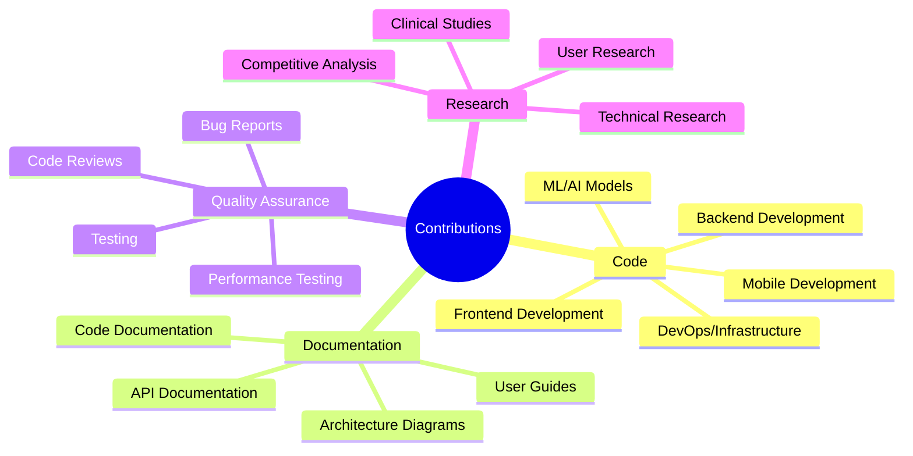
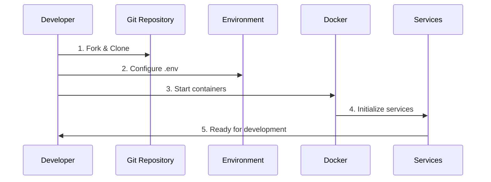
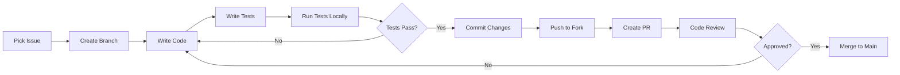
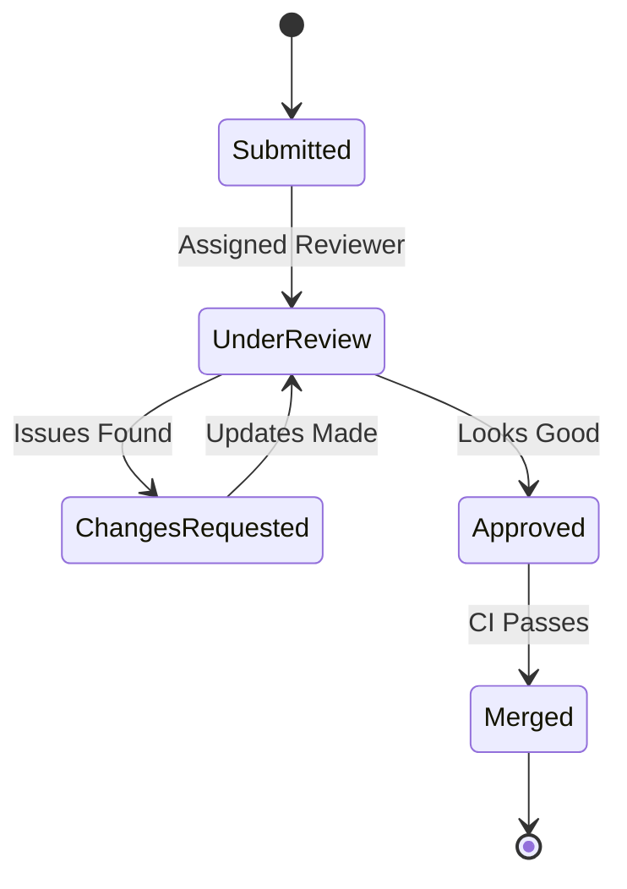
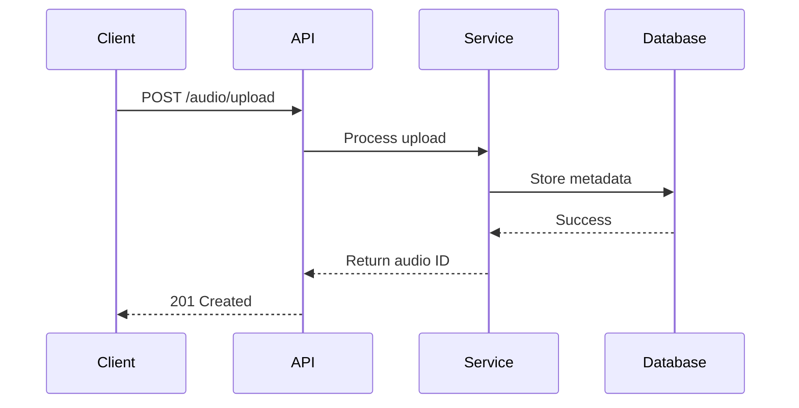

# Contributing to HearLoveen

Thank you for your interest in contributing to **HearLoveen**! We're building an AI-powered speech therapy platform that makes a real difference in the lives of hearing-impaired children. Every contribution matters, whether it's code, documentation, bug reports, or feature suggestions.

## Table of Contents

- [Code of Conduct](#code-of-conduct)
- [How Can I Contribute?](#how-can-i-contribute)
- [Development Setup](#development-setup)
- [Development Workflow](#development-workflow)
- [Code Style Guidelines](#code-style-guidelines)
- [Commit Message Convention](#commit-message-convention)
- [Pull Request Process](#pull-request-process)
- [Testing Requirements](#testing-requirements)
- [Documentation Standards](#documentation-standards)
- [Community](#community)

---

## Code of Conduct

This project adheres to a Code of Conduct that all contributors are expected to follow. By participating, you are expected to uphold this code.

### Our Standards

- **Be Respectful**: Treat everyone with respect and kindness
- **Be Inclusive**: Welcome newcomers and different perspectives
- **Be Collaborative**: Work together constructively
- **Be Professional**: Maintain professional conduct in all interactions

---

## How Can I Contribute?

### Contribution Types



### Contribution Areas & Skills

| Area | Technologies | Skill Level | Getting Started |
|------|--------------|-------------|-----------------|
| **Backend Development** | .NET 8, C#, CQRS, EF Core | Intermediate | [Backend Guide](docs/DEV_GUIDE.md) |
| **Frontend Development** | React 18, TypeScript, Redux | Intermediate | [Dashboard README](apps/therapist-dashboard/README.md) |
| **Mobile Development** | React Native, BLE | Advanced | [Mobile Guide](mobile/ble-gateway/README.md) |
| **AI/ML Engineering** | Python, PyTorch, Whisper, ONNX | Advanced | [MLOps Guide](docs/mlops/README.md) |
| **DevOps/SRE** | Kubernetes, Terraform, ArgoCD | Advanced | [GitOps Guide](docs/technical/gitops/README.md) |
| **Documentation** | Markdown, Mermaid | Beginner | This Guide |
| **Testing/QA** | xUnit, k6, Playwright | Intermediate | [Testing Guide](tests/) |
| **Clinical Research** | Healthcare, SLP Background | Expert | [Clinical Docs](docs/clinical/) |

---

## Development Setup

### Prerequisites Checklist

Before you begin, ensure you have the following installed:

| Tool | Version | Required For | Installation Link |
|------|---------|--------------|-------------------|
| ✅ Git | Latest | Version control | [git-scm.com](https://git-scm.com/) |
| ✅ .NET SDK | 8.0+ | Backend development | [dotnet.microsoft.com](https://dotnet.microsoft.com/download) |
| ✅ Node.js | 18+ | Frontend development | [nodejs.org](https://nodejs.org/) |
| ✅ Python | 3.11+ | ML/AI services | [python.org](https://www.python.org/downloads/) |
| ✅ Docker | Latest | Containerization | [docker.com](https://www.docker.com/get-started) |
| ✅ Docker Compose | Latest | Multi-container apps | Included with Docker Desktop |
| 🔧 Azure CLI | Latest | Cloud deployment (optional) | [Microsoft Docs](https://docs.microsoft.com/cli/azure/install-azure-cli) |
| 🔧 kubectl | Latest | Kubernetes (optional) | [kubernetes.io](https://kubernetes.io/docs/tasks/tools/) |

### Step-by-Step Setup



#### 1. Fork and Clone

```bash
# Fork the repository on GitHub
# Then clone your fork
git clone https://github.com/YOUR_USERNAME/HearLoveen.git
cd HearLoveen

# Add upstream remote
git remote add upstream https://github.com/yasserebrahimi/HearLoveen.git

# Verify remotes
git remote -v
```

#### 2. Configure Environment

```bash
# Copy environment template
cp .env.example .env

# Edit .env with your local configuration
# Minimum required:
# - Database connection strings
# - JWT secret keys
# - Azure storage (or use local emulator)
nano .env
```

#### 3. Start Development Environment

```bash
# Start all services in detached mode
docker-compose up -d

# View logs
docker-compose logs -f

# Verify all services are running
docker-compose ps
```

#### 4. Run Database Migrations

```bash
# Apply EF Core migrations
dotnet ef database update --project src/infrastructure/HearLoveen.Infrastructure

# Verify database schema
dotnet ef migrations list --project src/infrastructure/HearLoveen.Infrastructure
```

#### 5. Verify Setup

```bash
# Check API health
curl http://localhost:5000/health

# Run tests
dotnet test

# Access Swagger UI
open http://localhost:5000/swagger
```

### IDE Configuration

#### Visual Studio Code (Recommended)

Install recommended extensions:
- C# for Visual Studio Code
- ESLint
- Prettier
- Docker
- GitLens
- REST Client

```bash
# Install recommended extensions
code --install-extension ms-dotnettools.csharp
code --install-extension dbaeumer.vscode-eslint
code --install-extension esbenp.prettier-vscode
code --install-extension ms-azuretools.vscode-docker
```

#### Visual Studio 2022

- Ensure ASP.NET and web development workload is installed
- Install ReSharper (optional but recommended)

---

## Development Workflow

### Workflow Diagram



### 1. Pick an Issue

- Browse [open issues](https://github.com/yasserebrahimi/HearLoveen/issues)
- Look for `good first issue` or `help wanted` labels
- Comment on the issue to claim it
- Wait for maintainer approval before starting work

### 2. Create a Feature Branch

```bash
# Update main branch
git checkout main
git pull upstream main

# Create feature branch
git checkout -b feature/your-feature-name

# For bug fixes
git checkout -b fix/bug-description

# For documentation
git checkout -b docs/documentation-update
```

### 3. Make Your Changes

- Write clean, well-documented code
- Follow existing code patterns
- Add unit tests for new features
- Update documentation as needed

### 4. Test Thoroughly

```bash
# Run all tests
dotnet test

# Run specific test project
dotnet test tests/HearLoveen.Tests.Unit

# Run with coverage
dotnet test /p:CollectCoverage=true /p:CoverletOutputFormat=lcov

# Run integration tests
dotnet test --filter Category=Integration

# Run E2E tests
npm run test:e2e

# Run performance tests
k6 run tests/perf/k6/smoke.js
```

### 5. Update Documentation

- Update inline code comments
- Update README if adding new features
- Update API documentation in Swagger comments
- Add architecture diagrams if needed

---

## Code Style Guidelines

### .NET/C# Style

We follow Microsoft's C# Coding Conventions with some additions:

| Aspect | Standard | Example |
|--------|----------|---------|
| **Naming** | PascalCase for classes, methods | `public class AudioService` |
| | camelCase for parameters, local variables | `string fileName` |
| | Private fields with `_` prefix | `private readonly ILogger _logger;` |
| **Formatting** | 4 spaces indentation | Enforced by `.editorconfig` |
| | Braces on new line | `if (condition)\n{` |
| | Max line length: 120 characters | - |
| **Patterns** | CQRS with MediatR | See [Architecture](docs/technical/architecture/ARCHITECTURE.md) |
| | Repository pattern | `IRepository<TEntity>` |
| | Dependency Injection | Constructor injection |

#### StyleCop Rules

```xml
<!-- .editorconfig excerpt -->
[*.cs]
dotnet_diagnostic.SA1200.severity = error  # Using directives must be inside namespace
dotnet_diagnostic.SA1633.severity = none   # File must have header
csharp_new_line_before_open_brace = all
csharp_indent_labels = one_less_than_current
```

### TypeScript/JavaScript Style

We use ESLint + Prettier for consistent formatting:

| Aspect | Standard | Example |
|--------|----------|---------|
| **Naming** | camelCase for variables, functions | `const userName = '';` |
| | PascalCase for components, classes | `const AudioPlayer = () => {}` |
| | UPPER_SNAKE_CASE for constants | `const API_BASE_URL = '';` |
| **Formatting** | 2 spaces indentation | Enforced by Prettier |
| | Single quotes | `'string'` not `"string"` |
| | Semicolons required | `const x = 1;` |
| **React** | Functional components with hooks | `const Component = () => {}` |
| | Props interface before component | `interface Props { ... }` |

### Python Style

We follow PEP 8 with Black formatting:

| Aspect | Standard | Example |
|--------|----------|---------|
| **Naming** | snake_case for functions, variables | `def process_audio():` |
| | PascalCase for classes | `class WhisperModel:` |
| **Formatting** | 4 spaces indentation | Enforced by Black |
| | Max line length: 88 characters | Black default |
| **Documentation** | Docstrings for all public functions | `"""Process audio file."""` |

### Code Quality Tools

| Language | Tool | Configuration | Command |
|----------|------|---------------|---------|
| C# | StyleCop | `.editorconfig` | `dotnet format` |
| TypeScript | ESLint | `.eslintrc.js` | `npm run lint` |
| TypeScript | Prettier | `.prettierrc` | `npm run format` |
| Python | Black | `pyproject.toml` | `black .` |
| Python | Flake8 | `.flake8` | `flake8 .` |
| Python | mypy | `mypy.ini` | `mypy src/` |

---

## Commit Message Convention

We follow [Conventional Commits](https://www.conventionalcommits.org/) specification:

### Format

```
<type>(<scope>): <subject>

<body>

<footer>
```

### Types

| Type | Description | Example |
|------|-------------|---------|
| `feat` | New feature | `feat(audio): add noise reduction filter` |
| `fix` | Bug fix | `fix(api): resolve rate limiting issue` |
| `docs` | Documentation only | `docs(readme): update installation guide` |
| `style` | Code style changes (formatting) | `style(backend): apply dotnet format` |
| `refactor` | Code refactoring | `refactor(analysis): extract emotion detection` |
| `perf` | Performance improvement | `perf(whisper): optimize model inference` |
| `test` | Adding or updating tests | `test(audio): add upload integration tests` |
| `build` | Build system or dependencies | `build(docker): update base image` |
| `ci` | CI/CD changes | `ci(github): add code coverage report` |
| `chore` | Maintenance tasks | `chore(deps): update nuget packages` |
| `revert` | Revert previous commit | `revert: feat(audio): add noise reduction` |

### Examples

#### Good Commits

```bash
feat(ml): add multilingual G2P support for German and Farsi

- Implement g2p_en for English phoneme conversion
- Add language detection and routing
- Update API to accept language parameter
- Add unit tests for each language

Closes #123

---

fix(api): resolve JWT token expiration edge case

The refresh token flow was failing when the access token
expired exactly at midnight due to timezone handling.

Fixed by:
- Using UTC timestamps consistently
- Adding 5-minute grace period
- Improving error messages

Fixes #456
```

#### Bad Commits

```bash
# Too vague
update stuff

# Missing type
Added new feature

# No description
fix: bug
```

---

## Pull Request Process

### PR Checklist

Before submitting your pull request, ensure:

- [ ] Code follows project style guidelines
- [ ] All tests pass locally
- [ ] New tests added for new features
- [ ] Documentation updated
- [ ] Commit messages follow convention
- [ ] No merge conflicts with main
- [ ] PR description is clear and complete

### PR Template

When you create a PR, provide:

#### Description
Clear description of what changes you made and why.

#### Type of Change
- [ ] Bug fix (non-breaking change that fixes an issue)
- [ ] New feature (non-breaking change that adds functionality)
- [ ] Breaking change (fix or feature that would cause existing functionality to not work as expected)
- [ ] Documentation update

#### Testing
Describe the tests you ran and how to reproduce them.

#### Screenshots
If applicable, add screenshots to help explain your changes.

#### Related Issues
Link to related issues: Closes #123, Fixes #456

### Review Process



1. **Automated Checks**: CI/CD runs tests, linting, security scans
2. **Code Review**: At least one maintainer reviews your code
3. **Changes Requested**: Address feedback and push updates
4. **Approval**: Maintainer approves the PR
5. **Merge**: PR is merged into main branch

### Review Criteria

Reviewers will check for:

| Criteria | Details |
|----------|---------|
| **Functionality** | Does it work as intended? |
| **Tests** | Adequate test coverage? |
| **Code Quality** | Clean, readable, maintainable? |
| **Performance** | No performance regressions? |
| **Security** | No security vulnerabilities? |
| **Documentation** | Properly documented? |
| **Breaking Changes** | Are they necessary and documented? |

---

## Testing Requirements

### Test Coverage Goals

| Component | Target Coverage | Current |
|-----------|----------------|---------|
| Backend Services | >90% | 91% |
| Frontend | >80% | 85% |
| Mobile | >80% | 82% |
| Overall | >85% | 88% |

### Required Tests

#### Unit Tests

```csharp
// Example: AudioService unit test
[Fact]
public async Task UploadAudio_ValidFile_ReturnsSuccess()
{
    // Arrange
    var mockRepo = new Mock<IAudioRepository>();
    var service = new AudioService(mockRepo.Object);
    var file = CreateTestAudioFile();

    // Act
    var result = await service.UploadAsync(file);

    // Assert
    Assert.True(result.IsSuccess);
    Assert.NotNull(result.Data.AudioId);
}
```

#### Integration Tests

```csharp
// Example: API integration test with Testcontainers
[Collection("Integration")]
public class AudioApiTests : IAsyncLifetime
{
    private readonly WebApplicationFactory<Program> _factory;
    private readonly HttpClient _client;

    public AudioApiTests()
    {
        _factory = new WebApplicationFactory<Program>();
        _client = _factory.CreateClient();
    }

    [Fact]
    public async Task POST_Audio_Upload_ReturnsCreated()
    {
        // Arrange
        var content = CreateMultipartContent();

        // Act
        var response = await _client.PostAsync("/api/v1/audio/upload", content);

        // Assert
        response.StatusCode.Should().Be(HttpStatusCode.Created);
    }
}
```

---

## Documentation Standards

### Code Documentation

#### XML Documentation (C#)

```csharp
/// <summary>
/// Processes an audio file and generates speech analysis results.
/// </summary>
/// <param name="audioId">The unique identifier of the audio file.</param>
/// <param name="cancellationToken">Cancellation token for async operation.</param>
/// <returns>Analysis result containing transcription and emotion data.</returns>
/// <exception cref="NotFoundException">Thrown when audio file is not found.</exception>
public async Task<AnalysisResult> ProcessAudioAsync(
    Guid audioId,
    CancellationToken cancellationToken = default)
{
    // Implementation
}
```

#### JSDoc Documentation (TypeScript)

```typescript
/**
 * Uploads an audio file to the server for processing.
 *
 * @param file - The audio file to upload
 * @param options - Upload options including compression and format
 * @returns Promise resolving to upload result with audio ID
 * @throws {ValidationError} If file format is invalid
 *
 * @example
 * ```typescript
 * const result = await uploadAudio(file, { compress: true });
 * console.log(result.audioId);
 * ```
 */
async function uploadAudio(
  file: File,
  options: UploadOptions
): Promise<UploadResult> {
  // Implementation
}
```

### README Standards

Each service/module should have a README with:

1. Overview and purpose
2. Architecture diagram
3. Setup instructions
4. Configuration options
5. API documentation
6. Testing guide
7. Troubleshooting

### Mermaid Diagrams

Use Mermaid for all diagrams:

```markdown

```

---

## Community

### Communication Channels

- **GitHub Issues**: Bug reports, feature requests
- **GitHub Discussions**: Questions, ideas, showcases
- **Email**: support@hearloveen.com

### Getting Help

If you need help:

1. Check existing documentation
2. Search closed issues
3. Ask in GitHub Discussions
4. Reach out to maintainers

### Recognition

We value all contributions! Contributors will be:

- Listed in CONTRIBUTORS.md
- Mentioned in release notes
- Eligible for contributor badge

---

## Thank You!

Thank you for contributing to HearLoveen! Together, we're making speech therapy more accessible and effective for hearing-impaired children worldwide.

Every contribution, no matter how small, makes a difference. We appreciate your time and effort!
