# 🦻 HearLoveen - Enterprise AI Speech Therapy Platform

[](LICENSE)
[](https://dotnet.microsoft.com/)
[](https://reactjs.org/)
[](https://azure.microsoft.com/)

**Enterprise-grade, Cloud-native AI Platform for Speech Therapy in Hearing-Impaired Children**

---

## 📋 Table of Contents

- [Overview](#-overview)
- [Key Metrics](#-key-metrics--traction)
- [Features](#-core-features)
- [Architecture](#-system-architecture)
- [Tech Stack](#-technology-stack)
- [Quick Start](#-quick-start)
- [Services & Components](#-microservices--components)
- [API Documentation](#-api-endpoints)
- [Cloud Infrastructure](#-cloud-infrastructure)
- [Security & Compliance](#-security--compliance)
- [Testing & Quality](#-testing--quality-assurance)
- [Deployment](#-deployment)
- [Documentation](#-documentation-hub)
- [Contributing](#-contributing)
- [License](#-license)

---

## 🌟 Overview

**HearLoveen** is an **enterprise-grade**, **cloud-native**, AI-driven platform that revolutionizes speech therapy for hearing-impaired children. By combining cutting-edge **AI/ML models** (fine-tuned Whisper), **Azure Cloud infrastructure**, and **IoT device integration**, we deliver personalized, data-driven speech therapy services to children and their families worldwide.

### Mission
Empower hearing-impaired children with accessible, effective, and personalized speech therapy through advanced AI technology.

### Vision
Become the global standard for AI-powered speech therapy, serving 500,000+ active users by 2027.

---

## 📊 Key Metrics & Traction

| Metric | Value | Status |
|--------|-------|--------|
| **Active Families** | 25+ | 🟢 Growing |
| **Total Recordings** | 500+ | 🟢 Active |
| **AI Accuracy** | 94% | 🟢 High |
| **User Retention** | 78% | 🟢 Strong |
| **Target Users (2027)** | 500,000+ | 🎯 Goal |
| **Funding Round** | €750K Seed | 💰 Ongoing |
| **Uptime SLA** | 99.9% | 🟢 Committed |

---

## 🎯 Core Features


### Feature Details

| Feature | Description | Technology | Status |
|---------|-------------|------------|--------|
| **Real-time Speech-to-Text** | High-accuracy transcription using fine-tuned Whisper model | Whisper + ONNX | ✅ Production |
| **Emotion Analysis** | Detecting emotional states during therapy sessions | CNN + PyTorch | ✅ Production |
| **IoT Device Integration** | Real-time data from hearing aids & cochlear implants | BLE/ASHA/MFi | ✅ Production |
| **Multi-language Support** | i18n support for English, German, Dutch, Farsi | i18next + G2P | ✅ Production |
| **Real-Time Analytics** | Custom dashboards for progress visualization | Grafana + Prometheus | ✅ Production |
| **Federated Learning** | Privacy-preserving ML training | DP-SGD | 🚧 Beta |
| **LLM Coach** | AI-powered coaching assistance | GPT-4 + Guardrails | 🚧 Beta |

---

## 🔧 Technology Stack

### System Architecture Layers


### Technology Matrix

| Layer | Technology | Version | Purpose | Documentation |
|-------|------------|---------|---------|---------------|
| **Backend** | .NET | 8.0 | Core application framework | [Backend Guide](docs/DEV_GUIDE.md) |
| | CQRS + MediatR | Latest | Command/Query separation | [Architecture](docs/technical/architecture/ARCHITECTURE.md) |
| | Clean Architecture | - | Domain-driven design | [Architecture](docs/technical/architecture/ARCHITECTURE.md) |
| | Entity Framework Core | 8.0 | ORM for data access | [Dev Guide](docs/DEV_GUIDE.md) |
| **AI/ML** | Python | 3.11+ | ML runtime environment | [ML Guide](docs/mlops/README.md) |
| | PyTorch | 2.0+ | Deep learning framework | [ML Pipeline](docs/diagrams/10-ml-pipeline.md) |
| | Whisper | Fine-tuned | Speech-to-text model | [Analysis Service](src/AnalysisService/README.md) |
| | ONNX Runtime | Latest | Model inference optimization | [MLOps](docs/mlops/README.md) |
| | MLflow | 2.8+ | Model registry & tracking | [MLflow Setup](mlflow/README.md) |
| **Frontend** | React | 18 | Web UI framework | [Web App](apps/therapist-dashboard/README.md) |
| | TypeScript | 5.0+ | Type-safe JavaScript | - |
| | Redux Toolkit | Latest | State management | - |
| | Material-UI | 5.0+ | Component library | - |
| | Recharts | Latest | Data visualization | - |
| **Mobile** | React Native | 0.73+ | Cross-platform mobile | [Mobile Guide](mobile/ble-gateway/README.md) |
| | BLE Gateway | Custom | IoT device communication | [BLE Gateway](mobile/ble-gateway/README.md) |
| **Cloud** | Azure AKS | Latest | Kubernetes orchestration | [Deployment](docs/DEPLOYMENT.md) |
| | Azure IoT Hub | Latest | IoT device management | [IoT Service](src/IoTService/README.md) |
| | Azure Blob Storage | v2 | Audio file storage | [Storage Guide](docs/DEV_GUIDE.md) |
| | Azure Key Vault | Latest | Secrets management | [Security](docs/security/SECURITY_IMPLEMENTATION.md) |
| | Terraform | 1.5+ | Infrastructure as Code | [Infrastructure](deploy/) |
| **Data** | PostgreSQL | 14+ | Primary relational database | [Migrations](src/infrastructure/HearLoveen.Infrastructure/Migrations/README.md) |
| | Redis Cluster | 7.0+ | Caching & session store | [Dev Guide](docs/DEV_GUIDE.md) |
| | Azure Service Bus | Latest | Async messaging | [Architecture](docs/technical/architecture/ARCHITECTURE.md) |
| **DevOps** | GitHub Actions | - | CI/CD pipelines | [GitOps](docs/technical/gitops/README.md) |
| | ArgoCD | Latest | GitOps deployment | [GitOps](docs/technical/gitops/README.md) |
| | Argo Rollouts | Latest | Progressive delivery | [Deployment](docs/DEPLOYMENT.md) |
| | Helm | 3.0+ | Kubernetes package manager | [Charts](deploy/) |
| **Observability** | Prometheus | Latest | Metrics collection | [SRE](docs/sre/dr-runbook.md) |
| | Grafana | Latest | Metrics visualization | [Observability](deploy/observability/) |
| | OpenTelemetry | Latest | Distributed tracing | [Architecture](docs/technical/architecture/ARCHITECTURE.md) |
| | Application Insights | Latest | APM & logging | [Monitoring](docs/DEPLOYMENT.md) |
| **Testing** | xUnit | Latest | .NET unit testing | [Testing Guide](tests/) |
| | k6 | Latest | Performance testing | [K6 Tests](tests/perf/k6/README.md) |
| | Testcontainers | Latest | Integration testing | [Architecture](docs/technical/architecture/ARCHITECTURE.md) |
| | Pact | Latest | Contract testing | [Architecture](docs/technical/architecture/ARCHITECTURE.md) |

---

## 🚀 Quick Start

### Prerequisites Checklist

| Tool | Version | Purpose | Installation |
|------|---------|---------|--------------|
| Docker & Docker Compose | Latest | Container orchestration | [Install Docker](https://docs.docker.com/get-docker/) |
| .NET SDK | 8.0+ | Backend development | [Install .NET](https://dotnet.microsoft.com/download) |
| Node.js & npm | 18+ | Frontend development | [Install Node.js](https://nodejs.org/) |
| Python | 3.11+ | ML/AI services | [Install Python](https://www.python.org/downloads/) |
| Azure CLI | Latest | Cloud management | [Install Azure CLI](https://docs.microsoft.com/cli/azure/install-azure-cli) |
| kubectl | Latest | Kubernetes management | [Install kubectl](https://kubernetes.io/docs/tasks/tools/) |

### Local Development Setup

```mermaid
sequenceDiagram
    participant Dev as Developer
    participant Git as Git Repository
    participant Docker as Docker Compose
    participant Services as Microservices
    participant DB as PostgreSQL/Redis

    Dev->>Git: 1. Clone repository
    Dev->>Dev: 2. Configure .env
    Dev->>Docker: 3. docker-compose up -d
    Docker->>DB: Start databases
    Docker->>Services: Start all microservices
    Services->>DB: Run migrations
    Services-->>Dev: ✅ All services ready
```



### Step-by-Step Installation

#### 1. Clone & Configure

```bash
# Clone the repository
git clone https://github.com/yasserebrahimi/HearLoveen.git
cd HearLoveen

# Copy environment template
cp .env.example .env

# Edit .env with your credentials
# Required: Azure connection strings, API keys, JWT secrets
nano .env  # or use your preferred editor
```

#### 2. Start Services

```bash
# Start all services (detached mode)
docker-compose up -d

# View logs
docker-compose logs -f

# Check service health
docker-compose ps
```

#### 3. Verify Installation

```bash
# Check API Gateway health
curl http://localhost:5000/health

# Check service endpoints
curl http://localhost:5000/api/health
```

### Service Endpoints & Ports

| Service | Port | Endpoint | Purpose |
|---------|------|----------|---------|
| **API Gateway** | 5000 | http://localhost:5000 | Main entry point |
| **AudioService** | 5001 | http://localhost:5001 | Audio processing |
| **AnalysisService** | 5002 | http://localhost:5002 | AI/ML analysis |
| **NotificationService** | 5003 | http://localhost:5003 | Notifications |
| **UserService** | 5004 | http://localhost:5004 | User management |
| **IoTService** | 5005 | http://localhost:5005 | IoT device integration |
| **AnalysisProxy** | 5006 | http://localhost:5006 | ML proxy service |
| **PostgreSQL** | 5432 | localhost:5432 | Primary database |
| **Redis** | 6379 | localhost:6379 | Cache & sessions |
| **Grafana** | 3000 | http://localhost:3000 | Monitoring dashboards |
| **Prometheus** | 9090 | http://localhost:9090 | Metrics collection |

### Quick Commands

```bash
# Stop all services
docker-compose down

# Rebuild and restart
docker-compose up -d --build

# View specific service logs
docker-compose logs -f api-gateway

# Run database migrations
dotnet ef database update --project src/infrastructure/HearLoveen.Infrastructure

# Run tests
dotnet test

# Run performance tests
k6 run tests/perf/k6/smoke.js
```

For detailed installation instructions, see the [Installation Guide](docs/complete-package/INSTALLATION_GUIDE.md).

---

## 📊 System Architecture

### High-Level System Overview

```mermaid
graph TB
    subgraph "End Users"
        U1[👨‍👩‍👧 Parents]
        U2[👶 Children]
        U3[👩‍⚕️ Therapists]
        U4[🔐 Admins]
    end

    subgraph "Client Applications"
        C1[📱 Mobile App<br/>React Native]
        C2[🌐 Web Portal<br/>React 18]
        C3[📊 Dashboard<br/>Therapist View]
    end

    subgraph "API & Gateway Layer"
        G[🚪 YARP API Gateway<br/>Rate Limiting, Auth, Routing]
    end

    subgraph "Microservices - .NET 8"
        MS1[🎵 AudioService<br/>Audio Processing]
        MS2[🤖 AnalysisService<br/>AI/ML Analysis]
        MS3[🔔 NotificationService<br/>Alerts & Notifications]
        MS4[👤 UserService<br/>Authentication & Users]
        MS5[📡 IoTService<br/>Device Management]
        MS6[🔄 AnalysisProxy<br/>ML Gateway]
    end

    subgraph "AI/ML Processing"
        AI1[🎙️ Whisper ONNX<br/>Speech Recognition]
        AI2[😊 Emotion CNN<br/>Sentiment Analysis]
        AI3[📈 MLflow<br/>Model Registry]
        AI4[🧠 G2P Engine<br/>Phoneme Processing]
    end

    subgraph "Data Persistence"
        D1[(🗄️ PostgreSQL<br/>Primary DB)]
        D2[(⚡ Redis<br/>Cache & Sessions)]
        D3[📦 Blob Storage<br/>Audio Files]
        D4[📨 Service Bus<br/>Async Queue]
    end

    subgraph "Azure Infrastructure"
        I1[☸️ AKS<br/>Kubernetes]
        I2[🌐 IoT Hub<br/>Device Telemetry]
        I3[🔐 Key Vault<br/>Secrets]
        I4[📊 App Insights<br/>Monitoring]
    end

    U1 --> C1
    U2 --> C1
    U3 --> C2
    U3 --> C3
    U4 --> C2

    C1 --> G
    C2 --> G
    C3 --> G

    G --> MS1
    G --> MS2
    G --> MS3
    G --> MS4
    G --> MS5

    MS1 --> D3
    MS1 --> D4
    MS2 --> MS6
    MS3 --> D4
    MS4 --> D1
    MS4 --> D2
    MS5 --> I2

    MS6 --> AI1
    MS6 --> AI2
    AI1 --> AI3
    AI2 --> AI3
    MS6 --> AI4

    D4 --> AI1

    I1 -.->|Hosts| MS1
    I1 -.->|Hosts| MS2
    I1 -.->|Hosts| MS3
    I1 -.->|Hosts| MS4
    I1 -.->|Hosts| MS5

    MS1 --> I3
    MS4 --> I3
    MS1 --> I4
    MS2 --> I4
```



### Architecture Principles

| Principle | Implementation | Benefits |
|-----------|----------------|----------|
| **Microservices** | Domain-driven service boundaries | Independent scaling & deployment |
| **CQRS** | Separate read/write models | Optimized performance |
| **Event-Driven** | Azure Service Bus messaging | Async processing & resilience |
| **Cloud-Native** | Kubernetes + Azure services | Auto-scaling & high availability |
| **API-First** | OpenAPI/Swagger specs | Contract-driven development |
| **Security by Design** | Zero-trust, RBAC, encryption | GDPR & MDR compliance |
| **Observability** | OpenTelemetry + Prometheus | Full system visibility |

### Data Flow Sequence


### Deployment Architecture (Azure)


For detailed architecture documentation, see:
- [System Context Diagram](docs/diagrams/01-system-context.md)
- [Container Architecture](docs/diagrams/02-containers.md)
- [Backend Components](docs/diagrams/03-backend-components.md)
- [Complete Architecture Guide](docs/technical/architecture/ARCHITECTURE.md)

---

## 💻 Microservices & Components

### Service Architecture Map


### Core Microservices

| Service | Port | Tech Stack | Responsibilities | Documentation |
|---------|------|------------|------------------|---------------|
| **API Gateway** | 5000 | .NET 8 + YARP | Authentication, Rate limiting, Routing, Load balancing | [Gateway README](src/ApiGateway/README.md) |
| **AudioService** | 5001 | .NET 8 + EF Core | Audio upload/download, Blob storage management, Audio preprocessing | [Audio README](src/AudioService/README.md) |
| **AnalysisService** | 5002 | .NET 8 + CQRS | Analysis orchestration, Result aggregation, Feedback generation | [Analysis README](src/AnalysisService/README.md) |
| **UserService** | 5004 | .NET 8 + EF Core | User management, Authentication, Authorization, Profile data | [User README](src/UserService/README.md) |
| **NotificationService** | 5003 | .NET 8 + Azure SB | Push notifications, Email alerts, SMS notifications, Event handling | [Notification README](src/NotificationService/README.md) |
| **IoTService** | 5005 | .NET 8 + IoT Hub SDK | Device registration, Telemetry collection, Device twin management | [IoT README](src/IoTService/README.md) |
| **AnalysisProxy** | 5006 | Python + FastAPI | ML model serving, Whisper inference, Emotion recognition | - |

### Service Capabilities Matrix

| Capability | AudioService | AnalysisService | UserService | NotificationService | IoTService |
|------------|--------------|-----------------|-------------|---------------------|------------|
| **CQRS Pattern** | ✅ | ✅ | ✅ | ✅ | ✅ |
| **Event Sourcing** | ✅ | ✅ | ❌ | ❌ | ✅ |
| **Caching (Redis)** | ✅ | ✅ | ✅ | ❌ | ✅ |
| **Rate Limiting** | ✅ | ✅ | ✅ | ✅ | ✅ |
| **Health Checks** | ✅ | ✅ | ✅ | ✅ | ✅ |
| **OpenTelemetry** | ✅ | ✅ | ✅ | ✅ | ✅ |
| **Swagger/OpenAPI** | ✅ | ✅ | ✅ | ✅ | ✅ |
| **Authentication** | ✅ | ✅ | ✅ | ✅ | ✅ |

### Component Details

#### 1. Frontend Applications

**Web Portal (React 18 + TypeScript)**
- Responsive UI with Material-UI components
- Real-time data visualization using Recharts
- Multi-language support (i18next)
- State management with Redux Toolkit
- WebSocket for real-time updates

**Mobile App (React Native 0.73+)**
- Cross-platform iOS/Android support
- BLE integration for hearing devices
- Offline-first architecture
- Audio recording and playback
- Push notification handling

**Therapist Dashboard**
- Advanced analytics and reporting
- Patient progress tracking
- Curriculum management
- Session scheduling and notes

#### 2. Backend Services (.NET 8)

**Clean Architecture Layers:**


**Key Patterns & Practices:**
- CQRS with MediatR for command/query separation
- Domain-Driven Design (DDD) with Aggregates
- Repository pattern for data access
- FluentValidation for input validation
- AutoMapper for object mapping
- Polly for resilience and retry policies
- Serilog for structured logging

#### 3. AI/ML Services (Python)

**ML Pipeline Components:**


**Model Performance:**
| Model | Accuracy | Latency | Hardware | Optimization |
|-------|----------|---------|----------|--------------|
| Whisper ONNX | 94% WER | 300ms | CPU/GPU | Quantized INT8 |
| Emotion CNN | 89% | 50ms | CPU | ONNX Runtime |
| G2P Phoneme | 96% | 10ms | CPU | Cached |

#### 4. IoT Integration

**Supported Device Protocols:**
- **BLE (Bluetooth Low Energy)**: Generic hearing aids
- **ASHA (Audio Streaming for Hearing Aids)**: Android devices
- **MFi (Made for iPhone)**: Apple ecosystem
- **Custom Protocols**: Cochlear implant manufacturers

**Device Telemetry:**


---

## 🛠 API Endpoints

### API Overview

All APIs follow RESTful conventions and use JWT Bearer authentication. Base URL for local development: `http://localhost:5000/api/v1`

### Endpoint Catalog

#### Audio Service (`/api/v1/audio`)

| Method | Endpoint | Description | Auth | Request | Response |
|--------|----------|-------------|------|---------|----------|
| POST | `/audio/upload` | Upload audio file for analysis | Required | Multipart/form-data | `{ audioId, uploadUrl, status }` |
| GET | `/audio/{id}` | Get audio metadata | Required | - | `AudioDto` |
| GET | `/audio/{id}/progress` | Check processing status | Required | - | `{ status, progress, message }` |
| GET | `/audio/{id}/download` | Download audio file | Required | - | Audio file stream |
| DELETE | `/audio/{id}` | Delete audio file | Required | - | `204 No Content` |

#### Analysis Service (`/api/v1/analysis`)

| Method | Endpoint | Description | Auth | Request | Response |
|--------|----------|-------------|------|---------|----------|
| POST | `/analysis/speech-to-text` | Transcribe audio using Whisper | Required | `{ audioId }` | `TranscriptionDto` |
| POST | `/analysis/emotion` | Detect emotion from audio | Required | `{ audioId }` | `EmotionDto` |
| GET | `/analysis/{id}` | Get analysis results | Required | - | `AnalysisResultDto` |
| GET | `/analysis/child/{childId}` | Get child's analysis history | Required | Query params | `PagedResult<AnalysisDto>` |
| POST | `/analysis/feedback` | Generate feedback report | Required | `{ analysisId }` | `FeedbackReportDto` |

#### User Service (`/api/v1/users`)

| Method | Endpoint | Description | Auth | Request | Response |
|--------|----------|-------------|------|---------|----------|
| POST | `/users/register` | Register new user | Public | `RegisterDto` | `UserDto` |
| POST | `/users/login` | Authenticate user | Public | `LoginDto` | `{ token, refreshToken, user }` |
| POST | `/users/refresh` | Refresh access token | Public | `{ refreshToken }` | `{ token, refreshToken }` |
| GET | `/users/{id}` | Get user profile | Required | - | `UserDto` |
| PUT | `/users/{id}` | Update user profile | Required | `UpdateUserDto` | `UserDto` |
| GET | `/users/{id}/children` | Get user's children | Required | - | `List<ChildDto>` |
| POST | `/users/children` | Add child profile | Required | `CreateChildDto` | `ChildDto` |

#### Notification Service (`/api/v1/notifications`)

| Method | Endpoint | Description | Auth | Request | Response |
|--------|----------|-------------|------|---------|----------|
| GET | `/notifications` | Get user notifications | Required | Query params | `PagedResult<NotificationDto>` |
| PUT | `/notifications/{id}/read` | Mark as read | Required | - | `204 No Content` |
| POST | `/notifications/subscribe` | Subscribe to push | Required | `{ deviceToken, platform }` | `SubscriptionDto` |
| DELETE | `/notifications/subscribe/{id}` | Unsubscribe | Required | - | `204 No Content` |

#### IoT Service (`/api/v1/iot`)

| Method | Endpoint | Description | Auth | Request | Response |
|--------|----------|-------------|------|---------|----------|
| POST | `/iot/devices` | Register hearing device | Required | `RegisterDeviceDto` | `DeviceDto` |
| GET | `/iot/devices` | List user's devices | Required | - | `List<DeviceDto>` |
| GET | `/iot/devices/{id}` | Get device details | Required | - | `DeviceDto` |
| GET | `/iot/devices/{id}/telemetry` | Get device telemetry | Required | Query params | `PagedResult<TelemetryDto>` |
| PUT | `/iot/devices/{id}` | Update device settings | Required | `UpdateDeviceDto` | `DeviceDto` |
| DELETE | `/iot/devices/{id}` | Unregister device | Required | - | `204 No Content` |

#### Privacy & GDPR (`/api/v1/privacy`)

| Method | Endpoint | Description | Auth | Request | Response |
|--------|----------|-------------|------|---------|----------|
| POST | `/privacy/dsr/export` | Export user data (GDPR) | Required | - | `{ exportUrl, expiresAt }` |
| POST | `/privacy/dsr/delete` | Request data deletion | Required | - | `{ requestId, status }` |
| GET | `/privacy/consent` | Get consent status | Required | - | `ConsentDto` |
| POST | `/privacy/consent` | Update consent | Required | `UpdateConsentDto` | `ConsentDto` |

#### Curriculum Management (`/api/v1/curriculum`)

| Method | Endpoint | Description | Auth | Request | Response |
|--------|----------|-------------|------|---------|----------|
| GET | `/curriculum/child/{childId}` | Get child curriculum | Required | - | `CurriculumDto` |
| GET | `/curriculum/child/{childId}/next` | Get next prompt (Elo-based) | Required | - | `PromptDto` |
| POST | `/curriculum/child/{childId}/rating` | Update phoneme rating | Required | `{ phoneme, performance }` | `RatingDto` |
| GET | `/curriculum/progress/{childId}` | Get learning progress | Required | - | `ProgressDto` |

### API Authentication Flow


### Rate Limiting

| Tier | Requests/Minute | Burst | Applicable To |
|------|-----------------|-------|---------------|
| **Anonymous** | 10 | 20 | Registration, Login |
| **Free** | 60 | 100 | Authenticated users |
| **Premium** | 120 | 200 | Paid subscribers |
| **Therapist** | 300 | 500 | Healthcare professionals |
| **Admin** | Unlimited | - | System administrators |

### Error Response Format

All errors follow a consistent format:

```json
{
  "type": "https://tools.ietf.org/html/rfc7231#section-6.5.1",
  "title": "One or more validation errors occurred.",
  "status": 400,
  "traceId": "00-abc123-def456-01",
  "errors": {
    "field": ["Error message"]
  }
}
```

For complete API documentation with interactive examples, visit:
- **Swagger UI**: http://localhost:5000/swagger
- **ReDoc**: http://localhost:5000/redoc

---

## 🌍 Cloud Infrastructure

### Azure Services Architecture


### Infrastructure Specifications

| Service | SKU/Tier | Configuration | Cost (Monthly) | Purpose |
|---------|----------|---------------|----------------|---------|
| **AKS** | Standard | 3 node pools (4-16 nodes) | ~€800 | Container orchestration |
| **PostgreSQL** | Flexible HA | 4 vCores, 16GB RAM, 256GB SSD | ~€500 | Primary database |
| **Redis** | Premium P1 | 6GB, Clustering enabled | ~€300 | Caching & sessions |
| **Blob Storage** | Premium LRS | Hot tier, 1TB | ~€150 | Audio file storage |
| **IoT Hub** | Standard S1 | 400K msgs/day | ~€200 | Device telemetry |
| **Service Bus** | Premium | 1 messaging unit | ~€600 | Async messaging |
| **Key Vault** | Premium HSM | - | ~€50 | Secrets management |
| **App Insights** | - | 5GB/day ingestion | ~€120 | APM & monitoring |
| **B2C** | - | 50K MAU included | ~€0 | Authentication |
| **Bandwidth** | - | ~2TB egress | ~€160 | Data transfer |
| | | **Total** | **~€2,880/month** | |

### Infrastructure as Code (IaC)

All infrastructure is defined and managed through:
- **Terraform**: Main IaC tool for Azure resources
- **Helm Charts**: Kubernetes application deployment
- **ArgoCD**: GitOps continuous deployment

```bash
# Deploy infrastructure
cd deploy/terraform
terraform init
terraform plan
terraform apply

# Deploy applications
cd deploy/helm
helm install hearloveen ./charts/hearloveen -f values.prod.yaml
```

---

## 🛡 Security & Compliance

### Security Architecture


### Security Features Matrix

| Layer | Feature | Implementation | Status |
|-------|---------|----------------|--------|
| **Authentication** | JWT Bearer Tokens | Azure AD B2C + Custom Claims | ✅ |
| | Multi-Factor Auth (MFA) | Email, SMS, Authenticator App | ✅ |
| | OAuth 2.0 / OIDC | Standard flows | ✅ |
| **Authorization** | Role-Based Access Control | Parent, Therapist, Admin roles | ✅ |
| | Resource-Based Auth | Child data scoping | ✅ |
| | Policy-Based Auth | Open Policy Agent (OPA) | ✅ |
| **Encryption** | TLS 1.3 | All external communications | ✅ |
| | AES-256-GCM | Data at rest encryption | ✅ |
| | Azure Key Vault | Secret management | ✅ |
| **Network** | Private Endpoints | Database, Storage isolation | ✅ |
| | Azure Firewall | Traffic filtering | ✅ |
| | DDoS Protection | Standard tier | ✅ |
| **Application** | Input Validation | FluentValidation | ✅ |
| | Rate Limiting | 120 req/min per user | ✅ |
| | SQL Injection Prevention | Parameterized queries, EF Core | ✅ |
| | XSS Protection | Content Security Policy | ✅ |
| **Compliance** | GDPR | Data portability, right to erasure | ✅ |
| | MDR (EU 2017/745) | Medical device compliance | ✅ |
| | ISO 13485 | Quality management | 🚧 |
| | HIPAA | Healthcare data protection | 🚧 |

### Data Privacy & GDPR

**Data Lifecycle Management:**


**Data Subject Rights:**
- Right to Access: Automated export via `/api/v1/privacy/dsr/export`
- Right to Rectification: Update via user profile APIs
- Right to Erasure: Automated deletion via `/api/v1/privacy/dsr/delete`
- Right to Data Portability: JSON export in standard format
- Right to Object: Consent management via `/api/v1/privacy/consent`

### Compliance Documentation

| Standard | Status | Documentation | Certification |
|----------|--------|---------------|---------------|
| **GDPR** | ✅ Compliant | [PRIVACY.md](docs/technical/architecture/PRIVACY.md) | Self-assessed |
| **MDR** | ✅ Compliant | [MDR_COMPLIANCE.md](docs/compliance/MDR_COMPLIANCE.md) | In progress |
| **ISO 13485** | 🚧 In Progress | [COMPLIANCE.md](docs/technical/architecture/COMPLIANCE.md) | Planned Q3 2025 |
| **ISO 27001** | 🚧 Planned | - | Planned Q4 2025 |

---

## 📈 Testing & Quality Assurance

### Testing Strategy


### Test Coverage

| Component | Unit Tests | Integration Tests | E2E Tests | Coverage |
|-----------|-----------|-------------------|-----------|----------|
| **AudioService** | ✅ 95% | ✅ 85% | ✅ | 92% |
| **AnalysisService** | ✅ 93% | ✅ 82% | ✅ | 90% |
| **UserService** | ✅ 97% | ✅ 88% | ✅ | 94% |
| **NotificationService** | ✅ 91% | ✅ 80% | ✅ | 88% |
| **IoTService** | ✅ 89% | ✅ 78% | ✅ | 85% |
| **Frontend (Web)** | ✅ 85% | - | ✅ | 85% |
| **Mobile App** | ✅ 82% | - | ✅ | 82% |
| **Overall** | **91%** | **83%** | **✅** | **88%** |

### Performance Benchmarks

| Test Scenario | Target | Actual | Status |
|---------------|--------|--------|--------|
| Audio Upload (10MB) | < 2s | 1.4s | ✅ |
| Speech-to-Text (30s audio) | < 5s | 3.2s | ✅ |
| API Response (p95) | < 200ms | 145ms | ✅ |
| Database Query (p99) | < 100ms | 78ms | ✅ |
| Concurrent Users | 10,000 | 12,500 | ✅ |
| Throughput | 1000 req/s | 1,350 req/s | ✅ |

### Running Tests

```bash
# Unit tests
dotnet test

# Integration tests
dotnet test --filter Category=Integration

# E2E tests
npm run test:e2e

# Performance tests
k6 run tests/perf/k6/load-test.js

# Security scan
docker run -t owasp/zap2docker-stable zap-baseline.py -t http://localhost:5000
```

---

## 🚀 Deployment

### Deployment Pipeline


### Deployment Strategies

| Environment | Strategy | Approval | Rollback | Health Checks |
|-------------|----------|----------|----------|---------------|
| **Development** | Direct | Auto | Manual | Basic |
| **Staging** | Blue/Green | Auto | Auto | Standard |
| **Production** | Canary (10%-50%-100%) | Manual | Auto | Comprehensive |

### Quick Deployment Commands

```bash
# Local development
docker-compose up -d

# Build for production
docker-compose -f docker-compose.prod.yml build

# Deploy to Kubernetes (via Helm)
helm upgrade --install hearloveen ./deploy/helm/hearloveen \
  --namespace production \
  --values values.prod.yaml

# Deploy via ArgoCD
argocd app sync hearloveen-production

# Check rollout status
kubectl rollout status deployment/api-gateway -n production

# Rollback if needed
kubectl rollout undo deployment/api-gateway -n production
```

For detailed deployment instructions, see:
- [Deployment Guide](docs/DEPLOYMENT.md)
- [GitOps Documentation](docs/technical/gitops/README.md)
- [DR Runbook](docs/sre/dr-runbook.md)

---

## 📚 Documentation Hub

### Documentation Structure


### Core Documentation

#### Getting Started
- [Quick Start Guide](#-quick-start) - Get up and running in 5 minutes
- [Installation Guide](docs/complete-package/INSTALLATION_GUIDE.md) - Detailed installation instructions
- [Contributing Guidelines](CONTRIBUTING.md) - How to contribute to the project
- [Executive Summary](docs/complete-package/EXECUTIVE_SUMMARY.md) - High-level project overview

#### Architecture & Design
- [Complete Architecture Guide](docs/technical/architecture/ARCHITECTURE.md) - Full system architecture
- [System Context Diagram](docs/diagrams/01-system-context.md) - High-level system overview
- [Container Architecture](docs/diagrams/02-containers.md) - Deployment containers
- [Backend Components](docs/diagrams/03-backend-components.md) - Backend architecture
- [Sequence Diagrams](docs/diagrams/04-sequence-audio-to-feedback.md) - Key workflows
- [GDPR Data Lifecycle](docs/diagrams/05-gdpr-lifecycle.md) - Privacy-first design
- [Database Schema (ERD)](docs/diagrams/06-erd-core.md) - Data model
- [CI/CD Pipeline](docs/diagrams/07-cicd.md) - DevOps workflow
- [RBAC Model](docs/diagrams/08-rbac.md) - Access control
- [User Journeys](docs/diagrams/09-journey-parent.md) - UX flows
- [ML Pipeline](docs/diagrams/10-ml-pipeline.md) - AI/ML architecture
- [IoT Integration](docs/diagrams/11-iot-edge.md) - Device integration
- [Product Roadmap](docs/diagrams/12-roadmap.md) - Future plans

#### Development
- [Developer Guide](docs/DEV_GUIDE.md) - Development setup and workflows
- [API Documentation](src/ApiGateway/README.md) - API endpoints and usage
- [MLOps Guide](docs/mlops/README.md) - ML model development and deployment
- [GitOps Workflow](docs/technical/gitops/README.md) - Infrastructure and deployment

#### Service-Specific Documentation
- [API Gateway](src/ApiGateway/README.md) - Gateway configuration
- [Audio Service](src/AudioService/README.md) - Audio processing details
- [Analysis Service](src/AnalysisService/README.md) - AI/ML analysis
- [User Service](src/UserService/README.md) - User management
- [Notification Service](src/NotificationService/README.md) - Notification system
- [IoT Service](src/IoTService/README.md) - IoT device integration

#### Operations & SRE
- [Deployment Guide](docs/DEPLOYMENT.md) - Deployment procedures
- [DR Runbook](docs/sre/dr-runbook.md) - Disaster recovery
- [Production Readiness](PRODUCTION_READINESS_CHECKLIST.md) - Launch checklist
- [Performance Testing](tests/perf/k6/README.md) - Load testing

#### Security & Compliance
- [Security Implementation](docs/security/SECURITY_IMPLEMENTATION.md) - Security controls
- [Privacy Architecture](docs/technical/architecture/PRIVACY.md) - GDPR compliance
- [MDR Compliance](docs/compliance/MDR_COMPLIANCE.md) - Medical device regulation
- [Compliance Overview](docs/technical/architecture/COMPLIANCE.md) - Regulatory compliance
- [Comprehensive Audit Report](COMPREHENSIVE_AUDIT_REPORT.md) - Security audit

#### Business & Research
- [Executive Summary](docs/business/01_EXECUTIVE_SUMMARY.md) - Business overview
- [Pitch Deck](docs/business/02_PITCH_DECK.md) - Investor presentation
- [Financial Model](docs/business/03_FINANCIAL_MODEL.md) - Business projections
- [Competitive Analysis](03-competitive-analysis/competitive-matrix.md) - Market analysis
- [Clinical Protocols](01-clinical-validation/protocols/rct-protocol.md) - Research protocols
- [Informed Consent](01-clinical-validation/consent-forms/informed-consent.md) - Study consent

#### Advanced Features
- [A/B Testing Framework](docs/technical/experimentation/AB-Testing.md) - Experimentation
- [Sequential Testing](docs/technical/experimentation/sequential-testing.md) - Statistical testing
- [LLM Coach](docs/product/llm-coach/README.md) - AI coaching feature
- [GDPR Portal](docs/product/gdpr-portal.md) - Privacy management
- [FHIR Integration](integration/fhir/mapping.md) - Healthcare interoperability
- [Analytics Lakehouse](analytics/lakehouse/README.md) - Data analytics

### Quick Reference Card

| I want to... | Go to |
|-------------|-------|
| Set up the project locally | [Quick Start](#-quick-start) |
| Understand the architecture | [Architecture Guide](docs/technical/architecture/ARCHITECTURE.md) |
| Deploy to production | [Deployment Guide](docs/DEPLOYMENT.md) |
| Contribute code | [Contributing Guidelines](CONTRIBUTING.md) |
| Check compliance status | [Compliance Docs](docs/technical/architecture/COMPLIANCE.md) |
| Review API endpoints | [API Endpoints](#-api-endpoints) |
| Set up monitoring | [SRE Runbook](docs/sre/dr-runbook.md) |
| Understand security | [Security Implementation](docs/security/SECURITY_IMPLEMENTATION.md) |
| Review business case | [Executive Summary](docs/business/01_EXECUTIVE_SUMMARY.md) |

---

## 🤝 Contributing

We welcome contributions from the community! HearLoveen is built by developers, researchers, and healthcare professionals who want to make a difference.

### How to Contribute


### Contribution Areas

| Area | Skills Needed | Getting Started |
|------|---------------|-----------------|
| **Backend Development** | .NET, C#, CQRS | [Backend Guide](docs/DEV_GUIDE.md) |
| **AI/ML** | Python, PyTorch, Whisper | [MLOps Guide](docs/mlops/README.md) |
| **Frontend** | React, TypeScript | [Dashboard README](apps/therapist-dashboard/README.md) |
| **Mobile** | React Native, BLE | [Mobile Guide](mobile/ble-gateway/README.md) |
| **DevOps** | Kubernetes, Terraform | [GitOps Guide](docs/technical/gitops/README.md) |
| **Documentation** | Markdown, Mermaid | [Contributing Guide](CONTRIBUTING.md) |
| **Testing** | xUnit, k6, Playwright | [Testing Guide](tests/) |
| **Clinical Research** | Healthcare, SLP | [Clinical Docs](docs/clinical/) |

### Development Guidelines

- Follow [Conventional Commits](https://www.conventionalcommits.org/) for commit messages
- Maintain >80% code coverage for new features
- Update documentation alongside code changes
- Add unit tests and integration tests
- Follow existing code style and patterns
- Ensure all CI/CD checks pass

### Code Style

| Language | Linter/Formatter | Configuration |
|----------|-----------------|---------------|
| C# | StyleCop + EditorConfig | `.editorconfig` |
| TypeScript | ESLint + Prettier | `.eslintrc.js` |
| Python | Black + Flake8 | `pyproject.toml` |

For detailed contribution guidelines, see [CONTRIBUTING.md](CONTRIBUTING.md).

---

## 📞 Support & Community

- **Documentation**: [docs/](docs/)
- **Issues**: [GitHub Issues](https://github.com/yasserebrahimi/HearLoveen/issues)
- **Discussions**: [GitHub Discussions](https://github.com/yasserebrahimi/HearLoveen/discussions)
- **Email**: support@hearloveen.com

---

## 📄 License

This project is licensed under the **MIT License** - see the [LICENSE](LICENSE) file for details.

```text
MIT License

Copyright (c) 2024 HearLoveen

Permission is hereby granted, free of charge, to any person obtaining a copy
of this software and associated documentation files (the "Software"), to deal
in the Software without restriction, including without limitation the rights
to use, copy, modify, merge, publish, distribute, sublicense, and/or sell
copies of the Software, and to permit persons to whom the Software is
furnished to do so, subject to the following conditions:

The above copyright notice and this permission notice shall be included in all
copies or substantial portions of the Software.
```

---

## 🌟 Acknowledgments

Built with support from:
- European Union Digital Innovation Hubs
- Healthcare providers and speech-language pathologists
- Families of hearing-impaired children
- Open-source community

---

## 🎯 Project Status & Roadmap

### Current Status (Q4 2024)

| Component | Status | Version | Notes |
|-----------|--------|---------|-------|
| **Core Platform** | ✅ Production | v2.0 | Stable |
| **Mobile App** | ✅ Production | v1.5 | iOS/Android |
| **ML Models** | ✅ Production | v3.1 | Whisper fine-tuned |
| **IoT Integration** | ✅ Production | v1.2 | BLE/ASHA/MFi |
| **Federated Learning** | 🚧 Beta | v0.9 | Testing |
| **LLM Coach** | 🚧 Beta | v0.8 | Pilot |
| **FHIR Integration** | 📋 Planned | - | Q1 2025 |

### Roadmap 2025

See [Product Roadmap](docs/diagrams/12-roadmap.md) for detailed timeline.

**Q1 2025**
- FHIR integration for EHR systems
- Multi-language expansion (Spanish, Italian)
- ISO 13485 certification completion

**Q2 2025**
- Advanced curriculum AI personalization
- Real-time collaboration features
- Mobile app v2.0 with offline mode

**Q3 2025**
- Federated learning GA release
- Wearable device integration
- Clinical trial results publication

**Q4 2025**
- Scale to 100,000 active users
- International market expansion
- Series A funding round

---

**HearLoveen** - Empowering hearing-impaired children through AI-powered speech therapy.

*Built with ❤️ for children and families worldwide.*
