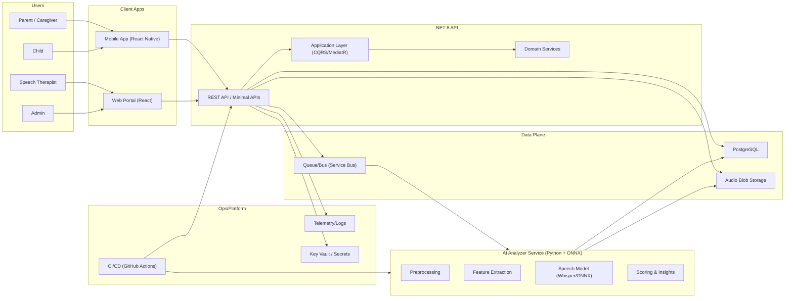

# System Context (Big-picture)

```mermaid
flowchart LR
  subgraph Users
    P["Parent / Caregiver"]
    C["Child"]
    ST["Speech Therapist"]
    ADM["Admin"]
  end

  subgraph Client_Apps["Client Apps"]
    RN["Mobile App (React Native)"]
    WEB["Web Portal (React)"]
  end

  subgraph Backend[".NET 8 API"]
    API["REST API / Minimal APIs"]
    APP["Application Layer (CQRS/MediatR)"]
    SVC["Domain Services"]
  end

  subgraph AI["AI Analyzer Service (Python + ONNX)"]
    PRE["Preprocessing"]
    FEAT["Feature Extraction"]
    MODEL["Speech Model (Whisper/ONNX)"]
    SCORE["Scoring & Insights"]
  end

  subgraph DataPlane["Data Plane"]
    DB["PostgreSQL"]
    BLOB["Audio Blob Storage"]
    Q["Queue/Bus (Service Bus)"]
  end

  subgraph Ops["Ops/Platform"]
    LOG["Telemetry/Logs"]
    SEC["Key Vault / Secrets"]
    CD["CI/CD (GitHub Actions)"]
  end

  P --> RN
  C --> RN
  ST --> WEB
  ADM --> WEB

  RN --> API
  WEB --> API
  API --> APP --> SVC
  API --> BLOB
  API --> Q
  Q --> AI
  AI --> BLOB
  AI --> DB
  API --> DB

  API --> LOG
  API --> SEC
  CD --> API
  CD --> AI
```
