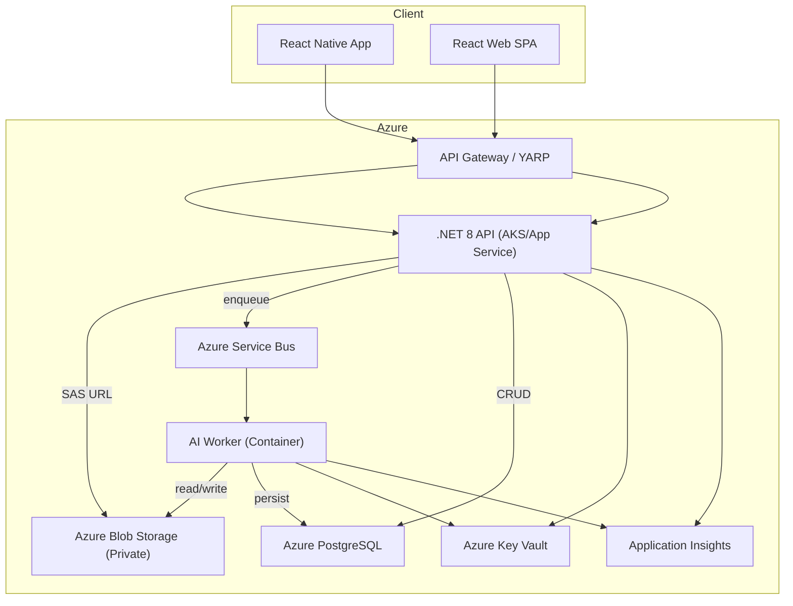

# Containers / Deployment (Azure)

```mermaid
flowchart TB
  subgraph Client
    RN["React Native App"]
    WEB["React Web SPA"]
  end

  subgraph Azure
    GW["API Gateway / YARP"]
    API[".NET 8 API (AKS/App Service)"]
    AIW["AI Worker (Container)"]
    DB["Azure PostgreSQL"]
    BLOB["Azure Blob Storage (Private)"]
    SB["Azure Service Bus"]
    KV["Azure Key Vault"]
    APPINS["Application Insights"]
  end

  RN --> GW --> API
  WEB --> GW --> API

  API -->|"SAS URL"| BLOB
  API -->|"enqueue"| SB
  SB --> AIW
  AIW -->|"read/write"| BLOB
  AIW -->|"persist"| DB
  API -->|"CRUD"| DB

  API --> KV
  AIW --> KV
  API --> APPINS
  AIW --> APPINS
```
