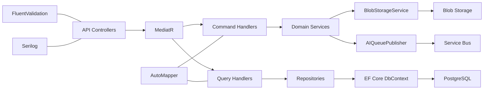

# Backend Components (Clean Architecture + CQRS)

```mermaid
flowchart LR
  CTRL["API Controllers"] --> MED["MediatR"]
  MED --> CMD["Command Handlers"]
  MED --> QRY["Query Handlers"]

  CMD --> DOM["Domain Services"]
  QRY --> REPO["Repositories"]

  REPO --> EF["EF Core DbContext"]
  DOM --> STG["BlobStorageService"]
  DOM --> AIQ["AIQueuePublisher"]

  STG --> BLOB["Blob Storage"]
  EF --> DB["PostgreSQL"]
  AIQ --> BUS["Service Bus"]

  VAL["FluentValidation"] --- CTRL
  MAP["AutoMapper"] --- CMD
  MAP --- QRY
  LOG["Serilog"] --- CTRL
```
