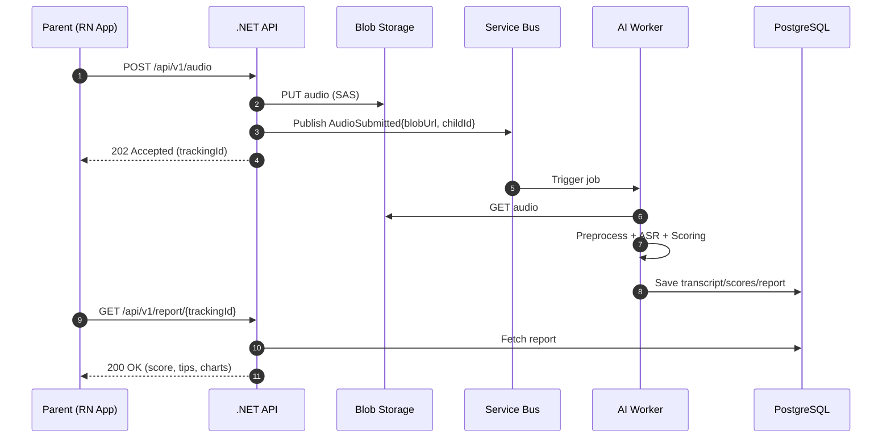

# Audio → Feedback (Sequence)

```mermaid
sequenceDiagram
  autonumber
  participant Parent as Parent (RN App)
  participant API as .NET API
  participant Blob as Blob Storage
  participant Bus as Service Bus
  participant AI as AI Worker
  participant DB as PostgreSQL

  Parent->>API: POST /api/v1/audio
  API->>Blob: PUT audio (SAS)
  API->>Bus: Publish AudioSubmitted{blobUrl, childId}
  API-->>Parent: 202 Accepted (trackingId)

  Bus->>AI: Trigger job
  AI->>Blob: GET audio
  AI->>AI: Preprocess + ASR + Scoring
  AI->>DB: Save transcript/scores/report

  Parent->>API: GET /api/v1/report/{trackingId}
  API->>DB: Fetch report
  API-->>Parent: 200 OK (score, tips, charts)
```
