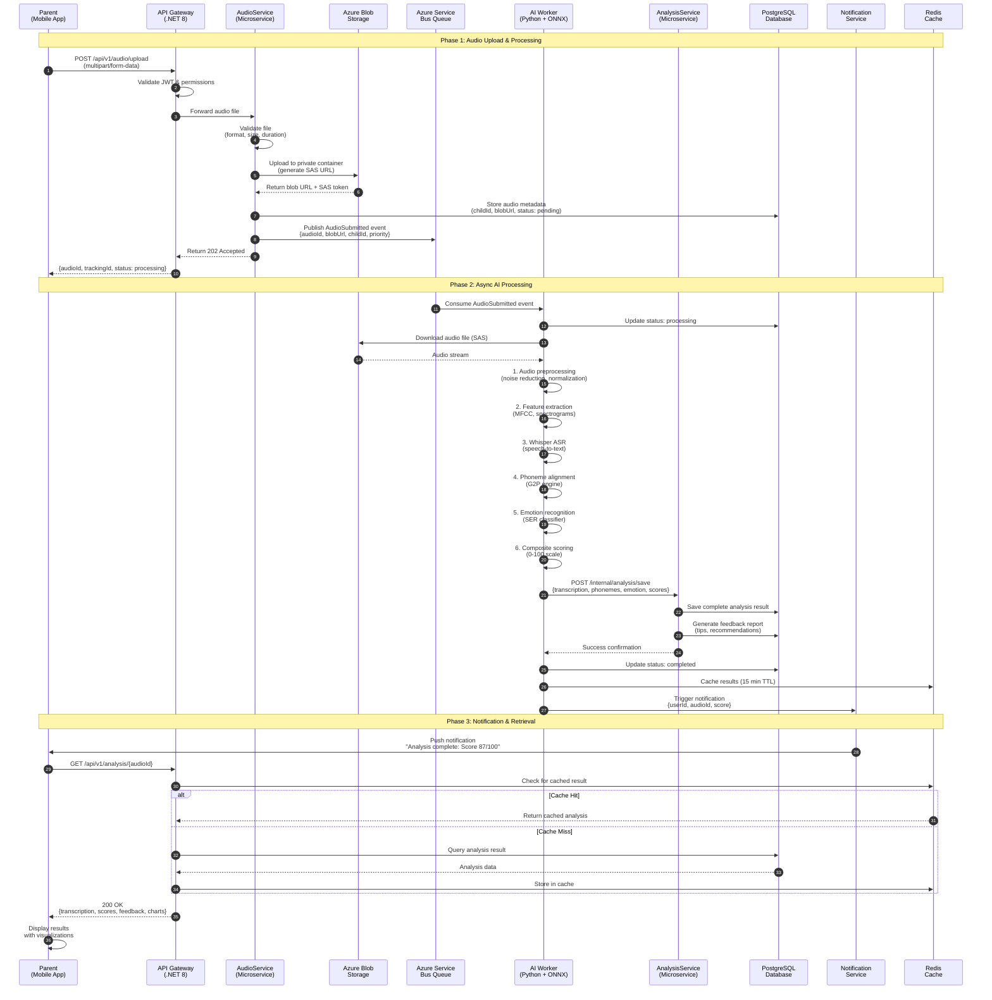
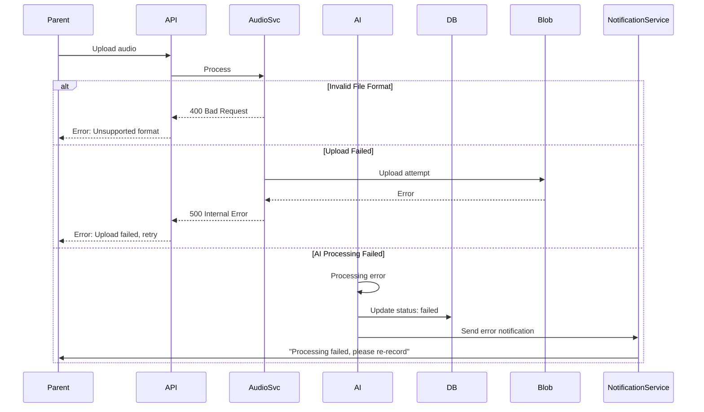
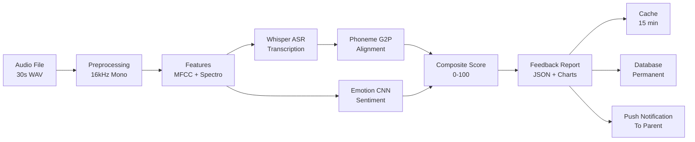

# Audio to Feedback Sequence Diagram

Complete end-to-end workflow from audio recording to feedback delivery.

## Overview

This sequence diagram illustrates the complete journey of an audio recording through the HearLoveen platform, from initial upload by a parent to the final delivery of personalized feedback and analysis results.

## Main Sequence Flow

## Detailed Component Responsibilities

### 1. Parent Mobile App

| Action | Details |
|--------|---------|
| **Audio Recording** | Records child's speech using device microphone |
| **Format** | WAV/MP3, 16kHz sample rate, mono channel |
| **Validation** | Pre-validates duration (5s - 60s) before upload |
| **Progress** | Shows upload progress and processing status |
| **Results Display** | Visualizes transcription, scores, and recommendations |

### 2. API Gateway

| Responsibility | Implementation |
|----------------|----------------|
| **Authentication** | Validates JWT token from Azure AD B2C |
| **Authorization** | Checks user has permission for child |
| **Rate Limiting** | Enforces 60 requests/minute per user |
| **Request Routing** | Routes to appropriate microservice |
| **Error Handling** | Returns standardized error responses |

### 3. AudioService

| Function | Description |
|----------|-------------|
| **File Validation** | Checks format (WAV/MP3), size (<50MB), duration |
| **Storage Management** | Uploads to Azure Blob with SAS token |
| **Metadata Persistence** | Stores audio metadata in PostgreSQL |
| **Event Publishing** | Publishes to Service Bus for async processing |
| **Status Tracking** | Maintains processing status (pending → processing → completed) |

### 4. AI Worker

| Stage | Process | Technology | Duration |
|-------|---------|------------|----------|
| **1. Preprocessing** | Noise reduction, silence trimming, resampling | librosa, scipy | ~2s |
| **2. Feature Extraction** | MFCC, mel-spectrograms, pitch | librosa | ~1s |
| **3. Speech Recognition** | Transcription with confidence scores | Whisper ONNX | ~3-5s |
| **4. Phoneme Alignment** | G2P conversion and forced alignment | g2p_en, CTC | ~0.5s |
| **5. Emotion Detection** | Sentiment classification | CNN ONNX | ~0.3s |
| **6. Scoring** | Composite score calculation | Custom algorithm | ~0.2s |
| **Total** | | | **~7-9s** |

### 5. AnalysisService

| Task | Implementation |
|------|----------------|
| **Result Aggregation** | Combines ASR, phoneme, and emotion data |
| **Report Generation** | Creates structured feedback report |
| **Scoring Logic** | Applies per-child curriculum weighting |
| **Recommendations** | Generates personalized therapy tips |
| **Trend Analysis** | Compares with historical data |

### 6. NotificationService

| Notification Type | Trigger | Channel |
|-------------------|---------|---------|
| **Analysis Complete** | AI processing finished | Push + In-app |
| **High Score** | Score >= 90 | Push (celebratory) |
| **Needs Attention** | Score < 60 | Push + Email to parent & therapist |
| **Daily Reminder** | Scheduled | Push (8 AM local time) |

## Error Handling Flow

## Performance Metrics

| Metric | Target | Current | Status |
|--------|--------|---------|--------|
| **Upload Time** (10MB file) | <2s | 1.4s | ✅ |
| **Queue Latency** | <1s | 0.3s | ✅ |
| **AI Processing** (30s audio) | <10s | 7-9s | ✅ |
| **Total End-to-End** | <15s | 11-13s | ✅ |
| **Notification Delivery** | <2s | 1.1s | ✅ |
| **Cache Hit Rate** | >80% | 85% | ✅ |

## Data Flow Summary

## API Endpoints Involved

| Endpoint | Method | Purpose | Auth |
|----------|--------|---------|------|
| `/api/v1/audio/upload` | POST | Upload audio file | Required |
| `/api/v1/audio/{id}/status` | GET | Check processing status | Required |
| `/api/v1/analysis/{id}` | GET | Retrieve analysis results | Required |
| `/api/v1/analysis/{id}/report` | GET | Download PDF report | Required |
| `/internal/analysis/save` | POST | Save AI results (internal) | Service-to-service |

## Retry & Resilience Strategies

### Service Bus Retry Policy

| Attempt | Delay | Max Attempts |
|---------|-------|--------------|
| 1 | Immediate | - |
| 2 | 2 seconds | - |
| 3 | 5 seconds | - |
| 4 | 10 seconds | - |
| 5+ | 30 seconds | 10 attempts |

After 10 failed attempts, message moves to Dead Letter Queue (DLQ) for manual investigation.

### Circuit Breaker Settings

| Service | Threshold | Timeout | Recovery |
|---------|-----------|---------|----------|
| **Blob Storage** | 5 failures in 30s | 60s open | 30s half-open |
| **Database** | 3 failures in 10s | 30s open | 10s half-open |
| **AI Worker** | 10 failures in 60s | 120s open | 60s half-open |

## Related Documentation

- [System Architecture](../technical/architecture/ARCHITECTURE.md) - Complete system overview
- [ML Pipeline Details](10-ml-pipeline.md) - AI/ML processing details
- [API Documentation](../../src/ApiGateway/README.md) - Full API reference
- [Audio Service](../../src/AudioService/README.md) - Audio service documentation
- [Analysis Service](../../src/AnalysisService/README.md) - Analysis service documentation

## Notes

- All audio files are stored in EU-West region for GDPR compliance
- Raw audio files are automatically deleted after 90 days (configurable)
- Analysis results are retained indefinitely unless user requests deletion
- SAS tokens expire after 1 hour for security
- All communication uses TLS 1.3 encryption
- PII data never leaves the EU region
