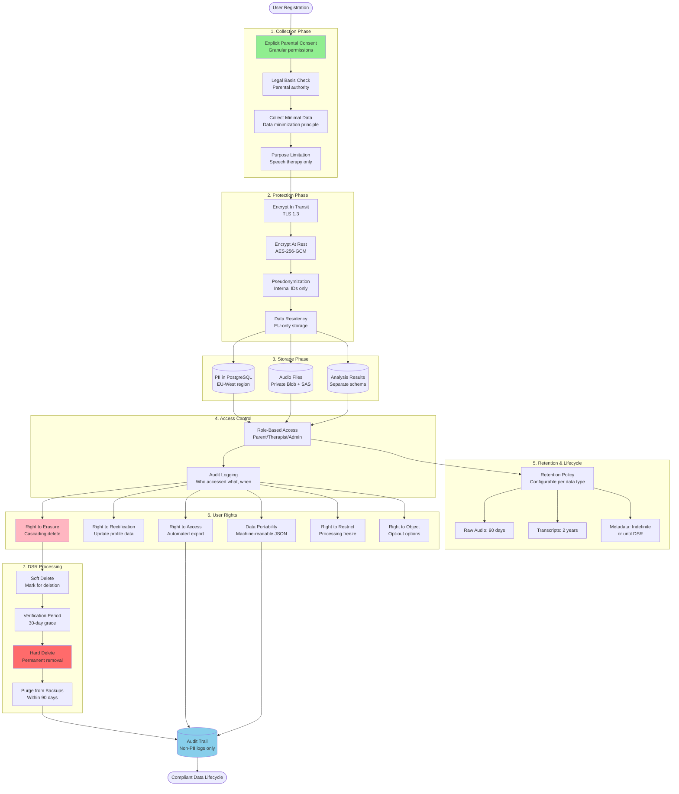
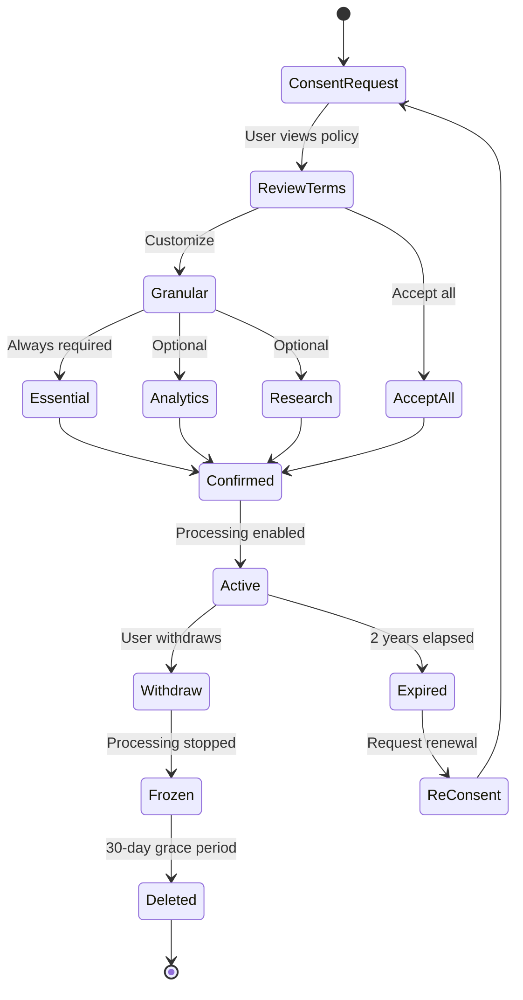
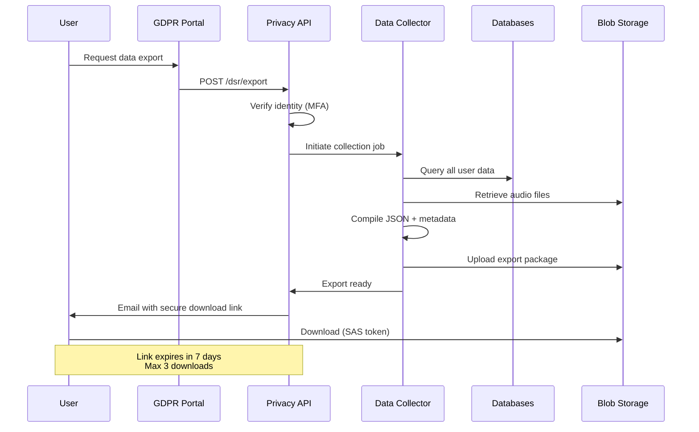
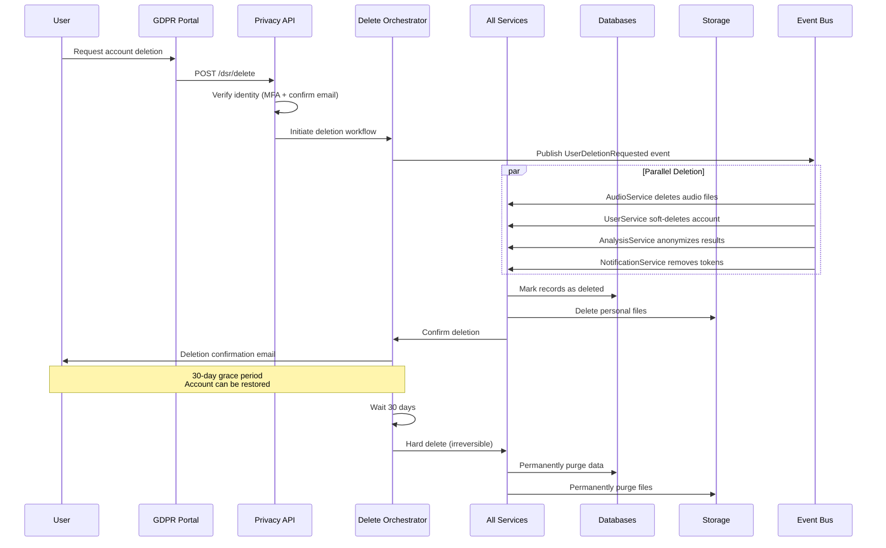
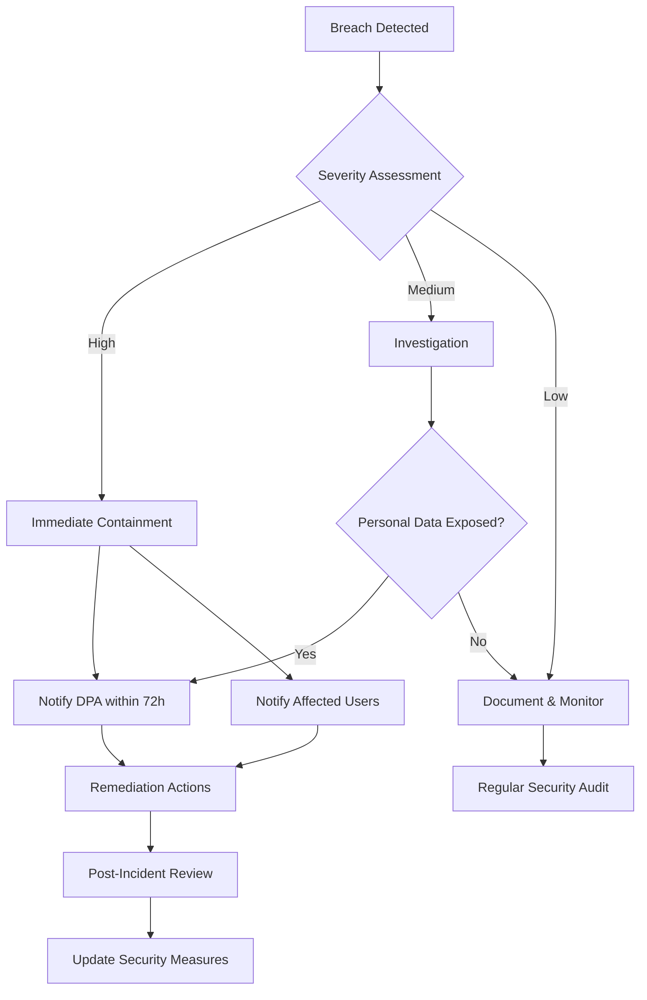

# GDPR-First Data Lifecycle

Complete data lifecycle management with privacy-by-design principles and GDPR compliance.

## Overview

HearLoveen implements a **privacy-first** approach to data management, ensuring full compliance with GDPR (General Data Protection Regulation) and other privacy regulations. This document details how personal data flows through the system with appropriate safeguards at every stage.

## Complete Data Lifecycle



## Data Categories & Classification

### Personal Data Inventory

| Data Category | Examples | Storage Location | Retention | Encryption |
|---------------|----------|------------------|-----------|------------|
| **Direct Identifiers** | Name, Email, Phone | PostgreSQL PII schema | Account lifetime | AES-256 + TLS |
| **Child Data** | Name, DOB, Diagnosis | PostgreSQL PII schema | Account lifetime | AES-256 + TLS |
| **Audio Recordings** | Voice samples (WAV/MP3) | Azure Blob (EU) | 90 days | AES-256 + SAS |
| **Transcriptions** | Speech-to-text output | PostgreSQL | 2 years | AES-256 + TLS |
| **Analysis Results** | Scores, phonemes, emotions | PostgreSQL | 2 years | AES-256 + TLS |
| **Usage Metadata** | Login times, session duration | PostgreSQL | 1 year | TLS only |
| **Device Data** | IoT telemetry | IoT Hub + PostgreSQL | 90 days | TLS + field-level |
| **Therapist Notes** | Clinical observations | PostgreSQL | Account lifetime | AES-256 + TLS |

### Non-Personal Data

| Data Type | Purpose | Retention | Notes |
|-----------|---------|-----------|-------|
| **Aggregated Analytics** | Product improvement | Indefinite | Anonymized, non-reversible |
| **System Logs** | Debugging, security | 90 days | Sanitized of PII |
| **Performance Metrics** | Monitoring | 1 year | No user linkage |
| **Model Training Data** | ML improvements | Indefinite | Fully anonymized |

## Legal Basis for Processing

| Processing Activity | Legal Basis | Notes |
|---------------------|-------------|-------|
| **User Registration** | Consent | Explicit opt-in required |
| **Audio Analysis** | Consent | Per-session consent |
| **Therapist Access** | Legitimate Interest | Healthcare provision |
| **Service Improvement** | Legitimate Interest | Aggregated data only |
| **Security Monitoring** | Legal Obligation | Fraud prevention |
| **Backup Retention** | Legitimate Interest | Business continuity |

## Consent Management Flow



## Consent Granularity

| Consent Type | Required | Withdrawable | Purpose |
|--------------|----------|--------------|---------|
| **Essential Services** | ✅ Yes | ❌ No | Core platform functionality |
| **Audio Analysis** | ✅ Yes | ✅ Yes | Speech therapy features |
| **Therapist Sharing** | ❌ No | ✅ Yes | Professional oversight |
| **Analytics & Improvement** | ❌ No | ✅ Yes | Platform optimization |
| **Research Participation** | ❌ No | ✅ Yes | Clinical studies |
| **Marketing Communications** | ❌ No | ✅ Yes | Updates and newsletters |

## Data Subject Rights Implementation

### 1. Right to Access



**Implementation**: `/api/v1/privacy/dsr/export`
- **Response Time**: Within 48 hours
- **Format**: Machine-readable JSON + CSV
- **Delivery**: Secure download link via email
- **Retention**: Export package deleted after 30 days

### 2. Right to Erasure



**Implementation**: `/api/v1/privacy/dsr/delete`
- **Grace Period**: 30 days (soft delete)
- **Final Deletion**: Day 31 (hard delete, irreversible)
- **Backup Purge**: Within 90 days
- **Exceptions**: Legal hold, active disputes

### 3. Right to Rectification

**Implementation**: User profile update APIs
- Users can update personal information directly
- Parents can update child information
- Changes audited and logged
- Real-time propagation to all services

### 4. Right to Data Portability

**Export Format**:
```json
{
  "export_date": "2024-12-08T10:30:00Z",
  "user": {
    "id": "usr_abc123",
    "email": "parent@example.com",
    "name": "John Doe",
    "registered": "2023-06-15T09:00:00Z"
  },
  "children": [
    {
      "id": "child_xyz789",
      "name": "Jane Doe",
      "dob": "2018-03-20",
      "recordings": 145,
      "analysis_history": "..."
    }
  ],
  "audio_files": [
    {
      "id": "audio_001",
      "recorded": "2024-12-01T14:30:00Z",
      "download_url": "https://...",
      "duration_seconds": 30,
      "transcription": "Hello world..."
    }
  ]
}
```

### 5. Right to Restrict Processing

- Users can pause all processing while keeping data
- Status: `account.processing_restricted = true`
- Restrictions:
  - No new audio analysis
  - No notifications sent
  - No data in analytics
  - No therapist access
- Data remains encrypted and stored
- Restrictions can be lifted anytime

### 6. Right to Object

Users can object to:
- Marketing communications (opt-out anytime)
- Profiling and automated decisions (manual review available)
- Research participation (opt-out anytime)
- Analytics tracking (anonymized aggregates only)

## Security Measures

### Encryption Standards

| Layer | Method | Key Management |
|-------|--------|----------------|
| **In Transit** | TLS 1.3 | Certificate rotation (90 days) |
| **At Rest (DB)** | AES-256-GCM | Azure Key Vault HSM |
| **At Rest (Blob)** | AES-256-GCM | Customer-managed keys |
| **Field-Level** | AES-256-GCM | Per-child encryption keys |
| **Backups** | AES-256-GCM | Separate backup keys |

### Access Controls

| Role | Access Level | Data Scope | MFA Required |
|------|--------------|------------|--------------|
| **Parent** | Read/Write | Own children only | Recommended |
| **Therapist** | Read/Comment | Assigned children | Required |
| **Admin** | Limited admin | Aggregates only | Required |
| **Support** | Read-only | Ticketed cases only | Required |
| **Developer** | No production access | Anonymized dev data | N/A |

### Audit Logging

All access to personal data is logged:

```json
{
  "timestamp": "2024-12-08T10:30:00Z",
  "user_id": "usr_abc123",
  "action": "data_access",
  "resource_type": "child_profile",
  "resource_id": "child_xyz789",
  "ip_address": "203.0.113.42",
  "user_agent": "HearLoveen/iOS 1.5.0",
  "result": "success",
  "accessed_fields": ["name", "recordings", "latest_score"]
}
```

**Retention**: Audit logs retained for 2 years (non-PII only)

## Data Residency & Transfers

### Regional Deployment

| Region | Services | Data Types | Status |
|--------|----------|------------|--------|
| **EU West (Primary)** | All services | All personal data | ✅ Active |
| **EU North (DR)** | Replicas | Encrypted backups | ✅ Standby |
| **US East** | CDN only | Static assets (no PII) | ✅ Active |

### Cross-Border Transfers

- **Prohibited**: Personal data never leaves EU
- **Exception**: User explicitly requests (e.g., moving countries)
- **Mechanism**: Standard Contractual Clauses (SCCs)
- **Assessment**: Transfer Impact Assessment (TIA) required

## Breach Response Plan



### Breach Notification Timeline

| Time | Action | Responsible |
|------|--------|-------------|
| **T+0** | Detect and contain breach | Security Team |
| **T+2h** | Assess scope and severity | Security + Legal |
| **T+24h** | Internal incident report | CISO |
| **T+72h** | Notify supervisory authority (if required) | DPO |
| **T+7d** | Notify affected users (if high risk) | Communications |
| **T+30d** | Post-incident review and remediation | All teams |

## GDPR Compliance Checklist

| Requirement | Implementation | Status |
|-------------|----------------|--------|
| **Lawful Basis** | Explicit consent + legitimate interest | ✅ |
| **Transparency** | Clear privacy policy + data usage notices | ✅ |
| **Data Minimization** | Only collect necessary data | ✅ |
| **Accuracy** | User-updateable profiles | ✅ |
| **Storage Limitation** | Automated retention policies | ✅ |
| **Integrity & Confidentiality** | Encryption + access controls | ✅ |
| **Accountability** | DPO appointed + documentation | ✅ |
| **Data Protection by Design** | Privacy-first architecture | ✅ |
| **DPO Appointment** | External DPO retained | ✅ |
| **DPIA Conducted** | For high-risk processing | ✅ |
| **Records of Processing** | Maintained and current | ✅ |
| **Third-Party Processors** | Data Processing Agreements (DPAs) | ✅ |

## Related Documentation

- [Privacy Architecture](../technical/architecture/PRIVACY.md) - Technical privacy implementation
- [Security Implementation](../security/SECURITY_IMPLEMENTATION.md) - Security controls
- [Compliance Overview](../technical/architecture/COMPLIANCE.md) - Regulatory compliance
- [GDPR Portal](../product/gdpr-portal.md) - User-facing privacy tools
- [Data Processing Agreement](../../legal/DPA.md) - Third-party processor terms

## Data Protection Officer (DPO)

- **Name**: [DPO Name/Company]
- **Email**: dpo@hearloveen.com
- **Address**: [EU Address]
- **Supervisory Authority**: [National DPA]
- **Registration**: [DPA Registration Number]

## Contact

For privacy inquiries:
- **Email**: privacy@hearloveen.com
- **GDPR Portal**: https://hearloveen.com/privacy
- **Support**: Via in-app chat or support@hearloveen.com
