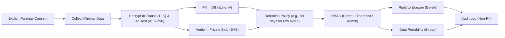

# GDPR-first Data Lifecycle

```mermaid
flowchart LR
  CONSENT["Explicit Parental Consent"] --> COLLECT["Collect Minimal Data"]
  COLLECT --> ENCRYPT["Encrypt In Transit (TLS) & At Rest (AES-256)"]
  ENCRYPT --> STORE_DB["PII in DB (EU-only)"]
  ENCRYPT --> STORE_BLOB["Audio in Private Blob (SAS)"]
  STORE_DB --> RET["Retention Policy (e.g., 90 days for raw audio)"]
  STORE_BLOB --> RET
  RET --> ACCESS["RBAC (Parent / Therapist / Admin)"]
  ACCESS --> EXPORT["Data Portability (Export)"]
  ACCESS --> ERASE["Right to Erasure (Delete)"]
  ERASE --> AUDIT["Audit Log (Non-PII)"]
  EXPORT --> AUDIT
```
