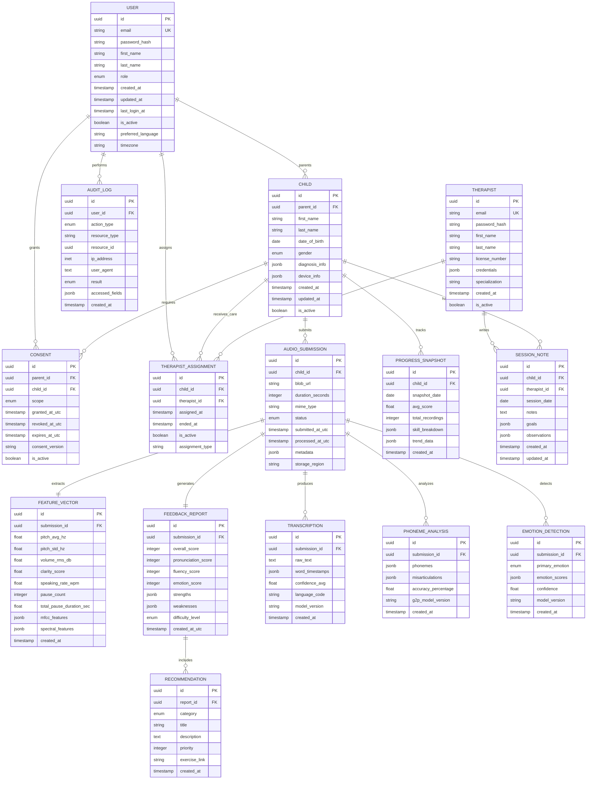

# Core Database Schema (ERD)

Complete entity-relationship diagram and database schema documentation for HearLoveen platform.

## Overview

HearLoveen uses **PostgreSQL 15+** as the primary relational database, implementing a normalized schema with strong referential integrity. The database is designed with GDPR compliance in mind, separating PII (Personally Identifiable Information) from analytical data.

## Complete Entity Relationship Diagram



## Schema Documentation

### Core User Tables

#### 1. USER

Main user account table for parents and administrators.

| Column | Type | Constraints | Description |
|--------|------|-------------|-------------|
| `id` | UUID | PRIMARY KEY | Unique user identifier |
| `email` | VARCHAR(255) | UNIQUE, NOT NULL | User email (login credential) |
| `password_hash` | VARCHAR(255) | NOT NULL | Bcrypt hashed password |
| `first_name` | VARCHAR(100) | NOT NULL | User's first name |
| `last_name` | VARCHAR(100) | NOT NULL | User's last name |
| `role` | ENUM | NOT NULL | Role: parent, admin, support |
| `created_at` | TIMESTAMP | NOT NULL, DEFAULT NOW() | Account creation timestamp |
| `updated_at` | TIMESTAMP | NOT NULL, DEFAULT NOW() | Last update timestamp |
| `last_login_at` | TIMESTAMP | NULL | Last successful login |
| `is_active` | BOOLEAN | NOT NULL, DEFAULT TRUE | Account status |
| `preferred_language` | VARCHAR(5) | DEFAULT 'en' | ISO 639-1 language code |
| `timezone` | VARCHAR(50) | DEFAULT 'UTC' | IANA timezone identifier |

**Indexes**:
- `idx_user_email` (UNIQUE) on `email`
- `idx_user_role` on `role`
- `idx_user_created_at` on `created_at`

#### 2. CHILD

Child profile table with diagnosis and device information.

| Column | Type | Constraints | Description |
|--------|------|-------------|-------------|
| `id` | UUID | PRIMARY KEY | Unique child identifier |
| `parent_id` | UUID | FOREIGN KEY → USER(id), NOT NULL | Parent reference |
| `first_name` | VARCHAR(100) | NOT NULL | Child's first name |
| `last_name` | VARCHAR(100) | NOT NULL | Child's last name |
| `date_of_birth` | DATE | NOT NULL | Date of birth |
| `gender` | ENUM | NULL | Gender: male, female, other, prefer_not_to_say |
| `diagnosis_info` | JSONB | NULL | Hearing diagnosis details |
| `device_info` | JSONB | NULL | Hearing aid/cochlear implant info |
| `created_at` | TIMESTAMP | NOT NULL, DEFAULT NOW() | Record creation timestamp |
| `updated_at` | TIMESTAMP | NOT NULL, DEFAULT NOW() | Last update timestamp |
| `is_active` | BOOLEAN | NOT NULL, DEFAULT TRUE | Active status |

**Indexes**:
- `idx_child_parent_id` on `parent_id`
- `idx_child_dob` on `date_of_birth`
- `idx_child_is_active` on `is_active`

**Constraints**:
- CHECK: `date_of_birth` <= CURRENT_DATE
- CHECK: `date_of_birth` >= '1900-01-01'

#### 3. THERAPIST

Licensed speech therapist accounts.

| Column | Type | Constraints | Description |
|--------|------|-------------|-------------|
| `id` | UUID | PRIMARY KEY | Unique therapist identifier |
| `email` | VARCHAR(255) | UNIQUE, NOT NULL | Professional email |
| `password_hash` | VARCHAR(255) | NOT NULL | Bcrypt hashed password |
| `first_name` | VARCHAR(100) | NOT NULL | Therapist's first name |
| `last_name` | VARCHAR(100) | NOT NULL | Therapist's last name |
| `license_number` | VARCHAR(50) | UNIQUE, NOT NULL | Professional license number |
| `credentials` | JSONB | NOT NULL | Degrees, certifications |
| `specialization` | VARCHAR(100) | NULL | Area of expertise |
| `created_at` | TIMESTAMP | NOT NULL, DEFAULT NOW() | Account creation |
| `is_active` | BOOLEAN | NOT NULL, DEFAULT TRUE | Active status |

**Indexes**:
- `idx_therapist_email` (UNIQUE) on `email`
- `idx_therapist_license` (UNIQUE) on `license_number`

### Audio & Analysis Tables

#### 4. AUDIO_SUBMISSION

Audio recording submissions from children.

| Column | Type | Constraints | Description |
|--------|------|-------------|-------------|
| `id` | UUID | PRIMARY KEY | Unique submission identifier |
| `child_id` | UUID | FOREIGN KEY → CHILD(id), NOT NULL | Child reference |
| `blob_url` | VARCHAR(500) | NOT NULL | Azure Blob Storage URL |
| `duration_seconds` | INTEGER | NOT NULL | Audio duration in seconds |
| `mime_type` | VARCHAR(50) | NOT NULL | Audio format (audio/wav, audio/mpeg) |
| `status` | ENUM | NOT NULL, DEFAULT 'pending' | Status: pending, processing, completed, failed |
| `submitted_at_utc` | TIMESTAMP | NOT NULL, DEFAULT NOW() | Submission timestamp |
| `processed_at_utc` | TIMESTAMP | NULL | AI processing completion time |
| `metadata` | JSONB | NULL | Device info, environment, recording settings |
| `storage_region` | VARCHAR(50) | NOT NULL, DEFAULT 'eu-west' | Data residency region |

**Indexes**:
- `idx_audio_child_id` on `child_id`
- `idx_audio_status` on `status`
- `idx_audio_submitted_at` on `submitted_at_utc`
- `idx_audio_processed_at` on `processed_at_utc`

**Constraints**:
- CHECK: `duration_seconds` BETWEEN 5 AND 300 (5s to 5min)
- CHECK: `status` IN ('pending', 'processing', 'completed', 'failed')

#### 5. FEATURE_VECTOR

Extracted audio features for ML processing.

| Column | Type | Constraints | Description |
|--------|------|-------------|-------------|
| `id` | UUID | PRIMARY KEY | Unique feature vector ID |
| `submission_id` | UUID | FOREIGN KEY → AUDIO_SUBMISSION(id), UNIQUE, NOT NULL | Audio reference (1:1) |
| `pitch_avg_hz` | FLOAT | NULL | Average pitch in Hertz |
| `pitch_std_hz` | FLOAT | NULL | Pitch standard deviation |
| `volume_rms_db` | FLOAT | NULL | RMS volume in decibels |
| `clarity_score` | FLOAT | NULL | Audio clarity score (0-1) |
| `speaking_rate_wpm` | FLOAT | NULL | Words per minute |
| `pause_count` | INTEGER | NULL | Number of pauses |
| `total_pause_duration_sec` | FLOAT | NULL | Total pause time |
| `mfcc_features` | JSONB | NULL | MFCC coefficients array |
| `spectral_features` | JSONB | NULL | Spectral features array |
| `created_at` | TIMESTAMP | NOT NULL, DEFAULT NOW() | Feature extraction time |

**Indexes**:
- `idx_feature_submission_id` (UNIQUE) on `submission_id`
- `idx_feature_created_at` on `created_at`

#### 6. TRANSCRIPTION

Speech-to-text transcription results.

| Column | Type | Constraints | Description |
|--------|------|-------------|-------------|
| `id` | UUID | PRIMARY KEY | Unique transcription ID |
| `submission_id` | UUID | FOREIGN KEY → AUDIO_SUBMISSION(id), NOT NULL | Audio reference |
| `raw_text` | TEXT | NOT NULL | Full transcribed text |
| `word_timestamps` | JSONB | NULL | Word-level timing data |
| `confidence_avg` | FLOAT | NULL | Average confidence (0-1) |
| `language_code` | VARCHAR(5) | NOT NULL | ISO 639-1 language |
| `model_version` | VARCHAR(50) | NOT NULL | Whisper model version |
| `created_at` | TIMESTAMP | NOT NULL, DEFAULT NOW() | Transcription timestamp |

**Indexes**:
- `idx_transcription_submission_id` on `submission_id`
- `idx_transcription_language` on `language_code`
- Full-text search index on `raw_text` (GIN)

#### 7. PHONEME_ANALYSIS

Phonetic analysis of speech.

| Column | Type | Constraints | Description |
|--------|------|-------------|-------------|
| `id` | UUID | PRIMARY KEY | Unique analysis ID |
| `submission_id` | UUID | FOREIGN KEY → AUDIO_SUBMISSION(id), NOT NULL | Audio reference |
| `phonemes` | JSONB | NOT NULL | Detected phonemes with timestamps |
| `misarticulations` | JSONB | NULL | Identified pronunciation errors |
| `accuracy_percentage` | FLOAT | NOT NULL | Phoneme accuracy (0-100) |
| `g2p_model_version` | VARCHAR(50) | NOT NULL | G2P model version |
| `created_at` | TIMESTAMP | NOT NULL, DEFAULT NOW() | Analysis timestamp |

**Indexes**:
- `idx_phoneme_submission_id` on `submission_id`
- GIN index on `phonemes` for JSONB queries

#### 8. EMOTION_DETECTION

Speech emotion recognition results.

| Column | Type | Constraints | Description |
|--------|------|-------------|-------------|
| `id` | UUID | PRIMARY KEY | Unique detection ID |
| `submission_id` | UUID | FOREIGN KEY → AUDIO_SUBMISSION(id), NOT NULL | Audio reference |
| `primary_emotion` | ENUM | NOT NULL | Dominant emotion: happy, sad, neutral, frustrated, excited |
| `emotion_scores` | JSONB | NOT NULL | Confidence scores for all emotions |
| `confidence` | FLOAT | NOT NULL | Primary emotion confidence (0-1) |
| `model_version` | VARCHAR(50) | NOT NULL | SER model version |
| `created_at` | TIMESTAMP | NOT NULL, DEFAULT NOW() | Detection timestamp |

**Indexes**:
- `idx_emotion_submission_id` on `submission_id`
- `idx_emotion_primary` on `primary_emotion`

#### 9. FEEDBACK_REPORT

Generated feedback and scoring reports.

| Column | Type | Constraints | Description |
|--------|------|-------------|-------------|
| `id` | UUID | PRIMARY KEY | Unique report ID |
| `submission_id` | UUID | FOREIGN KEY → AUDIO_SUBMISSION(id), UNIQUE, NOT NULL | Audio reference (1:1) |
| `overall_score` | INTEGER | NOT NULL | Composite score (0-100) |
| `pronunciation_score` | INTEGER | NOT NULL | Pronunciation subscore (0-100) |
| `fluency_score` | INTEGER | NOT NULL | Fluency subscore (0-100) |
| `emotion_score` | INTEGER | NOT NULL | Emotion subscore (0-100) |
| `strengths` | JSONB | NOT NULL | Identified strengths array |
| `weaknesses` | JSONB | NOT NULL | Areas for improvement array |
| `difficulty_level` | ENUM | NOT NULL | Level: beginner, intermediate, advanced |
| `created_at_utc` | TIMESTAMP | NOT NULL, DEFAULT NOW() | Report generation time |

**Indexes**:
- `idx_feedback_submission_id` (UNIQUE) on `submission_id`
- `idx_feedback_overall_score` on `overall_score`
- `idx_feedback_created_at` on `created_at_utc`

**Constraints**:
- CHECK: `overall_score` BETWEEN 0 AND 100
- CHECK: `pronunciation_score` BETWEEN 0 AND 100
- CHECK: `fluency_score` BETWEEN 0 AND 100
- CHECK: `emotion_score` BETWEEN 0 AND 100

#### 10. RECOMMENDATION

Personalized therapy recommendations.

| Column | Type | Constraints | Description |
|--------|------|-------------|-------------|
| `id` | UUID | PRIMARY KEY | Unique recommendation ID |
| `report_id` | UUID | FOREIGN KEY → FEEDBACK_REPORT(id), NOT NULL | Report reference |
| `category` | ENUM | NOT NULL | Category: pronunciation, fluency, listening, vocabulary |
| `title` | VARCHAR(200) | NOT NULL | Recommendation title |
| `description` | TEXT | NOT NULL | Detailed description |
| `priority` | INTEGER | NOT NULL | Priority (1-5, 1=highest) |
| `exercise_link` | VARCHAR(500) | NULL | Link to exercise/resource |
| `created_at` | TIMESTAMP | NOT NULL, DEFAULT NOW() | Creation timestamp |

**Indexes**:
- `idx_recommendation_report_id` on `report_id`
- `idx_recommendation_category` on `category`
- `idx_recommendation_priority` on `priority`

### Relationship & Tracking Tables

#### 11. THERAPIST_ASSIGNMENT

Therapist-child assignment tracking.

| Column | Type | Constraints | Description |
|--------|------|-------------|-------------|
| `id` | UUID | PRIMARY KEY | Unique assignment ID |
| `child_id` | UUID | FOREIGN KEY → CHILD(id), NOT NULL | Child reference |
| `therapist_id` | UUID | FOREIGN KEY → THERAPIST(id), NOT NULL | Therapist reference |
| `assigned_at` | TIMESTAMP | NOT NULL, DEFAULT NOW() | Assignment start date |
| `ended_at` | TIMESTAMP | NULL | Assignment end date |
| `is_active` | BOOLEAN | NOT NULL, DEFAULT TRUE | Current assignment status |
| `assignment_type` | VARCHAR(50) | NOT NULL | Type: primary, consultant, temporary |

**Indexes**:
- `idx_assignment_child_id` on `child_id`
- `idx_assignment_therapist_id` on `therapist_id`
- `idx_assignment_is_active` on `is_active`

**Constraints**:
- UNIQUE constraint on (`child_id`, `therapist_id`, `is_active`) WHERE `is_active` = TRUE

#### 12. SESSION_NOTE

Therapist session notes and observations.

| Column | Type | Constraints | Description |
|--------|------|-------------|-------------|
| `id` | UUID | PRIMARY KEY | Unique note ID |
| `child_id` | UUID | FOREIGN KEY → CHILD(id), NOT NULL | Child reference |
| `therapist_id` | UUID | FOREIGN KEY → THERAPIST(id), NOT NULL | Therapist reference |
| `session_date` | DATE | NOT NULL | Session date |
| `notes` | TEXT | NOT NULL | Clinical observations |
| `goals` | JSONB | NULL | Session goals |
| `observations` | JSONB | NULL | Structured observations |
| `created_at` | TIMESTAMP | NOT NULL, DEFAULT NOW() | Note creation time |
| `updated_at` | TIMESTAMP | NOT NULL, DEFAULT NOW() | Last update time |

**Indexes**:
- `idx_session_note_child_id` on `child_id`
- `idx_session_note_therapist_id` on `therapist_id`
- `idx_session_note_session_date` on `session_date`

#### 13. PROGRESS_SNAPSHOT

Periodic progress tracking snapshots.

| Column | Type | Constraints | Description |
|--------|------|-------------|-------------|
| `id` | UUID | PRIMARY KEY | Unique snapshot ID |
| `child_id` | UUID | FOREIGN KEY → CHILD(id), NOT NULL | Child reference |
| `snapshot_date` | DATE | NOT NULL | Snapshot date |
| `avg_score` | FLOAT | NOT NULL | Average score for period |
| `total_recordings` | INTEGER | NOT NULL | Total recordings in period |
| `skill_breakdown` | JSONB | NOT NULL | Scores by skill area |
| `trend_data` | JSONB | NULL | Trend analysis data |
| `created_at` | TIMESTAMP | NOT NULL, DEFAULT NOW() | Snapshot creation time |

**Indexes**:
- `idx_progress_child_id` on `child_id`
- `idx_progress_snapshot_date` on `snapshot_date`
- UNIQUE constraint on (`child_id`, `snapshot_date`)

### GDPR & Compliance Tables

#### 14. CONSENT

User consent management for GDPR compliance.

| Column | Type | Constraints | Description |
|--------|------|-------------|-------------|
| `id` | UUID | PRIMARY KEY | Unique consent ID |
| `parent_id` | UUID | FOREIGN KEY → USER(id), NOT NULL | Parent reference |
| `child_id` | UUID | FOREIGN KEY → CHILD(id), NOT NULL | Child reference |
| `scope` | ENUM | NOT NULL | Scope: essential, analytics, research, marketing |
| `granted_at_utc` | TIMESTAMP | NOT NULL, DEFAULT NOW() | Consent grant timestamp |
| `revoked_at_utc` | TIMESTAMP | NULL | Consent revocation timestamp |
| `expires_at_utc` | TIMESTAMP | NULL | Consent expiration (2 years default) |
| `consent_version` | VARCHAR(20) | NOT NULL | Privacy policy version |
| `is_active` | BOOLEAN | NOT NULL, DEFAULT TRUE | Current consent status |

**Indexes**:
- `idx_consent_parent_id` on `parent_id`
- `idx_consent_child_id` on `child_id`
- `idx_consent_scope` on `scope`
- `idx_consent_is_active` on `is_active`

**Constraints**:
- CHECK: `revoked_at_utc` IS NULL OR `revoked_at_utc` >= `granted_at_utc`
- CHECK: `expires_at_utc` IS NULL OR `expires_at_utc` > `granted_at_utc`

#### 15. AUDIT_LOG

Complete audit trail for GDPR compliance.

| Column | Type | Constraints | Description |
|--------|------|-------------|-------------|
| `id` | UUID | PRIMARY KEY | Unique audit ID |
| `user_id` | UUID | FOREIGN KEY → USER(id), NULL | User performing action |
| `action_type` | ENUM | NOT NULL | Action: data_access, data_export, data_delete, update, consent_change |
| `resource_type` | VARCHAR(100) | NOT NULL | Resource type (table/entity) |
| `resource_id` | UUID | NOT NULL | Resource identifier |
| `ip_address` | INET | NOT NULL | Client IP address |
| `user_agent` | TEXT | NULL | Browser/app user agent |
| `result` | ENUM | NOT NULL | Result: success, failure, blocked |
| `accessed_fields` | JSONB | NULL | List of accessed/modified fields |
| `created_at` | TIMESTAMP | NOT NULL, DEFAULT NOW() | Action timestamp |

**Indexes**:
- `idx_audit_user_id` on `user_id`
- `idx_audit_action_type` on `action_type`
- `idx_audit_resource` on (`resource_type`, `resource_id`)
- `idx_audit_created_at` on `created_at`

**Retention**: Audit logs retained for 2 years (non-PII only after user deletion)

## Relationship Cardinality

### One-to-Many Relationships

| Parent Table | Child Table | Cardinality | Description |
|--------------|-------------|-------------|-------------|
| USER | CHILD | 1:N | One parent can have multiple children |
| USER | CONSENT | 1:N | One user can grant multiple consents |
| USER | AUDIT_LOG | 1:N | One user can have multiple audit entries |
| CHILD | AUDIO_SUBMISSION | 1:N | One child can submit multiple audio recordings |
| CHILD | PROGRESS_SNAPSHOT | 1:N | One child has multiple progress snapshots |
| AUDIO_SUBMISSION | TRANSCRIPTION | 1:N | One audio can have multiple transcriptions (retries) |
| FEEDBACK_REPORT | RECOMMENDATION | 1:N | One report contains multiple recommendations |
| THERAPIST | THERAPIST_ASSIGNMENT | 1:N | One therapist can be assigned to multiple children |
| THERAPIST | SESSION_NOTE | 1:N | One therapist can write multiple notes |
| CHILD | SESSION_NOTE | 1:N | One child can have multiple session notes |

### One-to-One Relationships

| Table 1 | Table 2 | Description |
|---------|---------|-------------|
| AUDIO_SUBMISSION | FEATURE_VECTOR | Each audio has exactly one feature vector |
| AUDIO_SUBMISSION | FEEDBACK_REPORT | Each audio has exactly one feedback report |

### Many-to-Many Relationships

| Table 1 | Junction Table | Table 2 | Description |
|---------|----------------|---------|-------------|
| CHILD | THERAPIST_ASSIGNMENT | THERAPIST | Children can have multiple therapists over time |

## Data Types & Enums

### Enum Definitions

```sql
-- User roles
CREATE TYPE user_role AS ENUM ('parent', 'admin', 'support');

-- Child gender
CREATE TYPE gender_type AS ENUM ('male', 'female', 'other', 'prefer_not_to_say');

-- Audio processing status
CREATE TYPE audio_status AS ENUM ('pending', 'processing', 'completed', 'failed');

-- Emotion types
CREATE TYPE emotion_type AS ENUM ('happy', 'sad', 'neutral', 'frustrated', 'excited', 'anxious');

-- Difficulty levels
CREATE TYPE difficulty_level AS ENUM ('beginner', 'intermediate', 'advanced');

-- Recommendation categories
CREATE TYPE recommendation_category AS ENUM ('pronunciation', 'fluency', 'listening', 'vocabulary', 'emotion');

-- Consent scopes
CREATE TYPE consent_scope AS ENUM ('essential', 'analytics', 'research', 'marketing');

-- Audit action types
CREATE TYPE audit_action AS ENUM ('data_access', 'data_export', 'data_delete', 'update', 'consent_change', 'login', 'logout');

-- Audit results
CREATE TYPE audit_result AS ENUM ('success', 'failure', 'blocked');
```

### JSONB Schema Examples

#### diagnosis_info (in CHILD table)
```json
{
  "hearing_loss_type": "sensorineural",
  "severity": "moderate-to-severe",
  "affected_ear": "bilateral",
  "diagnosis_date": "2020-03-15",
  "audiologist": "Dr. Smith",
  "notes": "High-frequency hearing loss"
}
```

#### device_info (in CHILD table)
```json
{
  "device_type": "hearing_aid",
  "manufacturer": "Phonak",
  "model": "Audéo Paradise P90",
  "fitting_date": "2020-04-10",
  "features": ["bluetooth", "noise_cancellation"],
  "last_adjustment": "2024-01-15"
}
```

#### mfcc_features (in FEATURE_VECTOR table)
```json
{
  "coefficients": [13.5, -2.3, 5.1, ...],
  "num_coefficients": 13,
  "frame_length_ms": 25,
  "frame_shift_ms": 10
}
```

#### emotion_scores (in EMOTION_DETECTION table)
```json
{
  "happy": 0.15,
  "sad": 0.05,
  "neutral": 0.65,
  "frustrated": 0.10,
  "excited": 0.05
}
```

## Constraints & Validation

### Foreign Key Constraints

All foreign keys are configured with appropriate referential actions:

```sql
-- Cascade delete for child data when parent is deleted
ALTER TABLE CHILD
ADD CONSTRAINT fk_child_parent
FOREIGN KEY (parent_id) REFERENCES USER(id)
ON DELETE CASCADE
ON UPDATE CASCADE;

-- Cascade delete for audio submissions when child is deleted
ALTER TABLE AUDIO_SUBMISSION
ADD CONSTRAINT fk_audio_child
FOREIGN KEY (child_id) REFERENCES CHILD(id)
ON DELETE CASCADE
ON UPDATE CASCADE;

-- Restrict deletion of audio if analysis exists
ALTER TABLE FEATURE_VECTOR
ADD CONSTRAINT fk_feature_submission
FOREIGN KEY (submission_id) REFERENCES AUDIO_SUBMISSION(id)
ON DELETE RESTRICT
ON UPDATE CASCADE;
```

### Check Constraints

```sql
-- Ensure scores are within valid range
ALTER TABLE FEEDBACK_REPORT
ADD CONSTRAINT chk_score_range
CHECK (
  overall_score BETWEEN 0 AND 100 AND
  pronunciation_score BETWEEN 0 AND 100 AND
  fluency_score BETWEEN 0 AND 100 AND
  emotion_score BETWEEN 0 AND 100
);

-- Ensure audio duration is reasonable
ALTER TABLE AUDIO_SUBMISSION
ADD CONSTRAINT chk_audio_duration
CHECK (duration_seconds BETWEEN 5 AND 300);

-- Ensure date of birth is valid
ALTER TABLE CHILD
ADD CONSTRAINT chk_dob_valid
CHECK (
  date_of_birth <= CURRENT_DATE AND
  date_of_birth >= '1900-01-01'
);

-- Ensure consent revocation is after grant
ALTER TABLE CONSENT
ADD CONSTRAINT chk_consent_timeline
CHECK (
  revoked_at_utc IS NULL OR
  revoked_at_utc >= granted_at_utc
);
```

## Indexes Strategy

### Primary Indexes

All tables have:
- Primary key on `id` (UUID)
- Automatic index on UNIQUE constraints

### Secondary Indexes

Performance-critical indexes:

```sql
-- User queries
CREATE INDEX idx_user_email ON USER(email);
CREATE INDEX idx_user_role ON USER(role);
CREATE INDEX idx_user_created_at ON USER(created_at DESC);

-- Child queries
CREATE INDEX idx_child_parent_id ON CHILD(parent_id);
CREATE INDEX idx_child_is_active ON CHILD(is_active) WHERE is_active = true;

-- Audio submission queries
CREATE INDEX idx_audio_child_status ON AUDIO_SUBMISSION(child_id, status);
CREATE INDEX idx_audio_submitted_at ON AUDIO_SUBMISSION(submitted_at_utc DESC);

-- Analysis queries
CREATE INDEX idx_feedback_score_date ON FEEDBACK_REPORT(overall_score, created_at_utc DESC);

-- Full-text search
CREATE INDEX idx_transcription_text ON TRANSCRIPTION USING GIN(to_tsvector('english', raw_text));

-- JSONB queries
CREATE INDEX idx_feature_mfcc ON FEATURE_VECTOR USING GIN(mfcc_features);
CREATE INDEX idx_phoneme_data ON PHONEME_ANALYSIS USING GIN(phonemes);

-- Audit queries
CREATE INDEX idx_audit_user_date ON AUDIT_LOG(user_id, created_at DESC);
CREATE INDEX idx_audit_resource ON AUDIT_LOG(resource_type, resource_id);
```

### Partial Indexes

For frequently filtered queries:

```sql
-- Active children only
CREATE INDEX idx_child_active ON CHILD(parent_id) WHERE is_active = true;

-- Completed audio submissions only
CREATE INDEX idx_audio_completed ON AUDIO_SUBMISSION(child_id, processed_at_utc)
WHERE status = 'completed';

-- Active therapist assignments
CREATE INDEX idx_assignment_active ON THERAPIST_ASSIGNMENT(child_id, therapist_id)
WHERE is_active = true;
```

## Database Security

### Row-Level Security (RLS)

PostgreSQL RLS policies for multi-tenancy:

```sql
-- Enable RLS on sensitive tables
ALTER TABLE CHILD ENABLE ROW LEVEL SECURITY;
ALTER TABLE AUDIO_SUBMISSION ENABLE ROW LEVEL SECURITY;
ALTER TABLE FEEDBACK_REPORT ENABLE ROW LEVEL SECURITY;

-- Parents can only see their own children
CREATE POLICY parent_access_policy ON CHILD
FOR ALL
USING (parent_id = current_setting('app.user_id')::uuid);

-- Therapists can see assigned children
CREATE POLICY therapist_access_policy ON CHILD
FOR SELECT
USING (
  EXISTS (
    SELECT 1 FROM THERAPIST_ASSIGNMENT
    WHERE child_id = CHILD.id
    AND therapist_id = current_setting('app.user_id')::uuid
    AND is_active = true
  )
);
```

### Encryption

| Data Type | Encryption Method | Key Management |
|-----------|-------------------|----------------|
| **PII Fields** | Field-level encryption (AES-256-GCM) | Azure Key Vault |
| **Passwords** | Bcrypt (cost factor 12) | N/A (one-way hash) |
| **Database Files** | Transparent Data Encryption (TDE) | Azure managed keys |
| **Backups** | Encrypted backups (AES-256) | Customer-managed keys |

### Access Control

| Role | Permissions | Use Case |
|------|-------------|----------|
| **app_user** | SELECT, INSERT, UPDATE on user tables | Application runtime |
| **app_analytics** | SELECT on non-PII tables | Analytics queries |
| **db_admin** | Full access except PII decryption | Database maintenance |
| **backup_user** | SELECT for backup only | Automated backups |

## Migration Strategy

### Schema Versioning

Using **Flyway** for database migrations:

```
migrations/
├── V1__initial_schema.sql
├── V2__add_emotion_detection.sql
├── V3__add_therapist_tables.sql
├── V4__add_gdpr_tables.sql
├── V5__add_progress_snapshots.sql
└── V6__add_full_text_search.sql
```

### Migration Best Practices

1. **Backward Compatible Changes**:
   - Add new nullable columns
   - Add new tables
   - Add new indexes (concurrent)

2. **Breaking Changes**:
   - Deploy in multiple phases
   - Use feature flags
   - Maintain dual writes temporarily

3. **Data Migration**:
   - Batch updates for large tables
   - Use background jobs for heavy transformations
   - Monitor performance impact

### Example Migration

```sql
-- V7__add_multi_language_support.sql
BEGIN;

-- Add language columns
ALTER TABLE TRANSCRIPTION
ADD COLUMN IF NOT EXISTS language_code VARCHAR(5) DEFAULT 'en';

-- Add index for language filtering
CREATE INDEX CONCURRENTLY IF NOT EXISTS idx_transcription_language
ON TRANSCRIPTION(language_code);

-- Update existing records
UPDATE TRANSCRIPTION
SET language_code = 'en'
WHERE language_code IS NULL;

-- Make column NOT NULL after data migration
ALTER TABLE TRANSCRIPTION
ALTER COLUMN language_code SET NOT NULL;

COMMIT;
```

## Performance Optimization

### Query Optimization

**Common Query Patterns**:

1. **Get child's latest recordings**:
```sql
SELECT a.*, f.overall_score
FROM AUDIO_SUBMISSION a
JOIN FEEDBACK_REPORT f ON f.submission_id = a.id
WHERE a.child_id = $1 AND a.status = 'completed'
ORDER BY a.submitted_at_utc DESC
LIMIT 20;
```

2. **Get child progress over time**:
```sql
SELECT
  DATE_TRUNC('week', submitted_at_utc) as week,
  AVG(f.overall_score) as avg_score,
  COUNT(*) as recording_count
FROM AUDIO_SUBMISSION a
JOIN FEEDBACK_REPORT f ON f.submission_id = a.id
WHERE a.child_id = $1 AND a.status = 'completed'
GROUP BY week
ORDER BY week DESC
LIMIT 12;
```

### Connection Pooling

**PgBouncer Configuration**:
- Pool Mode: Transaction
- Max Client Connections: 1000
- Default Pool Size: 25 per database
- Reserve Pool: 5

### Partitioning Strategy

For large tables (>10M rows):

```sql
-- Partition AUDIT_LOG by month
CREATE TABLE AUDIT_LOG_2024_01 PARTITION OF AUDIT_LOG
FOR VALUES FROM ('2024-01-01') TO ('2024-02-01');

-- Partition AUDIO_SUBMISSION by region
CREATE TABLE AUDIO_SUBMISSION_EU PARTITION OF AUDIO_SUBMISSION
FOR VALUES IN ('eu-west', 'eu-north');
```

## Backup & Disaster Recovery

### Backup Strategy

| Backup Type | Frequency | Retention | Storage |
|-------------|-----------|-----------|---------|
| **Full Backup** | Daily (2 AM UTC) | 30 days | Azure Blob (GRS) |
| **Incremental** | Every 6 hours | 7 days | Azure Blob (LRS) |
| **Transaction Logs** | Continuous | 7 days | Azure Blob (LRS) |
| **Point-in-Time** | N/A | 35 days | Azure managed |

### Recovery Objectives

- **RPO (Recovery Point Objective)**: < 5 minutes
- **RTO (Recovery Time Objective)**: < 1 hour for critical services

### Disaster Recovery

- **Primary Region**: West Europe
- **Secondary Region**: North Europe
- **Replication**: Asynchronous streaming replication
- **Failover**: Manual trigger with automated validation

## Data Retention Policies

| Data Type | Retention Period | Deletion Method |
|-----------|------------------|-----------------|
| **Raw Audio Files** | 90 days | Soft delete → Hard delete after 30 days |
| **Transcriptions** | 2 years | Cascade delete with audio |
| **Analysis Results** | 2 years | Cascade delete with audio |
| **Feedback Reports** | Account lifetime | User-initiated deletion or DSR |
| **User Accounts** | Account lifetime | 30-day grace period for recovery |
| **Audit Logs** | 2 years | Automated purge (non-PII sanitized) |
| **Consent Records** | 7 years (legal requirement) | Archived after account deletion |

## Monitoring & Alerts

### Database Metrics

**Key Performance Indicators**:
- Query latency (P50, P95, P99)
- Connection pool utilization
- Cache hit ratio (> 90% target)
- Transaction throughput
- Dead tuple count
- Index usage statistics

**Alerting Thresholds**:
- Average query time > 500ms
- Connection pool > 80% utilized
- Cache hit ratio < 85%
- Replication lag > 10 seconds
- Disk usage > 85%

### Health Checks

```sql
-- Check replication lag
SELECT
  client_addr,
  state,
  pg_wal_lsn_diff(pg_current_wal_lsn(), replay_lsn) AS lag_bytes
FROM pg_stat_replication;

-- Check table bloat
SELECT
  schemaname,
  tablename,
  pg_size_pretty(pg_total_relation_size(schemaname||'.'||tablename)) AS size
FROM pg_tables
WHERE schemaname = 'public'
ORDER BY pg_total_relation_size(schemaname||'.'||tablename) DESC;
```

## Related Documentation

- [System Architecture](../technical/architecture/ARCHITECTURE.md) - Complete system design
- [Privacy Architecture](../technical/architecture/PRIVACY.md) - Data privacy implementation
- [GDPR Lifecycle](05-gdpr-lifecycle.md) - GDPR compliance details
- [API Gateway](../../src/ApiGateway/README.md) - API endpoints and authentication
- [Migration Guide](../technical/database/MIGRATIONS.md) - Database migration procedures
- [Backup Procedures](../technical/database/BACKUP.md) - Backup and recovery procedures

## Database Maintenance

### Routine Maintenance Tasks

| Task | Frequency | Purpose |
|------|-----------|---------|
| **VACUUM ANALYZE** | Daily (off-peak) | Reclaim space, update statistics |
| **REINDEX** | Monthly | Rebuild fragmented indexes |
| **Statistics Update** | After bulk operations | Optimize query plans |
| **Connection Audit** | Weekly | Identify long-running queries |
| **Backup Verification** | Weekly | Ensure backup integrity |

### Maintenance Scripts

```sql
-- Daily vacuum
VACUUM (ANALYZE, VERBOSE) AUDIO_SUBMISSION;
VACUUM (ANALYZE, VERBOSE) FEEDBACK_REPORT;

-- Monthly reindex (concurrent to avoid locks)
REINDEX INDEX CONCURRENTLY idx_audio_child_status;

-- Update statistics
ANALYZE AUDIO_SUBMISSION;
```

## Contact

For database-related questions:
- **Database Admin**: dba@hearloveen.com
- **DevOps Team**: devops@hearloveen.com
- **Documentation**: [Internal Wiki](https://wiki.hearloveen.com/database)
