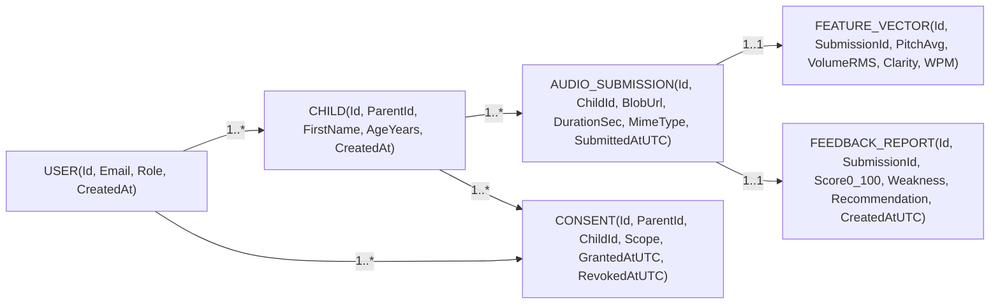

# ERD (Core) — fallback-safe (flowchart)

```mermaid
flowchart LR
  USER["USER(Id, Email, Role, CreatedAt)"]
  CHILD["CHILD(Id, ParentId, FirstName, AgeYears, CreatedAt)"]
  ASUB["AUDIO_SUBMISSION(Id, ChildId, BlobUrl, DurationSec, MimeType, SubmittedAtUTC)"]
  FTR["FEATURE_VECTOR(Id, SubmissionId, PitchAvg, VolumeRMS, Clarity, WPM)"]
  RPT["FEEDBACK_REPORT(Id, SubmissionId, Score0_100, Weakness, Recommendation, CreatedAtUTC)"]
  CONS["CONSENT(Id, ParentId, ChildId, Scope, GrantedAtUTC, RevokedAtUTC)"]

  USER -->|"1..*"| CHILD
  CHILD -->|"1..*"| ASUB
  ASUB -->|"1..1"| FTR
  ASUB -->|"1..1"| RPT
  USER -->|"1..*"| CONS
  CHILD -->|"1..*"| CONS
```
