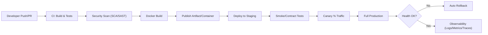

# CI/CD Pipeline

```mermaid
flowchart LR
  DEV["Developer Push/PR"] --> CI["CI: Build & Tests"]
  CI --> SCAN["Security Scan (SCA/SAST)"]
  SCAN --> IMG["Docker Build"]
  IMG --> ART["Publish Artifact/Container"]
  ART --> STG["Deploy to Staging"]
  STG --> SMOKE["Smoke/Contract Tests"]
  SMOKE --> CANARY["Canary % Traffic"]
  CANARY --> PROD["Full Production"]
  PROD --> HEALTH{"Health OK?"}
  HEALTH -- "No" --> ROLLBACK["Auto Rollback"]
  HEALTH -- "Yes" --> OBS["Observability (Logs/Metrics/Traces)"]
```
