# CI/CD Pipeline

Complete Continuous Integration and Continuous Deployment pipeline for HearLoveen platform.

## Overview

HearLoveen implements a **fully automated CI/CD pipeline** using GitHub Actions, Docker, Kubernetes (AKS), and ArgoCD. The pipeline ensures fast, reliable, and secure deployments with comprehensive testing, security scanning, and automated rollback capabilities.

## Complete CI/CD Pipeline

```mermaid
flowchart TB
    START([Developer Push/PR]) --> TRIGGER

    subgraph "Stage 1: Code Quality & Build"
        TRIGGER[GitHub Actions Trigger] --> LINT[Linting & Code Style<br/>ESLint, Ruff, dotnet format]
        LINT --> UNIT[Unit Tests<br/>xUnit, Jest, pytest]
        UNIT --> COVERAGE[Code Coverage<br/>Threshold: 80%]
        COVERAGE --> BUILD[Build Services<br/>.NET, TypeScript, Python]
    end

    subgraph "Stage 2: Security Scanning"
        BUILD --> SCA[SCA: Dependency Scan<br/>Snyk, Dependabot]
        SCA --> SAST[SAST: Code Analysis<br/>CodeQL, SonarQube]
        SAST --> SECRET[Secret Scanning<br/>GitGuardian, TruffleHog]
        SECRET --> LICENSE[License Compliance<br/>FOSSA]
    end

    subgraph "Stage 3: Container & Artifacts"
        LICENSE --> DOCKER[Docker Build<br/>Multi-stage builds]
        DOCKER --> SCAN_IMG[Container Scan<br/>Trivy, Grype]
        SCAN_IMG --> SIGN[Image Signing<br/>Cosign + Sigstore]
        SIGN --> PUSH[Push to ACR<br/>Azure Container Registry]
        PUSH --> SBOM[Generate SBOM<br/>Syft]
    end

    subgraph "Stage 4: Deploy to Staging"
        SBOM --> HELM[Package Helm Charts<br/>Version bump]
        HELM --> ARGOCD_STG[ArgoCD Sync<br/>Staging cluster]
        ARGOCD_STG --> MIGRATE_STG[Database Migration<br/>Flyway]
        MIGRATE_STG --> DEPLOY_STG[Deploy to AKS Staging<br/>Rolling update]
    end

    subgraph "Stage 5: Testing & Validation"
        DEPLOY_STG --> SMOKE[Smoke Tests<br/>Health checks]
        SMOKE --> INT_TEST[Integration Tests<br/>API contracts]
        INT_TEST --> E2E[E2E Tests<br/>Playwright]
        E2E --> PERF[Performance Tests<br/>k6, JMeter]
        PERF --> SEC_TEST[Security Tests<br/>OWASP ZAP, Burp]
    end

    subgraph "Stage 6: Production Deployment"
        SEC_TEST --> APPROVAL{Manual Approval<br/>Required?}
        APPROVAL -->|Yes| WAIT[Await Approval]
        APPROVAL -->|No| CANARY
        WAIT --> CANARY[Canary Deploy<br/>10% traffic]

        CANARY --> CANARY_METRICS{Canary Metrics OK?<br/>Error rate, latency}
        CANARY_METRICS -->|Failed| ROLLBACK_CANARY[Instant Rollback]
        CANARY_METRICS -->|Passed| PROGRESSIVE[Progressive Rollout<br/>25% → 50% → 100%]

        PROGRESSIVE --> FULL_PROD[Full Production<br/>Blue-Green switch]
    end

    subgraph "Stage 7: Monitoring & Verification"
        FULL_PROD --> HEALTH{Health Check<br/>5 min window}
        HEALTH -->|Failed| ROLLBACK[Auto Rollback<br/>Previous version]
        HEALTH -->|Passed| OBSERVE[Monitor Observability<br/>Prometheus, Grafana]

        OBSERVE --> ALERTS{Alerts Triggered?}
        ALERTS -->|Yes| ROLLBACK
        ALERTS -->|No| SUCCESS([Deployment Complete])
    end

    ROLLBACK_CANARY --> INCIDENT[Create Incident<br/>Alert team]
    ROLLBACK --> INCIDENT
    INCIDENT --> END([Failed Deployment])

    style TRIGGER fill:#90EE90
    style SUCCESS fill:#90EE90
    style ROLLBACK fill:#FF6B6B
    style ROLLBACK_CANARY fill:#FF6B6B
    style APPROVAL fill:#FFD700
    style CANARY fill:#87CEEB
```



## Pipeline Stages Detailed Breakdown

### Stage 1: Code Quality & Build

#### 1.1 Linting & Code Style

Enforces consistent code style across all languages.

| Language | Tool | Configuration | Auto-fix |
|----------|------|---------------|----------|
| **C# (.NET)** | dotnet format | .editorconfig | ✅ Yes |
| **TypeScript/JavaScript** | ESLint + Prettier | .eslintrc.json | ✅ Yes |
| **Python** | Ruff + Black | pyproject.toml | ✅ Yes |
| **YAML** | yamllint | .yamllint | ❌ No |
| **Dockerfile** | hadolint | .hadolint.yaml | ❌ No |

**GitHub Action**:
```yaml
- name: Lint .NET Code
  run: dotnet format --verify-no-changes --verbosity diagnostic

- name: Lint TypeScript
  run: npm run lint --workspace=@hearloveen/web

- name: Lint Python
  run: ruff check . && black --check .
```

#### 1.2 Unit Tests

Fast, isolated unit tests for each service.

| Service | Framework | Coverage Target | Duration |
|---------|-----------|-----------------|----------|
| **ApiGateway** | xUnit | 85% | ~30s |
| **AudioService** | xUnit | 80% | ~25s |
| **AnalysisService** | xUnit | 80% | ~20s |
| **UserService** | xUnit | 85% | ~15s |
| **ML Worker** | pytest | 75% | ~45s |
| **Web App** | Jest | 80% | ~40s |
| **Mobile App** | Jest | 75% | ~35s |

**Test Execution**:
```yaml
- name: Run .NET Tests
  run: |
    dotnet test --no-build \
      --configuration Release \
      --logger "trx;LogFileName=test-results.trx" \
      /p:CollectCoverage=true \
      /p:CoverletOutputFormat=cobertura \
      /p:Threshold=80

- name: Upload Coverage
  uses: codecov/codecov-action@v3
  with:
    files: ./coverage.cobertura.xml
    flags: unittests
    fail_ci_if_error: true
```

#### 1.3 Build Services

Compiles and packages all services.

**Build Matrix**:
```yaml
strategy:
  matrix:
    service:
      - ApiGateway
      - AudioService
      - AnalysisService
      - UserService
      - NotificationService
      - IoTService
    dotnet-version: ['8.0']
```

**Build Steps**:
```bash
# Restore dependencies with caching
dotnet restore --locked-mode

# Build in Release configuration
dotnet build --no-restore --configuration Release

# Publish optimized binaries
dotnet publish -c Release -o ./publish --no-build
```

### Stage 2: Security Scanning

#### 2.1 Software Composition Analysis (SCA)

Scans dependencies for known vulnerabilities.

| Tool | Scope | Severity Threshold | Auto-fix |
|------|-------|-------------------|----------|
| **Snyk** | NuGet, npm, PyPI | High+ | ✅ Yes (PRs) |
| **Dependabot** | All dependencies | Medium+ | ✅ Yes (PRs) |
| **npm audit** | JavaScript packages | Critical | ❌ No |
| **Safety** | Python packages | High+ | ❌ No |

**Snyk Scan**:
```yaml
- name: Run Snyk Scan
  uses: snyk/actions/dotnet@master
  env:
    SNYK_TOKEN: ${{ secrets.SNYK_TOKEN }}
  with:
    args: --severity-threshold=high --fail-on=all
```

#### 2.2 Static Application Security Testing (SAST)

Analyzes source code for security vulnerabilities.

| Tool | Languages | Ruleset | False Positive Rate |
|------|-----------|---------|---------------------|
| **CodeQL** | C#, TypeScript, Python | Security & Quality | ~5% |
| **SonarQube** | All languages | OWASP Top 10 | ~8% |
| **Semgrep** | Custom rules | HearLoveen specific | ~3% |

**CodeQL Configuration**:
```yaml
- name: Initialize CodeQL
  uses: github/codeql-action/init@v2
  with:
    languages: csharp, javascript, python
    queries: security-and-quality

- name: Perform CodeQL Analysis
  uses: github/codeql-action/analyze@v2
```

**Security Findings Escalation**:
- **Critical**: Block deployment, alert security team
- **High**: Block deployment, require manual review
- **Medium**: Warning only, tracked in backlog
- **Low**: Informational, no action required

#### 2.3 Secret Scanning

Prevents accidental credential commits.

**Tools**:
- **GitHub Secret Scanning**: Built-in detection
- **TruffleHog**: Pre-commit hook + CI scan
- **GitGuardian**: Real-time monitoring

**Pre-commit Hook**:
```bash
#!/bin/bash
# .git/hooks/pre-commit
trufflehog git file://. --since-commit HEAD --only-verified --fail
```

**Blocked Patterns**:
- API keys (AWS, Azure, OpenAI)
- Database connection strings
- Private keys (RSA, SSH)
- JWT secrets
- OAuth tokens

#### 2.4 License Compliance

Ensures all dependencies use approved licenses.

**Approved Licenses**:
- ✅ MIT, Apache 2.0, BSD-3-Clause
- ✅ ISC, MPL-2.0
- ⚠️ LGPL-3.0 (requires legal review)
- ❌ GPL-3.0, AGPL-3.0 (prohibited)

**FOSSA Scan**:
```yaml
- name: FOSSA Scan
  uses: fossas/fossa-action@main
  with:
    api-key: ${{ secrets.FOSSA_API_KEY }}
```

### Stage 3: Container & Artifacts

#### 3.1 Docker Build

Multi-stage Docker builds for optimized images.

**Build Example (ApiGateway)**:
```dockerfile
# Stage 1: Build
FROM mcr.microsoft.com/dotnet/sdk:8.0 AS build
WORKDIR /src
COPY ["src/ApiGateway/ApiGateway.csproj", "src/ApiGateway/"]
RUN dotnet restore "src/ApiGateway/ApiGateway.csproj"
COPY . .
RUN dotnet publish "src/ApiGateway/ApiGateway.csproj" -c Release -o /app/publish

# Stage 2: Runtime
FROM mcr.microsoft.com/dotnet/aspnet:8.0-alpine AS runtime
WORKDIR /app
COPY --from=build /app/publish .
USER 1000
ENTRYPOINT ["dotnet", "ApiGateway.dll"]
```

**Build Command**:
```bash
docker build \
  --build-arg BUILD_VERSION=${{ github.sha }} \
  --build-arg BUILD_DATE=$(date -u +'%Y-%m-%dT%H:%M:%SZ') \
  --cache-from hearloveen.azurecr.io/api-gateway:cache \
  --tag hearloveen.azurecr.io/api-gateway:${{ github.sha }} \
  --tag hearloveen.azurecr.io/api-gateway:latest \
  -f src/ApiGateway/Dockerfile .
```

**Image Size Optimization**:
| Service | Base Image | Final Size | Layers |
|---------|------------|------------|--------|
| **ApiGateway** | aspnet:8.0-alpine | 105 MB | 8 |
| **AudioService** | aspnet:8.0-alpine | 98 MB | 7 |
| **ML Worker** | python:3.11-slim | 450 MB | 12 |
| **Web App** | nginx:alpine | 25 MB | 5 |

#### 3.2 Container Security Scanning

Scans Docker images for vulnerabilities.

| Tool | Vulnerability DB | Scan Depth | Speed |
|------|------------------|------------|-------|
| **Trivy** | NVD, GHSA, Alpine, Debian | OS + app dependencies | Fast (~30s) |
| **Grype** | NVD, Alpine, Debian | OS packages | Very fast (~15s) |
| **Snyk Container** | Snyk DB | OS + app + Dockerfile | Medium (~60s) |

**Trivy Scan**:
```yaml
- name: Scan Docker Image
  uses: aquasecurity/trivy-action@master
  with:
    image-ref: hearloveen.azurecr.io/api-gateway:${{ github.sha }}
    format: 'sarif'
    output: 'trivy-results.sarif'
    severity: 'CRITICAL,HIGH'
    exit-code: '1'

- name: Upload Trivy Results
  uses: github/codeql-action/upload-sarif@v2
  with:
    sarif_file: 'trivy-results.sarif'
```

#### 3.3 Image Signing

Signs container images for supply chain security.

**Cosign + Sigstore**:
```bash
# Generate key pair (once)
cosign generate-key-pair

# Sign image
cosign sign --key cosign.key \
  hearloveen.azurecr.io/api-gateway:${{ github.sha }}

# Verify signature
cosign verify --key cosign.pub \
  hearloveen.azurecr.io/api-gateway:${{ github.sha }}
```

**Admission Controller**:
Kubernetes OPA policy to enforce signed images only:
```rego
package kubernetes.admission

deny[msg] {
  input.request.kind.kind == "Pod"
  image := input.request.object.spec.containers[_].image
  not image_is_signed(image)
  msg := sprintf("Image '%v' is not signed", [image])
}
```

#### 3.4 Software Bill of Materials (SBOM)

Generates SBOM for compliance and security tracking.

**Syft Generation**:
```bash
syft hearloveen.azurecr.io/api-gateway:${{ github.sha }} \
  -o spdx-json \
  > sbom-api-gateway.spdx.json

# Upload to Dependency-Track
curl -X POST "https://dtrack.hearloveen.com/api/v1/bom" \
  -H "X-Api-Key: ${{ secrets.DTRACK_API_KEY }}" \
  -F "project=hearloveen-api-gateway" \
  -F "bom=@sbom-api-gateway.spdx.json"
```

### Stage 4: Deploy to Staging

#### 4.1 Helm Chart Packaging

Packages Kubernetes manifests with versioning.

**Chart Structure**:
```
charts/
├── hearloveen/
│   ├── Chart.yaml
│   ├── values.yaml
│   ├── values-staging.yaml
│   ├── values-production.yaml
│   └── templates/
│       ├── deployment.yaml
│       ├── service.yaml
│       ├── ingress.yaml
│       ├── hpa.yaml
│       └── configmap.yaml
```

**Chart.yaml**:
```yaml
apiVersion: v2
name: hearloveen
version: 1.5.2
appVersion: "2024.12"
description: HearLoveen Speech Therapy Platform
dependencies:
  - name: postgresql
    version: 12.1.0
    repository: https://charts.bitnami.com/bitnami
  - name: redis
    version: 17.4.0
    repository: https://charts.bitnami.com/bitnami
```

**Helm Package & Push**:
```bash
# Bump version
helm upgrade --install hearloveen ./charts/hearloveen \
  --set image.tag=${{ github.sha }} \
  --set env=staging

# Package chart
helm package charts/hearloveen

# Push to ACR
helm push hearloveen-1.5.2.tgz oci://hearloveen.azurecr.io/helm
```

#### 4.2 ArgoCD Sync (GitOps)

Declarative continuous deployment using ArgoCD.

**Application Manifest**:
```yaml
apiVersion: argoproj.io/v1alpha1
kind: Application
metadata:
  name: hearloveen-staging
  namespace: argocd
spec:
  project: default
  source:
    repoURL: https://github.com/hearloveen/infrastructure
    targetRevision: HEAD
    path: k8s/staging
    helm:
      valueFiles:
        - values-staging.yaml
  destination:
    server: https://kubernetes.default.svc
    namespace: hearloveen-staging
  syncPolicy:
    automated:
      prune: true
      selfHeal: true
    syncOptions:
      - CreateNamespace=true
```

**Sync Process**:
1. ArgoCD polls Git repository every 3 minutes
2. Detects manifest changes
3. Compares desired state with cluster state
4. Applies changes with Kubernetes rolling update
5. Monitors health status
6. Reports sync status to Slack

#### 4.3 Database Migration

Automated schema migrations with rollback support.

**Flyway Migration**:
```bash
# Run migrations
flyway -url=jdbc:postgresql://db-staging:5432/hearloveen \
  -user=$DB_USER \
  -password=$DB_PASSWORD \
  -locations=filesystem:./migrations \
  migrate

# Validate migrations
flyway validate

# Rollback if needed (manual)
flyway undo
```

**Migration Example**:
```sql
-- V8__add_emotion_confidence.sql
BEGIN;

ALTER TABLE emotion_detection
ADD COLUMN confidence FLOAT NOT NULL DEFAULT 0.0;

CREATE INDEX idx_emotion_confidence ON emotion_detection(confidence);

COMMIT;
```

### Stage 5: Testing & Validation

#### 5.1 Smoke Tests

Quick health checks to verify deployment.

**Test Suite**:
```bash
#!/bin/bash
# smoke-tests.sh

API_URL="https://api-staging.hearloveen.com"

# Health endpoint
curl -f $API_URL/health || exit 1

# Database connectivity
curl -f $API_URL/health/db || exit 1

# Redis connectivity
curl -f $API_URL/health/cache || exit 1

# Service mesh connectivity
curl -f $API_URL/health/services || exit 1

echo "✅ All smoke tests passed"
```

#### 5.2 Integration Tests

Tests service-to-service communication and contracts.

**Pact Contract Testing**:
```yaml
- name: Run Integration Tests
  run: |
    docker-compose -f docker-compose.test.yml up -d
    npm run test:integration
    docker-compose down
```

**Test Coverage**:
- API Gateway ↔ AudioService
- AudioService ↔ AnalysisService
- AnalysisService ↔ ML Worker
- UserService ↔ NotificationService
- All services ↔ PostgreSQL
- All services ↔ Redis

#### 5.3 End-to-End Tests

Full user journey testing with Playwright.

**E2E Test Scenarios**:
1. User registration and login
2. Add child profile
3. Record and upload audio
4. View analysis results
5. Download PDF report
6. Therapist portal access

**Playwright Test**:
```typescript
test('complete audio analysis flow', async ({ page }) => {
  await page.goto('https://staging.hearloveen.com');
  await page.click('text=Login');
  await page.fill('[name=email]', 'test@example.com');
  await page.fill('[name=password]', 'TestPass123!');
  await page.click('button[type=submit]');

  await expect(page).toHaveURL(/.*dashboard/);

  await page.click('text=Upload Audio');
  await page.setInputFiles('input[type=file]', 'test-audio.wav');
  await page.click('text=Analyze');

  await page.waitForSelector('text=Analysis Complete', { timeout: 30000 });

  const score = await page.textContent('[data-testid=overall-score]');
  expect(parseInt(score)).toBeGreaterThan(0);
});
```

#### 5.4 Performance Tests

Load and stress testing with k6.

**k6 Test Script**:
```javascript
import http from 'k6/http';
import { check, sleep } from 'k6';

export const options = {
  stages: [
    { duration: '2m', target: 100 },  // Ramp up
    { duration: '5m', target: 100 },  // Stay at 100 users
    { duration: '2m', target: 200 },  // Spike to 200
    { duration: '5m', target: 200 },  // Stay at 200
    { duration: '2m', target: 0 },    // Ramp down
  ],
  thresholds: {
    http_req_duration: ['p(95)<500', 'p(99)<1000'],
    http_req_failed: ['rate<0.01'],
  },
};

export default function () {
  const res = http.get('https://api-staging.hearloveen.com/api/v1/children');
  check(res, {
    'status is 200': (r) => r.status === 200,
    'response time < 500ms': (r) => r.timings.duration < 500,
  });
  sleep(1);
}
```

**Performance Targets**:
| Metric | Target | Staging | Production |
|--------|--------|---------|------------|
| **P95 Latency** | <500ms | 320ms | 280ms |
| **P99 Latency** | <1000ms | 650ms | 580ms |
| **Error Rate** | <1% | 0.3% | 0.1% |
| **Throughput** | 1000 RPS | 850 RPS | 1200 RPS |

#### 5.5 Security Tests

OWASP ZAP and penetration testing.

**ZAP Baseline Scan**:
```bash
docker run -t owasp/zap2docker-stable zap-baseline.py \
  -t https://api-staging.hearloveen.com \
  -r zap-report.html \
  -w zap-report.md \
  -J zap-report.json
```

**Security Test Coverage**:
- SQL injection
- XSS (reflected, stored, DOM-based)
- CSRF protection
- Authentication bypass
- Authorization flaws
- Sensitive data exposure
- XML external entities (XXE)
- Insecure deserialization

### Stage 6: Production Deployment

#### 6.1 Canary Deployment

Gradual traffic shift to new version.

**Canary Strategy**:
```yaml
apiVersion: flagger.app/v1beta1
kind: Canary
metadata:
  name: api-gateway
  namespace: hearloveen-prod
spec:
  targetRef:
    apiVersion: apps/v1
    kind: Deployment
    name: api-gateway
  service:
    port: 80
  analysis:
    interval: 1m
    threshold: 5
    maxWeight: 50
    stepWeight: 10
    metrics:
      - name: request-success-rate
        thresholdRange:
          min: 99
        interval: 1m
      - name: request-duration
        thresholdRange:
          max: 500
        interval: 1m
```

**Traffic Distribution**:
1. 10% traffic → Monitor for 5 minutes
2. 25% traffic → Monitor for 5 minutes
3. 50% traffic → Monitor for 10 minutes
4. 100% traffic → Final rollout

#### 6.2 Blue-Green Deployment

Zero-downtime deployment with instant rollback.

**Deployment Process**:
```bash
# Deploy green environment
kubectl apply -f k8s/green/

# Wait for green to be healthy
kubectl wait --for=condition=available --timeout=300s \
  deployment/api-gateway-green -n hearloveen-prod

# Run smoke tests on green
./scripts/smoke-tests.sh https://green.hearloveen.com

# Switch traffic (update Ingress)
kubectl patch ingress hearloveen-ingress -n hearloveen-prod \
  --type=json -p='[{"op": "replace", "path": "/spec/rules/0/http/paths/0/backend/service/name", "value":"api-gateway-green"}]'

# Monitor for 10 minutes
sleep 600

# If all good, decommission blue
kubectl delete deployment api-gateway-blue -n hearloveen-prod
```

#### 6.3 Progressive Rollout

Kubernetes rolling update strategy.

**Deployment Configuration**:
```yaml
spec:
  strategy:
    type: RollingUpdate
    rollingUpdate:
      maxSurge: 25%
      maxUnavailable: 0
  minReadySeconds: 30
  progressDeadlineSeconds: 600
```

### Stage 7: Monitoring & Verification

#### 7.1 Health Checks

Continuous health monitoring post-deployment.

**Kubernetes Probes**:
```yaml
livenessProbe:
  httpGet:
    path: /health/live
    port: 8080
  initialDelaySeconds: 30
  periodSeconds: 10
  timeoutSeconds: 5
  failureThreshold: 3

readinessProbe:
  httpGet:
    path: /health/ready
    port: 8080
  initialDelaySeconds: 10
  periodSeconds: 5
  timeoutSeconds: 3
  failureThreshold: 2
```

#### 7.2 Observability

Comprehensive monitoring with Prometheus and Grafana.

**Key Metrics**:
- Request rate (RPS)
- Error rate (%)
- Latency (P50, P95, P99)
- CPU & memory usage
- Database connection pool
- Cache hit ratio
- Queue depth

**Prometheus Queries**:
```promql
# Error rate
rate(http_requests_total{status=~"5.."}[5m]) / rate(http_requests_total[5m])

# P95 latency
histogram_quantile(0.95, rate(http_request_duration_seconds_bucket[5m]))

# Pod restarts
rate(kube_pod_container_status_restarts_total[1h]) > 0
```

#### 7.3 Automated Rollback

Instant rollback on detected issues.

**Rollback Triggers**:
- Error rate > 5% for 2 minutes
- P95 latency > 1000ms for 3 minutes
- Pod crash loop detected
- Health check failures > 50%
- Manual trigger via Slack bot

**Rollback Execution**:
```bash
# ArgoCD rollback
argocd app rollback hearloveen-prod --revision <previous-sha>

# Helm rollback
helm rollback hearloveen -n hearloveen-prod

# Kubernetes rollback
kubectl rollout undo deployment/api-gateway -n hearloveen-prod
```

## Pipeline Performance Metrics

| Stage | Duration | Success Rate | Bottleneck |
|-------|----------|--------------|------------|
| **Code Quality & Build** | 3-5 min | 98% | Unit tests |
| **Security Scanning** | 4-6 min | 95% | SAST analysis |
| **Container Build** | 2-3 min | 99% | Docker layers |
| **Deploy to Staging** | 3-4 min | 97% | Database migration |
| **Testing & Validation** | 8-12 min | 94% | E2E tests |
| **Production Deployment** | 15-25 min | 99% | Canary validation |
| **Total Pipeline** | **35-55 min** | **93%** | E2E & validation |

## Environment Configuration

### Staging Environment

| Resource | Configuration | Purpose |
|----------|---------------|---------|
| **Cluster** | AKS 3-node (Standard_D4s_v3) | Mirrors production at smaller scale |
| **Database** | PostgreSQL 15 (GP_Gen5_2) | EU West region |
| **Cache** | Redis 6.2 (Standard C1) | 1GB memory |
| **Storage** | Azure Blob (Standard LRS) | EU West region |
| **Ingress** | Nginx Ingress Controller | Let's Encrypt staging |
| **Namespace** | `hearloveen-staging` | Isolated from production |

### Production Environment

| Resource | Configuration | Purpose |
|----------|---------------|---------|
| **Cluster** | AKS 6-node (Standard_D8s_v3) | High availability |
| **Database** | PostgreSQL 15 (GP_Gen5_8) | EU West + replica in EU North |
| **Cache** | Redis 6.2 (Premium P1) | 6GB memory + persistence |
| **Storage** | Azure Blob (Standard GRS) | Geo-redundant |
| **Ingress** | Azure Application Gateway | WAF enabled |
| **Namespace** | `hearloveen-prod` | Strict network policies |

## Rollback Procedures

### Automatic Rollback

Triggered by monitoring alerts:

```yaml
# Prometheus Alert Rule
groups:
  - name: deployment_alerts
    rules:
      - alert: HighErrorRate
        expr: rate(http_requests_total{status=~"5.."}[5m]) > 0.05
        for: 2m
        annotations:
          summary: "High error rate detected"
          description: "Error rate is {{ $value }}%"
        actions:
          - type: rollback
            target: previous_version
```

### Manual Rollback

Via Slack bot or kubectl:

```bash
# Slack command
/hearloveen rollback production api-gateway

# Kubectl command
kubectl rollout undo deployment/api-gateway -n hearloveen-prod --to-revision=5
```

## Deployment Approval Flow

### Automated Deployments

- **Staging**: Fully automated on merge to `develop`
- **Production (off-hours)**: Automated between 2 AM - 6 AM UTC
- **Production (business hours)**: Requires approval

### Manual Approval

GitHub Environments with protection rules:

```yaml
environment:
  name: production
  protection_rules:
    - type: required_reviewers
      reviewers:
        - devops-team
        - tech-lead
    - type: wait_timer
      minutes: 30
```

## Disaster Recovery

### Backup Strategy

| Component | Frequency | Retention | Location |
|-----------|-----------|-----------|----------|
| **Database** | Every 6 hours | 30 days | Azure Backup (GRS) |
| **Container Images** | Every build | 90 days | ACR (GRS) |
| **Helm Charts** | Every release | 1 year | ACR OCI registry |
| **Configuration** | Git commit | Indefinite | GitHub (backed up) |

### Recovery Procedures

**Database Restore**:
```bash
# Restore from specific point in time
az postgres flexible-server restore \
  --resource-group hearloveen-prod \
  --name hearloveen-db-prod \
  --source-server hearloveen-db-prod \
  --restore-time "2024-12-08T10:00:00Z"
```

**Full System Restore**:
1. Restore database from backup (RTO: 30 minutes)
2. Deploy last known good Helm chart (RTO: 10 minutes)
3. Restore blob storage files (RTO: 60 minutes)
4. Run smoke tests
5. Switch DNS to recovered system

**Total RTO**: < 2 hours
**RPO**: < 15 minutes

## CI/CD Tools & Versions

| Tool | Version | Purpose |
|------|---------|---------|
| **GitHub Actions** | Latest | CI/CD orchestration |
| **Docker** | 24.0+ | Container runtime |
| **Helm** | 3.12+ | Kubernetes package manager |
| **ArgoCD** | 2.9+ | GitOps continuous delivery |
| **Kubernetes** | 1.28+ | Container orchestration |
| **Trivy** | 0.47+ | Container vulnerability scanning |
| **Snyk** | Latest | Dependency scanning |
| **SonarQube** | 10.3+ | Code quality analysis |
| **Flyway** | 9.22+ | Database migrations |
| **Playwright** | 1.40+ | E2E testing |
| **k6** | 0.47+ | Performance testing |

## Related Documentation

- [System Architecture](../technical/architecture/ARCHITECTURE.md) - Complete system design
- [Kubernetes Configuration](../../infrastructure/k8s/README.md) - K8s manifests
- [Deployment Guide](../technical/deployment/DEPLOYMENT.md) - Deployment procedures
- [Monitoring Setup](../technical/observability/MONITORING.md) - Monitoring configuration
- [Security Implementation](../security/SECURITY_IMPLEMENTATION.md) - Security controls
- [Disaster Recovery Plan](../technical/DR_PLAN.md) - DR procedures

## Troubleshooting

### Common Issues

#### Build Failures

**Issue**: Tests timeout
**Solution**:
```bash
# Increase timeout in test configuration
dotnet test --timeout 300000  # 5 minutes
```

#### Deployment Failures

**Issue**: Pod CrashLoopBackOff
**Diagnosis**:
```bash
kubectl logs -n hearloveen-prod deployment/api-gateway --previous
kubectl describe pod -n hearloveen-prod <pod-name>
```

**Common Causes**:
- Database connection failure → Check connection string
- Missing ConfigMap/Secret → Verify ArgoCD sync
- Resource limits too low → Increase memory/CPU

#### Rollback Failures

**Issue**: Rollback stuck
**Solution**:
```bash
# Force rollback
kubectl rollout undo deployment/api-gateway -n hearloveen-prod
kubectl delete pod -l app=api-gateway -n hearloveen-prod
```

## Security Best Practices

### Secret Management

- **Never** commit secrets to Git
- Use Azure Key Vault for sensitive data
- Rotate secrets every 90 days
- Use managed identities where possible

**External Secrets Operator**:
```yaml
apiVersion: external-secrets.io/v1beta1
kind: ExternalSecret
metadata:
  name: database-credentials
spec:
  secretStoreRef:
    name: azure-keyvault
    kind: SecretStore
  target:
    name: db-secret
  data:
    - secretKey: password
      remoteRef:
        key: database-password
```

### Container Security

- Use minimal base images (Alpine, Distroless)
- Run as non-root user
- Read-only root filesystem
- Drop all capabilities
- Scan images before deployment

### Network Security

- Network policies to restrict pod-to-pod traffic
- Ingress with WAF enabled
- mTLS for service mesh (Istio/Linkerd)
- Private endpoints for Azure services

## Contact

For CI/CD issues:
- **DevOps Team**: devops@hearloveen.com
- **Slack Channel**: #devops-support
- **On-call**: Use PagerDuty
