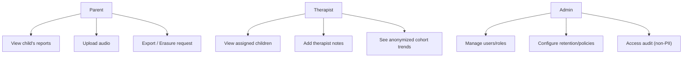

# RBAC at a Glance

```mermaid
flowchart TB
  P["Parent"] --> V1["View child's reports"]
  P --> U1["Upload audio"]
  P --> E1["Export / Erasure request"]

  T["Therapist"] --> V2["View assigned children"]
  T --> N1["Add therapist notes"]
  T --> R1["See anonymized cohort trends"]

  A["Admin"] --> M1["Manage users/roles"]
  A --> C1["Configure retention/policies"]
  A --> AUD["Access audit (non-PII)"]
```
