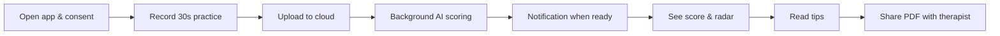

# Parent Journey (fallback-safe)

```mermaid
flowchart LR
  A["Open app & consent"] --> B["Record 30s practice"]
  B --> C["Upload to cloud"]
  C --> D["Background AI scoring"]
  D --> E["Notification when ready"]
  E --> F["See score & radar"]
  F --> G["Read tips"]
  G --> H["Share PDF with therapist"]
```
