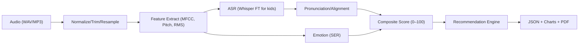

# AI/ML Pipeline

```mermaid
flowchart LR
  IN["Audio (WAV/MP3)"] --> NORM["Normalize/Trim/Resample"]
  NORM --> FEAT["Feature Extract (MFCC, Pitch, RMS)"]
  FEAT --> ASR["ASR (Whisper FT for kids)"]
  FEAT --> SER["Emotion (SER)"]
  ASR --> PRON["Pronunciation/Alignment"]
  PRON --> SCORE["Composite Score (0–100)"]
  SER --> SCORE
  SCORE --> TIPS["Recommendation Engine"]
  TIPS --> OUT["JSON + Charts + PDF"]
```
