# AI/ML Pipeline

Complete machine learning pipeline for speech analysis and feedback generation.

## Overview

The HearLoveen AI/ML pipeline processes audio recordings from hearing-impaired children, performing speech recognition, emotion analysis, phoneme alignment, and generating personalized feedback. This document details the entire ML workflow from raw audio input to actionable insights.

## Complete ML Pipeline


## Pipeline Stages Detail

### 1. Input Processing

**Purpose**: Validate and queue audio files for processing.

| Step | Technology | Duration | Error Handling |
|------|------------|----------|----------------|
| File Validation | Python validators | <100ms | Return 400 Bad Request |
| Format Detection | librosa | <50ms | Attempt conversion |
| Job Enqueueing | Azure Service Bus | <200ms | Retry with exponential backoff |

**Validation Rules:**
- Supported formats: WAV, MP3, M4A, FLAC
- Max file size: 50MB
- Duration: 5 seconds - 5 minutes
- Sample rate: 8kHz - 48kHz (will be resampled)
- Channels: Mono or Stereo (converted to mono)

### 2. Audio Preprocessing

**Purpose**: Prepare audio for optimal model performance.


**Processing Details:**

| Operation | Library | Parameters | Rationale |
|-----------|---------|------------|-----------|
| **Resampling** | librosa.resample | Target: 16kHz | Whisper requirement |
| **Mono Conversion** | librosa.to_mono | Mix channels | Single channel analysis |
| **Silence Trimming** | librosa.effects.trim | Top_db: 20, frame_length: 2048 | Remove dead air |
| **Normalization** | librosa.util.normalize | Target: -20 dBFS | Consistent volume |
| **Noise Reduction** | noisereduce | stationary=True | Remove background noise |

**Code Example:**
```python
import librosa
import noisereduce as nr

def preprocess_audio(audio_path):
    # Load audio
    audio, sr = librosa.load(audio_path, sr=16000, mono=True)

    # Trim silence
    audio, _ = librosa.effects.trim(audio, top_db=20)

    # Normalize
    audio = librosa.util.normalize(audio)

    # Noise reduction
    audio = nr.reduce_noise(y=audio, sr=sr, stationary=True)

    return audio, sr
```

### 3. Feature Extraction

**Purpose**: Extract acoustic features for downstream models.

| Feature | Dimensions | Purpose | Extraction Time |
|---------|-----------|---------|-----------------|
| **MFCC** | 13 coefficients × frames | Speech characteristics | ~500ms |
| **Mel Spectrogram** | 80 mel bins × frames | Visual representation | ~300ms |
| **Pitch (F0)** | 1 × frames | Prosody analysis | ~200ms |
| **RMS Energy** | 1 × frames | Volume patterns | ~100ms |
| **Zero-Crossing Rate** | 1 × frames | Voice/unvoiced detection | ~100ms |

**Feature Visualization:**


### 4. Speech Recognition (Whisper)

**Purpose**: Convert speech to text with confidence scores.

**Model Specifications:**
- **Base Model**: OpenAI Whisper (small.en)
- **Fine-tuning**: Child speech dataset (10,000+ hours)
- **Format**: ONNX quantized (INT8)
- **Inference**: ONNX Runtime
- **Performance**: 94% WER on child speech

**Whisper Pipeline:**

```mermaid
sequenceDiagram
    participant Audio as Mel Spectrogram
    participant Encoder as Whisper Encoder
    participant Decoder as Whisper Decoder
    participant Output as Transcription

    Audio->>Encoder: 80 mel bins × 3000 frames
    Encoder->>Encoder: 6 transformer layers
    Encoder->>Decoder: Encoded features
    Decoder->>Decoder: Autoregressive decoding
    Decoder->>Output: Text tokens + confidence
    Output->>Output: Post-processing (punctuation, capitalization)
```


**Optimization Techniques:**
- ONNX quantization (INT8): 4x smaller, 3x faster
- Beam search with width=5
- Temperature=0.0 for deterministic output
- Language hint: "en" for English
- Task: "transcribe"

**Output Format:**
```json
{
  "text": "hello my name is sarah",
  "segments": [
    {
      "id": 0,
      "start": 0.0,
      "end": 0.5,
      "text": "hello",
      "confidence": 0.98
    },
    {
      "id": 1,
      "start": 0.5,
      "end": 1.2,
      "text": "my name is",
      "confidence": 0.95
    }
  ],
  "language": "en",
  "duration": 2.5
}
```

### 5. Emotion Recognition (SER)

**Purpose**: Detect emotional state during speech.

**Model Architecture:**


**Emotion Classes:**

| Emotion | Description | Typical Indicators | Support Actions |
|---------|-------------|-------------------|-----------------|
| **Happy** 😊 | Positive, engaged | High pitch variability, fast tempo | Reinforce positive feedback |
| **Neutral** 😐 | Calm, focused | Steady pitch, moderate energy | Standard feedback |
| **Frustrated** 😤 | Struggling, stressed | Irregular pitch, pauses | Simplified exercises |
| **Sad** 😢 | Low energy, disengaged | Low pitch, slow tempo | Encouraging feedback |

**Performance Metrics:**
- **Accuracy**: 89% on validation set
- **F1-Score**: 0.87 (macro average)
- **Inference Time**: 50ms per recording
- **Model Size**: 12MB (ONNX)

### 6. Phoneme Analysis

**Purpose**: Detailed pronunciation assessment.

**G2P (Grapheme-to-Phoneme) Pipeline:**


**Supported Languages:**
| Language | G2P Backend | Phoneme Set | Status |
|----------|-------------|-------------|--------|
| **English** | g2p_en | ARPAbet (39 phonemes) | ✅ Production |
| **German** | phonetisaurus | IPA | ✅ Production |
| **Dutch** | espeak-ng | IPA | 🚧 Beta |
| **Farsi** | custom model | IPA | 🚧 Beta |

**Accuracy Calculation:**
```python
def calculate_phoneme_accuracy(predicted, expected, audio_features):
    """
    Calculate per-phoneme accuracy using CTC alignment.
    """
    # Forced alignment
    boundaries = ctc_forced_alignment(audio_features, expected)

    # Per-phoneme confidence
    confidences = []
    for phoneme, (start, end) in zip(expected, boundaries):
        segment = audio_features[start:end]
        confidence = phoneme_classifier(segment, phoneme)
        confidences.append(confidence)

    return {
        'phonemes': expected,
        'confidences': confidences,
        'boundaries': boundaries,
        'average_accuracy': np.mean(confidences)
    }
```

### 7. Prosody Analysis

**Purpose**: Assess intonation, rhythm, and stress patterns.

**Prosody Metrics:**

| Metric | Calculation | Normal Range | Interpretation |
|--------|-------------|--------------|----------------|
| **Speech Rate** | Syllables per second | 3-5 syl/s | Too fast/slow indicates difficulty |
| **Pitch Range** | Max F0 - Min F0 | 100-300 Hz | Narrow range = monotone |
| **Pitch Variability** | Std dev of F0 | 20-50 Hz | Low = flat intonation |
| **Pause Duration** | Mean silence length | 200-500ms | Long pauses = processing difficulty |
| **Stress Pattern** | Energy peaks | 2-3 per phrase | Missing stress = prosody issues |

**Prosody Visualization:**


### 8. Composite Scoring

**Purpose**: Generate overall performance score.

**Scoring Formula:**
```
Composite Score = (
    0.35 × Transcription_Accuracy +  // Correctness
    0.25 × Phoneme_Accuracy +         // Pronunciation
    0.20 × Prosody_Score +            // Natural speech
    0.10 × Fluency_Score +            // Smoothness
    0.10 × Emotional_Engagement       // Positive emotion
) × Curriculum_Weight
```

**Score Interpretation:**

| Score Range | Level | Description | Action |
|-------------|-------|-------------|--------|
| **90-100** | Excellent | Native-like proficiency | Advanced exercises |
| **75-89** | Good | Clear, understandable speech | Continue current level |
| **60-74** | Fair | Some issues, needs practice | Targeted practice |
| **40-59** | Needs Improvement | Significant difficulties | Simplified exercises |
| **0-39** | Challenging | Major pronunciation issues | Foundational work |

### 9. Feedback Generation

**Purpose**: Provide actionable, personalized feedback.

**Recommendation Engine:**


**Feedback Template:**
```json
{
  "overall_score": 78,
  "level": "Good",
  "strengths": [
    "Excellent pronunciation of 's' sounds",
    "Good speech rhythm and pacing",
    "Clear articulation of vowels"
  ],
  "improvements": [
    "Work on 'th' sound - try tongue between teeth",
    "Practice final consonants - don't drop endings"
  ],
  "recommended_exercises": [
    {
      "type": "phoneme_drill",
      "target": "th",
      "difficulty": "easy",
      "description": "Practice words: think, three, thumb"
    },
    {
      "type": "minimal_pairs",
      "target": "final_consonants",
      "difficulty": "medium",
      "description": "Contrast: cat vs. cap, dog vs. dock"
    }
  ],
  "progress_summary": "Improved 12% since last session",
  "next_milestone": "Master 'th' sound for Level 3"
}
```

### 10. Model Performance & Monitoring

**Key Metrics:**

| Metric | Target | Current | Alerting |
|--------|--------|---------|----------|
| **Inference Latency (p95)** | <5s | 3.2s | >10s |
| **Whisper WER** | <8% | 6.1% | >12% |
| **SER Accuracy** | >85% | 89% | <80% |
| **Model Drift (KL)** | <0.1 | 0.03 | >0.15 |
| **GPU Utilization** | 60-80% | 72% | >90% |
| **Memory Usage** | <8GB | 6.2GB | >10GB |

**Drift Detection:**


**MLflow Integration:**
- Track all model versions
- Log hyperparameters and metrics
- Store model artifacts
- A/B test model variants
- Rollback capabilities

## Technology Stack

| Component | Technology | Version | Purpose |
|-----------|------------|---------|---------|
| **Audio Processing** | librosa | 0.10+ | Audio I/O and preprocessing |
| **Noise Reduction** | noisereduce | 3.0+ | Background noise removal |
| **Speech Recognition** | Whisper (ONNX) | v3 | Speech-to-text conversion |
| **Emotion Recognition** | TensorFlow/Keras | 2.13+ | Emotion classification |
| **ONNX Runtime** | onnxruntime-gpu | 1.16+ | Optimized inference |
| **G2P** | g2p_en | 2.1+ | Phoneme conversion |
| **Model Registry** | MLflow | 2.8+ | Model versioning |
| **Monitoring** | Prometheus | Latest | Metrics collection |
| **Feature Store** | Redis | 7.0+ | Feature caching |

## Performance Optimization

### 1. Model Optimization

| Technique | Speed Improvement | Accuracy Impact | Deployment |
|-----------|------------------|-----------------|------------|
| **ONNX Conversion** | 3x faster | <1% loss | ✅ Production |
| **INT8 Quantization** | 4x smaller, 2x faster | <2% loss | ✅ Production |
| **Dynamic Batching** | 2x throughput | No impact | ✅ Production |
| **Model Pruning** | 30% smaller | <1% loss | 🚧 Testing |
| **Knowledge Distillation** | 5x faster | <3% loss | 📋 Planned |

### 2. Inference Optimization

**GPU Acceleration:**
```python
# ONNX Runtime with CUDA
import onnxruntime as ort

providers = [
    ('CUDAExecutionProvider', {
        'device_id': 0,
        'arena_extend_strategy': 'kNextPowerOfTwo',
        'gpu_mem_limit': 2 * 1024 * 1024 * 1024,  # 2GB
        'cudnn_conv_algo_search': 'DEFAULT',
    }),
    'CPUExecutionProvider',
]

session = ort.InferenceSession(
    'whisper_model.onnx',
    providers=providers
)
```

**Batch Processing:**
- Dynamic batching with max wait time 100ms
- Batch size: 1-16 (adaptive based on GPU memory)
- Priority queue for real-time vs. batch jobs

### 3. Caching Strategy

| Cache Layer | Technology | TTL | Hit Rate |
|-------------|------------|-----|----------|
| **Feature Cache** | Redis | 15 min | 85% |
| **Model Output** | Redis | 1 hour | 92% |
| **G2P Results** | PostgreSQL | Permanent | 98% |

## Deployment Architecture


## Related Documentation

- [Sequence Diagram: Audio to Feedback](04-sequence-audio-to-feedback.md) - End-to-end workflow
- [MLOps Guide](../mlops/README.md) - Model training and deployment
- [Analysis Service](../../src/AnalysisService/README.md) - Service implementation
- [MLflow Setup](../../mlflow/README.md) - Model registry configuration
- [Performance Testing](../../tests/perf/k6/README.md) - Load testing

## Troubleshooting

### Common Issues

| Issue | Cause | Solution |
|-------|-------|----------|
| **High latency** | GPU not utilized | Check CUDA installation, use `providers` |
| **Out of memory** | Large batch size | Reduce batch size or upgrade GPU |
| **Low accuracy** | Model drift | Retrain model with recent data |
| **Crashes** | ONNX version mismatch | Align onnxruntime and model versions |

### Monitoring Queries

```prometheus
# Average inference time
rate(ml_inference_duration_seconds_sum[5m])
/ rate(ml_inference_duration_seconds_count[5m])

# Error rate
rate(ml_inference_errors_total[5m])

# Model drift alert
ml_phoneme_kl_divergence > 0.15
```

## Future Enhancements

| Feature | Status | Timeline | Benefits |
|---------|--------|----------|----------|
| **Real-time streaming** | 📋 Planned | Q2 2025 | Instant feedback during recording |
| **Multi-language support** | 🚧 Beta | Q1 2025 | Support Spanish, Italian |
| **Federated learning** | 🚧 Beta | Q3 2025 | Privacy-preserving training |
| **Edge deployment** | 📋 Planned | Q4 2025 | Offline mobile inference |
| **Active learning** | 📋 Research | 2026 | Continuous improvement |

## Contact

For ML pipeline questions:
- **ML Team**: ml-team@hearloveen.com
- **MLOps**: mlops@hearloveen.com
- **Documentation**: [MLOps Guide](../mlops/README.md)
