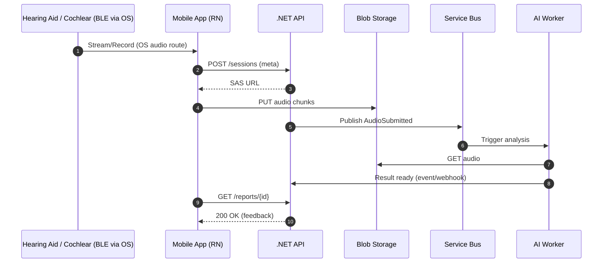

# IoT / Hearing Device (Sequence)

```mermaid
sequenceDiagram
  autonumber
  participant Device as Hearing Aid / Cochlear (BLE via OS)
  participant RN as Mobile App (RN)
  participant API as .NET API
  participant Blob as Blob Storage
  participant Bus as Service Bus
  participant AI as AI Worker

  Device->>RN: Stream/Record (OS audio route)
  RN->>API: POST /sessions (meta)
  API-->>RN: SAS URL
  RN->>Blob: PUT audio chunks
  API->>Bus: Publish AudioSubmitted
  Bus->>AI: Trigger analysis
  AI->>Blob: GET audio
  AI->>API: Result ready (event/webhook)
  RN->>API: GET /reports/{id}
  API-->>RN: 200 OK (feedback)
```
