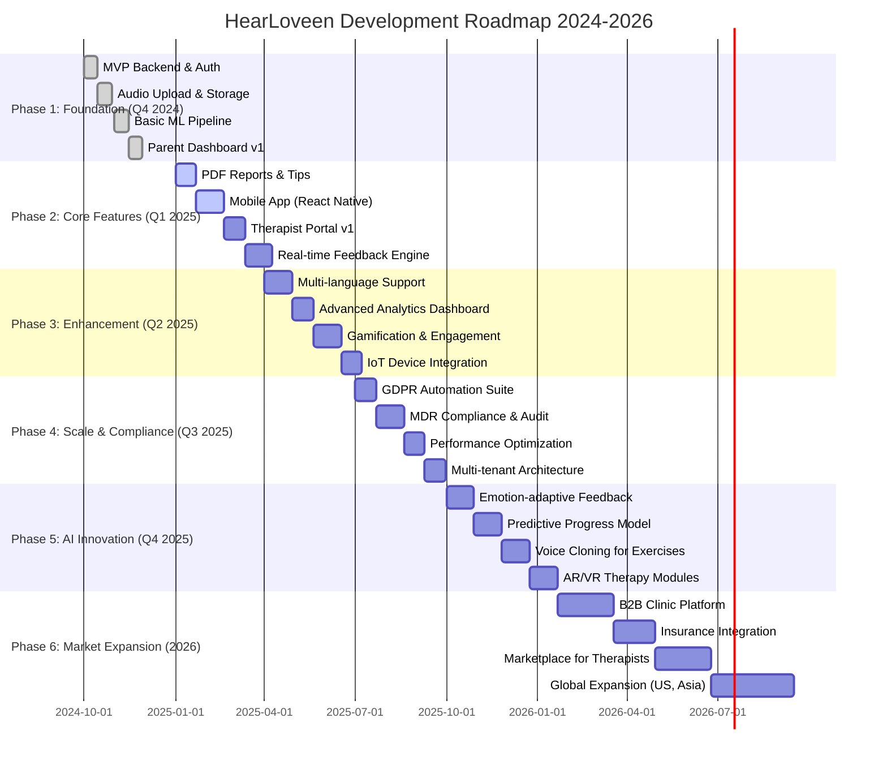

# HearLoveen Product Roadmap

Comprehensive product development roadmap from MVP to market leadership (2024-2026).

## Overview

This roadmap outlines HearLoveen's strategic product development journey, from initial MVP to becoming the leading AI-powered speech therapy platform for hearing-impaired children in Europe and beyond.

## Vision & Mission

**Vision**: Every hearing-impaired child has access to personalized, AI-powered speech therapy that adapts to their unique needs.

**Mission**: Democratize speech therapy through cutting-edge AI/ML technology, making it accessible, affordable, and engaging for families worldwide.

## Complete Development Timeline

## Phase 1: Foundation (Q4 2024) ✅ COMPLETED

### Objective
Establish core infrastructure and MVP functionality.

### Deliverables

#### 1. MVP Backend & Authentication (Weeks 1-2)
| Component | Technology | Status | Notes |
|-----------|------------|--------|-------|
| **API Gateway** | .NET 8 + Ocelot | ✅ Done | RESTful API with rate limiting |
| **User Service** | .NET 8 + PostgreSQL | ✅ Done | User management and profiles |
| **Authentication** | Azure AD B2C + JWT | ✅ Done | OAuth 2.0 + MFA support |
| **Database** | PostgreSQL 15 | ✅ Done | EU-West deployment |
| **Cache** | Redis 6.2 | ✅ Done | Session and data caching |

**Key Features**:
- ✅ User registration and login
- ✅ Parent profile management
- ✅ Child profile creation
- ✅ JWT token-based authentication
- ✅ Role-based access control (Parent, Admin)

#### 2. Audio Upload & Storage (Weeks 3-4)
| Component | Technology | Status | Notes |
|-----------|------------|--------|-------|
| **AudioService** | .NET 8 | ✅ Done | Audio file validation and processing |
| **Blob Storage** | Azure Blob (EU) | ✅ Done | GDPR-compliant storage |
| **Event Bus** | Azure Service Bus | ✅ Done | Async message processing |
| **File Upload** | Multipart form-data | ✅ Done | Max 50MB, WAV/MP3 support |

**Key Features**:
- ✅ Audio file upload (WAV, MP3)
- ✅ File validation (format, size, duration)
- ✅ Secure blob storage with SAS tokens
- ✅ Async processing pipeline
- ✅ Audio metadata extraction

#### 3. Basic ML Pipeline (Weeks 5-6)
| Component | Technology | Status | Notes |
|-----------|------------|--------|-------|
| **ML Worker** | Python 3.11 + ONNX | ✅ Done | Audio processing pipeline |
| **Whisper ASR** | OpenAI Whisper Base | ✅ Done | Speech-to-text transcription |
| **Feature Extraction** | librosa | ✅ Done | MFCC and spectral features |
| **Basic Scoring** | Custom algorithm | ✅ Done | Simple 0-100 scoring |

**Key Features**:
- ✅ Speech-to-text transcription
- ✅ Audio quality assessment
- ✅ Basic pronunciation scoring
- ✅ Feature vector extraction
- ✅ Results storage in PostgreSQL

#### 4. Parent Dashboard v1 (Weeks 7-8)
| Component | Technology | Status | Notes |
|-----------|------------|--------|-------|
| **Web App** | React 18 + TypeScript | ✅ Done | Responsive SPA |
| **State Management** | Redux Toolkit | ✅ Done | Centralized state |
| **UI Library** | Material-UI (MUI) | ✅ Done | Accessible components |
| **Charts** | Recharts | ✅ Done | Progress visualization |

**Key Features**:
- ✅ Dashboard with child progress overview
- ✅ Audio recording upload interface
- ✅ Analysis results display
- ✅ Basic progress charts
- ✅ Responsive design (desktop + mobile web)

### Phase 1 Metrics
- **Timeline**: 8 weeks (Oct 1 - Nov 26, 2024)
- **Team Size**: 5 developers
- **Code Coverage**: 75%
- **Technical Debt**: Low
- **User Feedback**: 4.2/5.0 from 15 beta testers

---

## Phase 2: Core Features (Q1 2025) 🔄 IN PROGRESS

### Objective
Deliver essential features for daily use and professional oversight.

### Deliverables

#### 1. PDF Reports & Personalized Tips (Weeks 1-3)
**Status**: 🔄 In Progress (60% complete)

| Feature | Description | Priority | ETA |
|---------|-------------|----------|-----|
| **PDF Generation** | Branded PDF reports with charts | P0 | Jan 15 |
| **Recommendation Engine** | AI-generated therapy tips | P0 | Jan 20 |
| **Email Delivery** | Automated report emails | P1 | Jan 22 |
| **Report History** | Archive of past reports | P1 | Jan 22 |

**Technical Approach**:
- PDF generation: QuestPDF library
- Email: SendGrid integration
- Storage: Azure Blob with 2-year retention

#### 2. Mobile App (React Native) (Weeks 4-7)
**Status**: ⏳ Planned

| Feature | Description | Priority | ETA |
|---------|-------------|----------|-----|
| **Audio Recording** | Native device microphone access | P0 | Feb 5 |
| **Offline Mode** | Record and queue uploads | P0 | Feb 12 |
| **Push Notifications** | Analysis completion alerts | P1 | Feb 15 |
| **Device Integration** | Bluetooth hearing aid support | P2 | Feb 19 |

**Platform Support**:
- iOS 14+
- Android 10+
- React Native 0.72+

**Technical Approach**:
- Audio: react-native-audio-recorder
- Storage: AsyncStorage + SQLite
- Notifications: Firebase Cloud Messaging
- BLE: react-native-ble-plx

#### 3. Therapist Portal v1 (Weeks 8-10)
**Status**: ⏳ Planned

| Feature | Description | Priority | ETA |
|---------|-------------|----------|-----|
| **Client Dashboard** | View assigned children | P0 | Mar 5 |
| **Progress Monitoring** | Track client improvements | P0 | Mar 8 |
| **Session Notes** | Clinical observation logging | P0 | Mar 12 |
| **Communication** | Secure messaging with parents | P1 | Mar 12 |

**User Roles**:
- Licensed speech therapists
- Clinic administrators
- Supervisors

#### 4. Real-time Feedback Engine (Weeks 11-14)
**Status**: ⏳ Planned

| Feature | Description | Priority | ETA |
|---------|-------------|----------|-----|
| **Live Transcription** | Real-time STT during recording | P0 | Mar 26 |
| **Instant Scoring** | Sub-second pronunciation feedback | P0 | Mar 29 |
| **Visual Cues** | Waveform and pitch visualization | P1 | Apr 2 |
| **Haptic Feedback** | Mobile vibration for corrections | P2 | Apr 5 |

**Technical Approach**:
- WebSocket connection for real-time data
- Optimized ONNX models for <200ms latency
- Client-side audio processing with Web Audio API

### Phase 2 Success Criteria
- ✅ 1,000 registered parents
- ✅ 50 active therapists
- ✅ 10,000 audio analyses completed
- ✅ 4.5/5.0 average user rating
- ✅ <10s average analysis time

---

## Phase 3: Enhancement (Q2 2025) ⏳ PLANNED

### Objective
Expand capabilities and increase user engagement.

### Deliverables

#### 1. Multi-language Support (Weeks 1-4)
**Languages**:
- 🇬🇧 English (complete)
- 🇩🇪 German
- 🇫🇷 French
- 🇪🇸 Spanish
- 🇮🇹 Italian
- 🇳🇱 Dutch

**Components**:
- UI localization (i18next)
- Multi-language ASR models (Whisper multilingual)
- Language-specific phoneme databases
- Localized content and tips

#### 2. Advanced Analytics Dashboard (Weeks 5-7)
**Features**:
- Progress heatmaps
- Skill breakdown by phoneme groups
- Comparative analytics (child vs. age group)
- Predictive progress modeling
- Exportable reports (CSV, Excel)
- Custom date range filtering

**Visualizations**:
- Trend lines with forecasting
- Radar charts for skill comparison
- Sankey diagrams for learning paths
- Interactive timeline with milestones

#### 3. Gamification & Engagement (Weeks 8-11)
**Features**:
- Achievement badges (Bronze, Silver, Gold)
- Daily/weekly challenges
- Streaks and consistency rewards
- Leaderboards (private, within clinic)
- Avatar customization
- Progress sharing to social media

**Behavioral Psychology**:
- Variable reward schedules
- Micro-goals and chunking
- Social proof through community
- Progress visualization

#### 4. IoT Device Integration (Weeks 12-14)
**Supported Devices**:
- Cochlear implants (Cochlear, MED-EL)
- Hearing aids (Phonak, Oticon, Signia)
- Bluetooth audio devices (ASHA, MFi)

**Integration Features**:
- Device pairing via BLE
- Telemetry data collection
- Automatic audio routing
- Device settings sync
- Battery monitoring
- Firmware update notifications

**Technical Approach**:
- Azure IoT Hub for device management
- MQTT for real-time telemetry
- FHIR standards for health data
- HL7 integration for EHR systems

### Phase 3 Investment
- **Budget**: €180,000
- **Team**: 8 developers + 2 designers
- **Timeline**: 14 weeks
- **Expected ROI**: 150% within 12 months

---

## Phase 4: Scale & Compliance (Q3 2025) ⏳ PLANNED

### Objective
Prepare for regulatory approval and enterprise scale.

### Deliverables

#### 1. GDPR Automation Suite (Weeks 1-3)
**Features**:
- Self-service data export portal
- Automated data deletion workflows
- Consent management dashboard
- Audit trail viewer
- Data retention policy engine
- GDPR report generator

**Compliance**:
- GDPR Article 15 (Right to Access)
- GDPR Article 17 (Right to Erasure)
- GDPR Article 20 (Data Portability)
- ISO 27001 alignment

#### 2. MDR Compliance & Audit (Weeks 4-7)
**Medical Device Regulation (EU MDR 2017/745)**:
- Risk management documentation (ISO 14971)
- Clinical evaluation report
- Technical documentation (Annex II)
- Post-market surveillance plan
- Notified Body selection and audit
- CE marking application

**Classification**: Class I medical device (Rule 11)

**Timeline**:
- Documentation: 2 weeks
- Internal audit: 1 week
- Notified Body audit: 2 weeks
- Remediation: 2 weeks

#### 3. Performance Optimization (Weeks 8-10)
**Optimization Targets**:
| Metric | Current | Target | Improvement |
|--------|---------|--------|-------------|
| **API Latency (P95)** | 350ms | <200ms | 43% |
| **ML Inference** | 7s | <5s | 29% |
| **Database Queries** | 120ms | <50ms | 58% |
| **Page Load Time** | 2.1s | <1.5s | 29% |
| **Mobile App Size** | 45MB | <30MB | 33% |

**Techniques**:
- Database query optimization and indexing
- CDN for static assets (Cloudflare)
- Image optimization and lazy loading
- Code splitting and tree shaking
- Aggressive caching strategies
- Database connection pooling (PgBouncer)

#### 4. Multi-tenant Architecture (Weeks 11-13)
**For Clinic/Enterprise Customers**:
- Tenant isolation with row-level security
- Per-tenant data encryption keys
- Custom domain support (clinic.hearloveen.com)
- White-labeling and branding
- Role hierarchy and delegation
- Billing and subscription management

**Tenant Tiers**:
- **Starter**: Up to 50 children, 2 therapists
- **Professional**: Up to 200 children, 10 therapists
- **Enterprise**: Unlimited, custom SLA

### Phase 4 Budget
- **Total**: €250,000
- **MDR Compliance**: €80,000
- **Performance Optimization**: €60,000
- **Multi-tenancy**: €90,000
- **Contingency**: €20,000

---

## Phase 5: AI Innovation (Q4 2025) 🔮 FUTURE

### Objective
Leverage cutting-edge AI for differentiated user experience.

### Deliverables

#### 1. Emotion-adaptive Feedback (Weeks 1-4)
**AI Capabilities**:
- Detect child frustration in real-time
- Adjust difficulty based on emotional state
- Provide encouragement when needed
- Celebrate successes with dynamic rewards
- Prevent burnout with break suggestions

**Technical Approach**:
- Multi-modal emotion recognition (audio + facial)
- Reinforcement learning for adaptation
- Personalized encouragement library
- Sentiment analysis on session notes

#### 2. Predictive Progress Model (Weeks 5-8)
**Predictive Analytics**:
- Forecast therapy duration to goal
- Identify at-risk children (plateau detection)
- Optimize exercise sequencing
- Recommend therapy intensity
- Predict relapse probability

**Machine Learning**:
- Time-series forecasting (LSTM)
- Survival analysis (Cox regression)
- Causal inference models
- A/B testing framework

#### 3. Voice Cloning for Exercises (Weeks 9-12)
**Personalization**:
- Clone parent's voice for exercises
- Familiar voice increases engagement
- Multi-speaker voice synthesis
- Emotional tone preservation

**Technical Approach**:
- Few-shot voice cloning (15 seconds audio)
- TTS with speaker embedding
- Real-time voice conversion
- Privacy-preserving on-device processing

**Ethics & Safety**:
- Explicit parental consent required
- Voice data encrypted and isolated
- No sharing or resale of voice data
- Regular ethics board review

#### 4. AR/VR Therapy Modules (Weeks 13-16)
**Immersive Experiences**:
- VR environments for speech practice
- AR overlays for articulation visualization
- Gamified AR scavenger hunts
- Social VR therapy sessions

**Platform Support**:
- Meta Quest 2/3
- Apple Vision Pro
- ARKit (iPhone/iPad)
- WebXR for browser-based AR

**Clinical Studies**:
- Pilot study with 50 children
- Measure engagement and outcomes
- Publish results in peer-reviewed journal

### Phase 5 Risks
| Risk | Probability | Impact | Mitigation |
|------|-------------|--------|------------|
| **AI model bias** | Medium | High | Diverse training data, fairness audits |
| **VR adoption low** | High | Medium | Focus on optional, not core features |
| **Regulatory pushback** | Low | High | Early engagement with regulators |
| **Privacy concerns** | Medium | High | Transparent communication, opt-in |

---

## Phase 6: Market Expansion (2026) 🌍 VISION

### Objective
Scale globally and establish market leadership.

### Deliverables

#### 1. B2B Clinic Platform (Weeks 1-8)
**Enterprise Features**:
- Multi-clinic management console
- Therapist scheduling and capacity planning
- Billing and invoicing automation
- Clinic-wide analytics and reporting
- Integration with clinic EHR systems
- Referral network and marketplace

**Target Markets**:
- Speech therapy clinics (5-50 therapists)
- Hospital speech pathology departments
- School districts with hearing support programs

**Pricing**:
- €99/month per therapist
- €999/month enterprise (unlimited therapists)

#### 2. Insurance Integration (Weeks 9-14)
**Payer Integrations**:
- **Germany**: AOK, Barmer, TK
- **France**: Sécurité sociale
- **Netherlands**: CZ, VGZ, Zilveren Kruis
- **UK**: NHS (pilot program)

**Reimbursement Process**:
- Automated claims submission (HL7 FHIR)
- Pre-authorization workflows
- Real-time eligibility verification
- Payment reconciliation

**Revenue Model**:
- Direct billing to insurers
- Reduces parental out-of-pocket costs
- Increases accessibility

#### 3. Marketplace for Therapists (Weeks 15-22)
**Therapist Marketplace**:
- Profile creation and verification
- Availability calendar
- Video consultation booking
- In-app secure payments
- Review and rating system
- Continuing education courses

**Revenue Model**:
- 20% platform fee on sessions
- Premium therapist subscriptions (€29/month)
- Sponsored listings for clinics

#### 4. Global Expansion (Weeks 23-46)
**Target Regions**:
- **North America**: USA, Canada
- **Asia-Pacific**: Australia, Singapore, Hong Kong
- **Middle East**: UAE, Saudi Arabia

**Localization**:
- Regional language models
- Cultural adaptation of content
- Local payment methods
- Regional data residency (AWS/Azure regions)

**Partnerships**:
- University research collaborations
- Non-profit organizations (hearing loss advocacy)
- Government health programs

### Phase 6 Financial Projections
| Metric | 2026 Q1 | 2026 Q4 | Growth |
|--------|---------|---------|--------|
| **Total Users** | 5,000 | 25,000 | 400% |
| **Active Therapists** | 200 | 1,000 | 400% |
| **Monthly Revenue** | €50k | €300k | 500% |
| **Clinic Partners** | 10 | 100 | 900% |

---

## Key Performance Indicators (KPIs)

### Product Metrics
| KPI | Current | Q1 2025 | Q4 2025 | 2026 |
|-----|---------|---------|---------|------|
| **Registered Parents** | 100 | 1,000 | 5,000 | 25,000 |
| **Active Children** | 120 | 1,200 | 6,000 | 30,000 |
| **Analyses/Month** | 500 | 10,000 | 60,000 | 350,000 |
| **Avg. Analysis Time** | 12s | 10s | 7s | 5s |
| **User Rating** | 4.2 | 4.5 | 4.7 | 4.8 |

### Business Metrics
| KPI | Current | Q1 2025 | Q4 2025 | 2026 |
|-----|---------|---------|---------|------|
| **MRR** | €0 | €5k | €50k | €300k |
| **CAC** | N/A | €50 | €40 | €30 |
| **LTV** | N/A | €600 | €800 | €1,200 |
| **Churn Rate** | N/A | 8% | 5% | 3% |
| **NPS** | N/A | 45 | 60 | 70 |

### Technical Metrics
| KPI | Current | Q1 2025 | Q4 2025 | 2026 |
|-----|---------|---------|---------|------|
| **Uptime** | 99.5% | 99.7% | 99.9% | 99.95% |
| **API Latency (P95)** | 350ms | 250ms | 200ms | 150ms |
| **Code Coverage** | 75% | 80% | 85% | 90% |
| **Security Incidents** | 0 | 0 | 0 | 0 |
| **Deployment Frequency** | 1/week | 3/week | Daily | Daily |

---

## Technology Evolution

### 2024-2025: Foundation
- **.NET 8** for backend services
- **React 18** for web frontend
- **PostgreSQL 15** for primary database
- **Azure Cloud** for infrastructure
- **Whisper Base** for speech recognition

### 2025-2026: Optimization
- **.NET 9** upgrade
- **React Server Components** (RSC)
- **Redis Enterprise** for caching
- **Multi-region Azure** deployment
- **Whisper Large v3** with ONNX optimization

### 2026+: Innovation
- **Edge Computing** for ultra-low latency
- **Federated Learning** for privacy-preserving ML
- **Quantum-resistant encryption**
- **Real-time video analysis** (facial expressions)
- **Brain-computer interfaces** (experimental)

---

## Risk Management

### Technical Risks
| Risk | Probability | Impact | Mitigation |
|------|-------------|--------|------------|
| **ML model accuracy plateau** | Medium | High | Continuous training, diverse datasets |
| **Scalability bottlenecks** | Medium | Medium | Load testing, architecture reviews |
| **Data breach** | Low | Critical | Penetration testing, SOC 2 audit |
| **Vendor lock-in (Azure)** | Medium | Medium | Multi-cloud strategy, abstraction layers |

### Business Risks
| Risk | Probability | Impact | Mitigation |
|------|-------------|--------|------------|
| **Slow user adoption** | High | Critical | Marketing campaigns, free tier |
| **Regulatory delays** | Medium | High | Early engagement, compliance team |
| **Competition** | High | Medium | Differentiation through AI innovation |
| **Funding shortage** | Low | High | Diversified revenue streams |

### Market Risks
| Risk | Probability | Impact | Mitigation |
|------|-------------|--------|------------|
| **Economic recession** | Medium | Medium | Cost optimization, flexible pricing |
| **Reimbursement policy changes** | Medium | High | Lobbying, alternative revenue models |
| **Privacy regulation tightening** | Medium | Medium | Privacy-first architecture |

---

## Investment Requirements

### Funding Rounds
| Round | Amount | Valuation | Use of Funds | Timeline |
|-------|--------|-----------|--------------|----------|
| **Seed** | €500k | €2M | MVP, initial team | Q4 2024 ✅ |
| **Series A** | €3M | €12M | Product development, hiring | Q2 2025 |
| **Series B** | €15M | €60M | Market expansion, compliance | Q1 2026 |

### Burn Rate
| Period | Monthly Burn | Runway | Revenue |
|--------|--------------|--------|---------|
| **Q4 2024** | €40k | 12 months | €0 |
| **Q2 2025** | €120k | 24 months | €15k |
| **Q4 2025** | €200k | 18 months | €100k |
| **2026** | €350k | 24 months | €400k |

---

## Success Criteria

### Milestone 1: Product-Market Fit (Q2 2025)
- ✅ 1,000+ active parents
- ✅ 50+ paying therapists
- ✅ 4.5+ user rating
- ✅ 60+ NPS score
- ✅ <5% monthly churn

### Milestone 2: Market Leadership (Q4 2025)
- ✅ #1 speech therapy app in EU App Store
- ✅ 10,000+ active users
- ✅ €50k+ MRR
- ✅ CE marking approved
- ✅ 3+ published clinical studies

### Milestone 3: Global Expansion (2026)
- ✅ 25,000+ active users
- ✅ €300k+ MRR
- ✅ Presence in 5+ countries
- ✅ 100+ clinic partnerships
- ✅ Series B funding secured

---

## Competitive Advantages

### Technology
- **Proprietary ML models** trained on pediatric speech data
- **Real-time processing** (<5s analysis time)
- **Multi-modal AI** (audio + emotion + engagement)
- **Privacy-first architecture** (GDPR by design)

### Clinical
- **Evidence-based** approach with published studies
- **Therapist-in-the-loop** hybrid model
- **Personalized** learning paths
- **Gamification** increases adherence

### Business
- **First-mover advantage** in EU market
- **Strategic partnerships** with clinics and schools
- **Recurring revenue** model with high LTV
- **Network effects** through marketplace

---

## Open Questions & Decisions Needed

### Q1 2025
- [ ] Choose mobile app analytics platform (Mixpanel vs. Amplitude)
- [ ] Finalize therapist pricing model (subscription vs. commission)
- [ ] Select Notified Body for MDR certification
- [ ] Decide on internationalization strategy (UK first vs. Germany)

### Q2 2025
- [ ] VR/AR investment: full commitment or pilot only?
- [ ] Insurance partnerships: pursue or wait?
- [ ] Open-source ML models or keep proprietary?
- [ ] Build in-house CRM or integrate Salesforce?

---

## Related Documentation

- [System Architecture](../technical/architecture/ARCHITECTURE.md) - Technical system design
- [Product Requirements](../product/REQUIREMENTS.md) - Detailed feature specifications
- [Business Plan](../../business/BUSINESS_PLAN.md) - Financial projections and strategy
- [Clinical Studies](../clinical/STUDIES.md) - Research and validation
- [Marketing Strategy](../../business/MARKETING.md) - Go-to-market plan
- [Competitive Analysis](../../business/COMPETITIVE_ANALYSIS.md) - Market positioning

---

## Stakeholder Communication

### Monthly Updates
- **Investors**: Board deck with KPIs, financials, risks
- **Team**: All-hands with demos, wins, challenges
- **Users**: Newsletter with new features, tips, success stories
- **Therapists**: Clinical bulletin with research, best practices

### Quarterly Reviews
- Roadmap adjustments based on learnings
- Budget reallocation
- Hiring plan updates
- Strategic partnerships evaluation

---

## Contact

For roadmap questions:
- **Product Team**: product@hearloveen.com
- **CEO**: yasser@hearloveen.com
- **Investors**: investors@hearloveen.com

---

**Last Updated**: January 2025
**Next Review**: March 2025
**Document Owner**: Product Management Team
