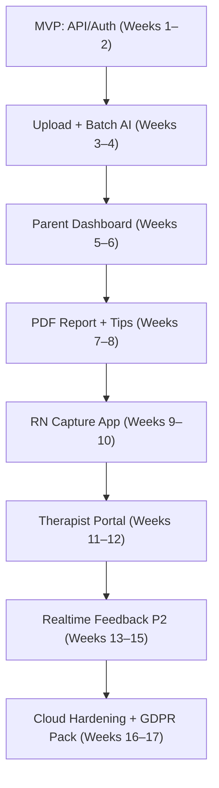

# Roadmap (fallback-safe timeline)

```mermaid
flowchart TB
  A["MVP: API/Auth (Weeks 1–2)"] --> B["Upload + Batch AI (Weeks 3–4)"]
  B --> C["Parent Dashboard (Weeks 5–6)"]
  C --> D["PDF Report + Tips (Weeks 7–8)"]
  D --> E["RN Capture App (Weeks 9–10)"]
  E --> F["Therapist Portal (Weeks 11–12)"]
  F --> G["Realtime Feedback P2 (Weeks 13–15)"]
  G --> H["Cloud Hardening + GDPR Pack (Weeks 16–17)"]
```
